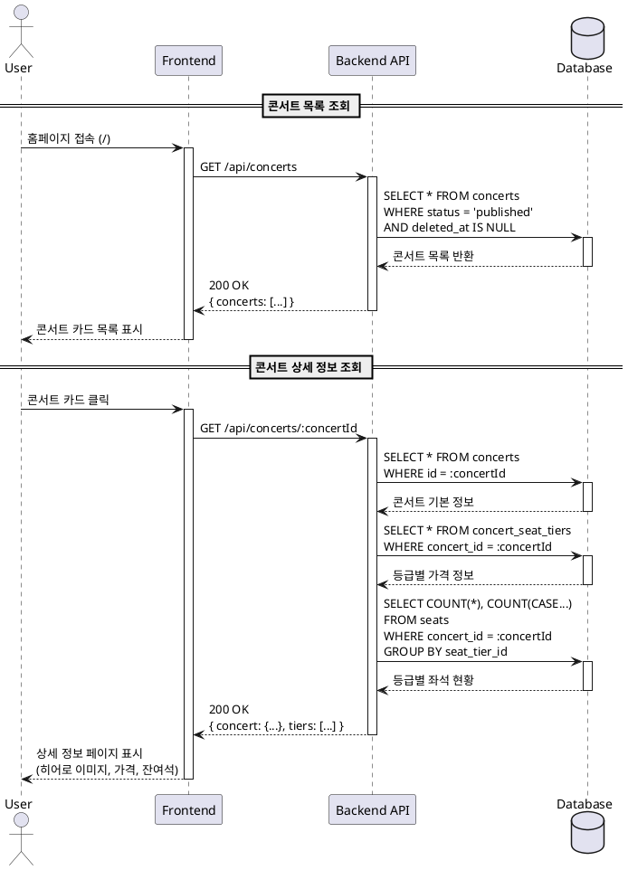

# Usecase 001: 콘서트 탐색 및 상세 조회

## Primary Actor
- 예매자(User)

## Precondition
- 사용자가 시스템 홈페이지에 접속할 수 있다.
- 데이터베이스에 하나 이상의 콘서트가 등록되어 있다.

## Trigger
- 사용자가 홈페이지(`/`)에 접속한다.
- 사용자가 콘서트 목록 카드 중 하나를 클릭한다.

## Main Scenario

### 1. 콘서트 목록 조회 (홈페이지)
1. 사용자가 홈페이지(`/`)에 접속한다.
2. 시스템은 `status = 'published'` 상태의 콘서트 목록을 데이터베이스에서 조회한다.
3. 시스템은 조회된 콘서트 목록을 카드 형식으로 화면에 표시한다.
   - 각 카드에는 콘서트 제목, 썸네일 이미지, 기본 정보가 포함된다.
4. 사용자는 관심 있는 콘서트 카드를 선택한다.

### 2. 콘서트 상세 정보 조회
1. 사용자가 특정 콘서트 카드를 클릭하면, 시스템은 해당 콘서트의 상세 페이지(`/concerts/[concertId]`)로 이동한다.
2. 시스템은 다음 정보를 데이터베이스에서 조회한다:
   - 콘서트 기본 정보 (`concerts` 테이블)
   - 좌석 등급별 가격 정보 (`concert_seat_tiers` 테이블)
   - 전체 좌석 수 및 예약된 좌석 수 (`seats` 테이블에서 `status = 'reserved'` 개수 집계)
3. 시스템은 실시간 잔여 좌석 수를 계산한다:
   - 잔여 좌석 = 전체 좌석 수 - `status = 'reserved'` 좌석 수
4. 시스템은 다음 정보를 화면에 표시한다:
   - 히어로 섹션 이미지
   - 공연 일시 및 장소
   - 등급별 가격표 (예: 스페셜 250,000원, R석 180,000원)
   - 등급별 잔여 좌석 수 (예: 스페셜 48/48석, R석 120/150석)
   - 전체 예약 현황 (예: 잔여 150석 / 전체 500석)
   - "예약하기" 버튼

## Edge Cases

### 1. 조회 가능한 콘서트가 없는 경우
- **원인**: `status = 'published'`인 콘서트가 데이터베이스에 없음.
- **처리**: 홈페이지에 "현재 예약 가능한 콘서트가 없습니다." 메시지를 표시한다.

### 2. 콘서트 ID가 유효하지 않은 경우
- **원인**: URL에 존재하지 않는 `concertId`가 입력됨.
- **처리**: 404 페이지를 표시하거나 "요청하신 콘서트를 찾을 수 없습니다." 메시지를 표시한다.

### 3. 콘서트 상태가 'published'가 아닌 경우
- **원인**: 사용자가 `status = 'draft'` 또는 `status = 'archived'` 콘서트의 직접 URL로 접근 시도.
- **처리**: 접근을 차단하고 "해당 콘서트는 현재 예약할 수 없습니다." 메시지를 표시한다.

### 4. 데이터베이스 연결 오류
- **원인**: 네트워크 문제 또는 데이터베이스 장애.
- **처리**: "일시적인 오류가 발생했습니다. 잠시 후 다시 시도해주세요." 메시지를 표시한다.

### 5. 잔여 좌석이 없는 경우
- **원인**: 모든 좌석이 `status = 'reserved'` 상태.
- **처리**:
  - "예약하기" 버튼을 비활성화한다.
  - "매진" 배지 또는 메시지를 표시한다.

## Business Rules

### BR-001: 콘서트 노출 조건
- 홈페이지와 검색 결과에는 `status = 'published'` 상태의 콘서트만 노출한다.
- `status = 'draft'` 콘서트는 운영자만 확인 가능하며, 사용자에게 노출되지 않는다.
- `status = 'archived'` 콘서트는 더 이상 예약할 수 없지만, 기존 예약 내역은 유지된다.

### BR-002: 실시간 잔여 좌석 계산
- 잔여 좌석 수는 조회 시점의 실시간 데이터로 계산한다.
- 계산 공식: `전체 좌석 수 - COUNT(seats WHERE status = 'reserved')`
- `status = 'temporarily_held'` 좌석은 잔여 좌석 수 계산에서 제외한다 (이미 다른 사용자가 선점 중).

### BR-003: 등급별 정보 표시
- 각 콘서트는 1개 이상의 좌석 등급을 가질 수 있다.
- 등급별로 가격, 좌석 범위(예: 1-3열), 잔여 좌석 수를 별도로 표시한다.
- 등급 정보는 `concert_seat_tiers` 테이블에서 조회한다.

### BR-004: 소프트 삭제 정책
- 데이터베이스 조회 시 `deleted_at IS NULL` 조건을 항상 포함한다.
- 물리적으로 삭제된 것처럼 보이지만, 실제 레코드는 데이터베이스에 보존된다.

### BR-005: 캐싱 전략 (선택 사항)
- 콘서트 기본 정보(제목, 이미지 등)는 짧은 시간(예: 1분) 동안 캐싱 가능하다.
- 잔여 좌석 수는 매 요청마다 실시간으로 계산하여 정확도를 보장한다.

## 데이터 요구사항

### API Endpoints

#### 1. GET `/api/concerts`
- **목적**: 예약 가능한 콘서트 목록 조회
- **Query Parameters**: 없음 (향후 필터링 기능 추가 가능)
- **Response**:
```json
{
  "success": true,
  "data": {
    "concerts": [
      {
        "id": "uuid",
        "title": "string",
        "thumbnail": "string (URL)",
        "status": "published",
        "createdAt": "ISO 8601 timestamp"
      }
    ]
  }
}
```

#### 2. GET `/api/concerts/:concertId`
- **목적**: 특정 콘서트의 상세 정보 조회
- **Path Parameters**:
  - `concertId` (uuid, required)
- **Response**:
```json
{
  "success": true,
  "data": {
    "concert": {
      "id": "uuid",
      "title": "string",
      "status": "published",
      "heroImage": "string (URL)",
      "performanceDate": "ISO 8601 timestamp",
      "venue": "string",
      "totalSeats": 500,
      "reservedSeats": 350,
      "availableSeats": 150,
      "tiers": [
        {
          "id": "uuid",
          "label": "스페셜",
          "price": 250000,
          "totalSeats": 48,
          "reservedSeats": 0,
          "availableSeats": 48
        },
        {
          "id": "uuid",
          "label": "R석",
          "price": 180000,
          "totalSeats": 150,
          "reservedSeats": 30,
          "availableSeats": 120
        }
      ]
    }
  }
}
```

### Database Queries

#### 1. 콘서트 목록 조회
```sql
SELECT
  id,
  title,
  thumbnail,
  status,
  created_at
FROM concerts
WHERE status = 'published'
  AND deleted_at IS NULL
ORDER BY created_at DESC;
```

#### 2. 콘서트 상세 정보 조회
```sql
-- 기본 정보
SELECT *
FROM concerts
WHERE id = $1
  AND deleted_at IS NULL;

-- 등급별 가격 정보
SELECT
  id,
  label,
  price
FROM concert_seat_tiers
WHERE concert_id = $1
  AND deleted_at IS NULL
ORDER BY price DESC;

-- 전체 좌석 수 및 예약 좌석 수 집계
SELECT
  COUNT(*) as total_seats,
  COUNT(CASE WHEN status = 'reserved' THEN 1 END) as reserved_seats,
  COUNT(CASE WHEN status = 'available' THEN 1 END) as available_seats
FROM seats
WHERE concert_id = $1
  AND deleted_at IS NULL;

-- 등급별 좌석 현황
SELECT
  st.id as tier_id,
  st.label,
  st.price,
  COUNT(*) as total_seats,
  COUNT(CASE WHEN s.status = 'reserved' THEN 1 END) as reserved_seats,
  COUNT(CASE WHEN s.status = 'available' THEN 1 END) as available_seats
FROM concert_seat_tiers st
LEFT JOIN seats s ON st.id = s.seat_tier_id AND s.deleted_at IS NULL
WHERE st.concert_id = $1
  AND st.deleted_at IS NULL
GROUP BY st.id, st.label, st.price
ORDER BY st.price DESC;
```

## UI/UX 요구사항

### 홈페이지 (콘서트 목록)
- 콘서트 카드는 Grid 또는 List 형식으로 표시한다.
- 각 카드는 클릭 가능하며, 호버 시 시각적 피드백을 제공한다.
- 로딩 중일 때는 스켈레톤 UI 또는 로딩 스피너를 표시한다.

### 콘서트 상세 페이지
- 히어로 섹션에 대표 이미지를 크게 배치한다.
- 공연 정보(일시, 장소)는 눈에 잘 띄는 위치에 배치한다.
- 등급별 정보는 카드 형식으로 나란히 배치한다.
- 잔여 좌석이 적을 경우(예: 10석 이하) 경고 색상(빨강)으로 강조한다.
- "예약하기" 버튼은 고정 위치(Sticky) 또는 화면 하단에 배치하여 항상 접근 가능하게 한다.

## PlantUML Sequence Diagram



## 추가 고려사항

### 성능 최적화
- 콘서트 목록 조회 시 페이지네이션 또는 무한 스크롤 적용 가능.
- 이미지는 CDN을 통해 제공하여 로딩 속도를 개선한다.
- 잔여 좌석 수 집계 쿼리는 인덱스를 활용하여 성능을 최적화한다.

### 확장 가능성
- 향후 검색 기능 추가 시 제목, 장르, 날짜 등으로 필터링 가능.
- 사용자 선호도 기반 추천 콘서트 표시 기능 추가 가능.
- 콘서트 알림 기능(품절 시 재오픈 알림 등) 추가 가능.

### 접근성(Accessibility)
- 모든 이미지에 대체 텍스트(alt text)를 제공한다.
- 키보드만으로도 모든 콘서트 카드에 접근 가능하도록 한다.
- 색상 외에 텍스트로도 매진/잔여석 정보를 제공한다.
