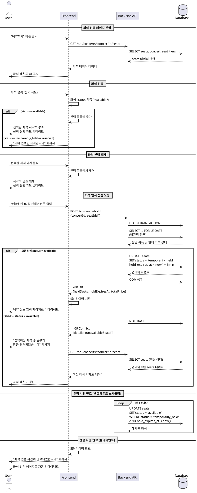

# 좌석 선택 및 임시 선점 (Use Case #002)

## Primary Actor
예매자 (User)

## Precondition
- 예매자가 콘서트 상세 페이지(`/concerts/[concertId]`)를 통해 콘서트 정보를 확인한 상태
- 해당 콘서트의 `status`가 `published`인 상태
- 해당 콘서트에 `available` 상태의 좌석이 1개 이상 존재

## Trigger
예매자가 콘서트 상세 페이지에서 "예약하기" 버튼을 클릭하여 좌석 선택 페이지(`/concerts/[concertId]/seats`)로 진입

## 페이지 경로
- **현재 페이지**: `/concerts/[concertId]/seats` (좌석 선택 페이지)
- **다음 페이지**: `/book` (예약 정보 입력 페이지, 좌석 선점 성공 후 이동)

## Main Scenario

### 1. 좌석 선택 페이지 진입 및 초기 상태 로드
1. 예매자가 좌석 선택 페이지에 진입
2. 시스템은 해당 콘서트의 모든 좌석 정보를 조회
3. 시스템은 좌석 배치도를 구역 및 등급별로 색상 구분하여 표시
   - `available`: 선택 가능 상태 (예: 회색)
   - `temporarily_held`: 다른 사용자가 선점 중 (예: 노란색)
   - `reserved`: 예약 완료됨 (예: 빨간색)
4. 등급별 가격 정보 및 잔여 좌석 수를 안내 카드로 표시

### 2. 좌석 선택 시도
1. 예매자가 좌석 배치도에서 원하는 좌석을 클릭
2. 시스템은 해당 좌석의 현재 `status`를 실시간으로 검증
   - `status = 'available'`인 경우: 선택 가능
   - `status = 'temporarily_held'` 또는 `reserved'`인 경우: 선택 불가
3. 선택 가능한 좌석인 경우:
   - UI에서 해당 좌석을 선택된 상태로 시각적으로 변경 (예: 파란색 강조)
   - 선택된 좌석 정보(구역, 좌석 번호, 가격)를 '선택 현황 카드'에 실시간 반영
   - "예약하기 (N석 선택)" 버튼의 카운트를 업데이트
4. 선택 불가능한 좌석인 경우:
   - "이미 선택된 좌석입니다" 토스트 메시지 표시
   - 좌석 선택 상태를 변경하지 않음

### 3. 좌석 선택 해제
1. 예매자가 이미 선택한 좌석을 다시 클릭
2. 시스템은 해당 좌석을 선택 목록에서 제거
3. UI에서 해당 좌석의 시각적 강조를 해제
4. '선택 현황 카드'에서 해당 좌석 정보를 제거
5. "예약하기 (N석 선택)" 버튼의 카운트를 업데이트

### 4. 좌석 임시 선점 요청 (CRITICAL)
1. 예매자가 좌석을 1개 이상 선택한 후 "예약하기 (N석 선택)" 버튼을 클릭
2. 시스템은 선택된 모든 좌석에 대해 임시 선점 트랜잭션을 시작
3. **트랜잭션 내 처리**:
   - 선택된 모든 좌석에 대해 `SELECT ... FOR UPDATE` 비관적 잠금 획득
   - 각 좌석의 현재 `status`가 `available`인지 재검증
   - 모든 좌석이 `available` 상태인 경우:
     - `status`를 `temporarily_held`로 변경
     - `hold_expires_at`을 현재 시각 + 5분으로 설정
     - 트랜잭션 커밋
   - 하나라도 `available`이 아닌 좌석이 있는 경우:
     - 트랜잭션 전체를 롤백
     - 실패 응답 반환
4. 성공 시:
   - 선점된 좌석 정보(좌석 ID 목록, 만료 시각)를 클라이언트에 전달
   - 예약 정보 입력 페이지(`/book`)로 리다이렉트
   - 쿼리 파라미터로 선점된 좌석 정보 전달
5. 실패 시:
   - "선택하신 좌석 중 일부가 방금 판매되었습니다. 좌석을 다시 선택해주세요." 메시지 표시
   - 최신 좌석 상태를 다시 조회하여 좌석 배치도를 갱신

### 5. 선점 시간 관리 (클라이언트)
1. 예약 정보 입력 페이지로 이동한 후, 클라이언트는 5분 타이머를 시작
2. 남은 시간을 UI에 표시 (예: "남은 시간: 4분 32초")
3. 선점 시간이 만료되면:
   - "좌석 선점 시간이 만료되었습니다" 메시지 표시
   - 좌석 선택 페이지로 자동 리다이렉트

## Edge Cases

### 1. 동시 선점 경쟁 (Race Condition)
- **상황**: 여러 사용자가 동일한 좌석을 동시에 선택하려고 시도
- **처리**:
  - `SELECT ... FOR UPDATE`를 통해 트랜잭션 격리 레벨에서 충돌 방지
  - 먼저 커밋된 트랜잭션만 성공
  - 나중에 시도한 사용자에게는 "이미 선택된 좌석입니다" 메시지 반환

### 2. 선점 만료된 좌석 선택 시도
- **상황**: 다른 사용자가 선점했으나 5분이 경과하여 `hold_expires_at`이 지난 좌석을 선택 시도
- **처리**:
  - 백그라운드 스케줄러가 해당 좌석의 `status`를 이미 `available`로 변경
  - 정상적으로 새로운 선점 처리

### 3. 네트워크 오류로 인한 선점 요청 실패
- **상황**: 클라이언트에서 선점 API 호출 중 네트워크 오류 발생
- **처리**:
  - "일시적인 오류가 발생했습니다. 다시 시도해주세요." 메시지 표시
  - 선점 상태를 변경하지 않음
  - 사용자가 다시 "예약하기" 버튼 클릭 가능

### 4. 좌석 배치도 로딩 중 좌석 상태 변경
- **상황**: 페이지 로딩 중 다른 사용자가 좌석을 선점/예약
- **처리**:
  - 초기 로딩 시 최신 상태를 반영
  - 주기적으로 좌석 상태를 폴링하여 UI 업데이트 (옵션)
  - 선점 시도 시점에 최종 검증을 통해 정합성 보장

### 5. 선점 가능한 좌석 수 초과 선택 시도
- **상황**: 사용자가 한 번에 선택 가능한 좌석 수 제한을 초과하여 선택 시도 (예: 최대 4석)
- **처리**:
  - 클라이언트에서 4석 초과 시 추가 선택 불가능하도록 제한
  - "최대 4석까지 선택 가능합니다" 메시지 표시

### 6. 데이터베이스 오류 (트랜잭션 실패)
- **상황**: 선점 트랜잭션 처리 중 DB 오류 발생
- **처리**:
  - 트랜잭션 전체 롤백
  - "일시적인 오류가 발생했습니다. 잠시 후 다시 시도해주세요." 메시지 표시
  - 에러 로그 기록

## Business Rules

### 1. 좌석 선점 정책
- 좌석 임시 선점 유효 시간: **정확히 5분**
- 선점 시간 계산: `hold_expires_at = now() + interval '5 minutes'`
- 선점된 좌석은 `temporarily_held` 상태로 다른 사용자에게 비노출

### 2. 좌석 선점 자동 해제
- 서버 스케줄러(Cron Job)가 **1분마다** 만료된 선점을 검색
- 검색 조건: `status = 'temporarily_held' AND hold_expires_at < now()`
- 해제 처리: 해당 좌석의 `status`를 `available`로 변경, `hold_expires_at`을 `NULL`로 초기화

### 3. 트랜잭션 원자성 보장
- **다중 좌석 선점은 단일 트랜잭션으로 처리**
- 선택된 좌석 중 하나라도 선점 불가능하면 전체 롤백
- All-or-Nothing 정책: 모든 좌석이 선점되거나, 하나도 선점되지 않음

### 4. 동시성 제어
- 비관적 잠금(Pessimistic Lock) 사용: `SELECT ... FOR UPDATE`
- 트랜잭션 격리 레벨: `READ COMMITTED` 이상
- 동시 선점 시도 시 먼저 커밋된 트랜잭션만 성공

### 5. 좌석 선택 가능 상태
- `status = 'available'` 좌석만 선택 가능
- `status = 'temporarily_held'` 또는 `'reserved'` 좌석은 선택 불가능
- 실시간 상태 검증: 선택 시도 시점과 선점 요청 시점 모두에서 검증

### 6. 좌석 선택 제한
- 최소 선택 좌석 수: **1석**
- 최대 선택 좌석 수: **4석** (MVP 기준)
- 제한 초과 시 클라이언트에서 선택 차단

### 7. 데이터 무결성
- 선점된 좌석은 반드시 `hold_expires_at`을 가져야 함
- 제약 조건: `CHECK ((status = 'temporarily_held' AND hold_expires_at IS NOT NULL) OR (status <> 'temporarily_held'))`

### 8. 사용자 피드백
- 좌석 선택/해제 시 즉각적인 UI 업데이트
- 선점 성공 시 5분 타이머 시작 및 표시
- 선점 실패 시 구체적인 실패 사유 메시지 제공

### 9. 예약 프로세스 흐름
- 좌석 선점 성공 → 예약 정보 입력 페이지로 자동 리다이렉트
- 선점 정보는 쿼리 파라미터 또는 세션을 통해 전달
- 예약 정보 입력 페이지에서 선점 유효성 재검증 필수

## API Requirements

### 1. GET `/api/concerts/:concertId/seats`
**목적**: 좌석 배치도 조회

**응답 데이터**:
```typescript
{
  concert: {
    id: string,
    title: string,
    status: 'published'
  },
  seatTiers: [
    {
      id: string,
      label: string,     // 예: "스페셜석", "R석"
      price: number,
      availableCount: number,
      totalCount: number
    }
  ],
  seats: [
    {
      id: string,
      label: string,         // 예: "A-1", "B-5"
      sectionLabel: string,  // 예: "SP1", "PR3" (구역/블록)
      rowLabel: string,      // 예: "A", "B"
      rowNumber: number,     // 행 정렬용 숫자
      seatNumber: number,    // 행 내 좌석 번호
      status: 'available' | 'temporarily_held' | 'reserved',
      seatTierId: string,
      holdExpiresAt?: string  // ISO 8601 format, status가 temporarily_held인 경우에만
    }
  ]
}
```

- 각 좌석 엔티티는 `sectionLabel`(구역), `rowLabel`/`rowNumber`(행), `seatNumber`(열)을 포함하여 실제 좌석 배치도를 그대로 재현할 수 있다.

### 2. POST `/api/seats/hold`
**목적**: 선택한 좌석 임시 선점

**요청 데이터**:
```typescript
{
  concertId: string,
  seatIds: string[]  // 1~4개의 좌석 ID
}
```

**성공 응답** (200):
```typescript
{
  success: true,
  data: {
    heldSeats: [
      {
        id: string,
        label: string,
        price: number,
        seatTierLabel: string
      }
    ],
    holdExpiresAt: string,  // ISO 8601 format
    totalPrice: number
  }
}
```

**실패 응답** (409 Conflict):
```typescript
{
  success: false,
  error: {
    code: 'SEAT_ALREADY_HELD',
    message: '선택하신 좌석 중 일부가 방금 판매되었습니다.',
    details: {
      unavailableSeats: string[]  // 선점 불가능한 좌석 ID 목록
    }
  }
}
```

**실패 응답** (400 Bad Request):
```typescript
{
  success: false,
  error: {
    code: 'INVALID_SEAT_COUNT',
    message: '좌석은 1석 이상 4석 이하로 선택해야 합니다.'
  }
}
```

## Database Operations

### 1. 좌석 상태 조회 (읽기)
```sql
SELECT
  s.id,
  s.label,
  s.status,
  s.hold_expires_at,
  s.seat_tier_id,
  cst.label AS tier_label,
  cst.price
FROM seats s
JOIN concert_seat_tiers cst ON s.seat_tier_id = cst.id
WHERE s.concert_id = $1
  AND s.deleted_at IS NULL
ORDER BY s.label;
```

### 2. 좌석 임시 선점 (쓰기 - 트랜잭션)
```sql
BEGIN;

-- 1. 비관적 잠금으로 좌석 조회
SELECT id, status
FROM seats
WHERE id = ANY($1::uuid[])
  AND concert_id = $2
  AND deleted_at IS NULL
FOR UPDATE;

-- 2. 모든 좌석이 available인지 검증 (애플리케이션 레벨)

-- 3. 선점 상태로 업데이트
UPDATE seats
SET
  status = 'temporarily_held',
  hold_expires_at = now() + interval '5 minutes',
  updated_at = now()
WHERE id = ANY($1::uuid[])
  AND status = 'available';

COMMIT;
```

### 3. 만료된 선점 자동 해제 (스케줄러)
```sql
UPDATE seats
SET
  status = 'available',
  hold_expires_at = NULL,
  updated_at = now()
WHERE status = 'temporarily_held'
  AND hold_expires_at < now()
RETURNING id, label;
```

## Data Requirements

### 1. 클라이언트 상태 관리
- 현재 선택된 좌석 목록 (`selectedSeats: Seat[]`)
- 전체 좌석 배치도 데이터 (`allSeats: Seat[]`)
- 선점 만료 시각 (`holdExpiresAt: Date | null`)
- 남은 선점 시간 (`remainingTime: number`, 초 단위)

### 2. 세션/쿼리 파라미터로 전달할 데이터
- 선점된 좌석 ID 목록 (`heldSeatIds: string[]`)
- 선점 만료 시각 (`holdExpiresAt: string`)
- 콘서트 ID (`concertId: string`)
- 총 가격 (`totalPrice: number`)

### 3. UI 표시 데이터
- 좌석별 시각적 상태 (색상, 클릭 가능 여부)
- 등급별 가격 및 잔여 좌석 수
- 선택된 좌석 정보 (구역, 번호, 가격)
- 총 선택 좌석 수 및 총 금액
- 선점 타이머 (분:초 형식)

## Sequence Diagram


