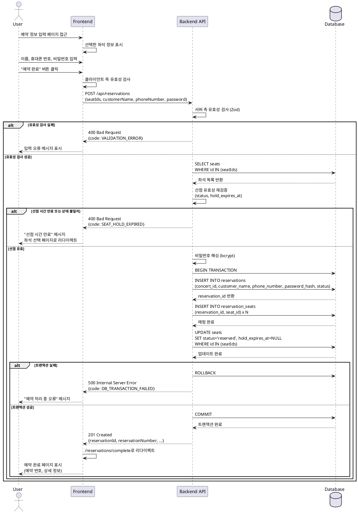

# **Use Case 003: 예약 정보 입력 및 확정**

## Overview
사용자가 임시 선점한 좌석에 대해 예약자 정보를 입력하고 최종 예약을 확정하는 기능입니다. 5분의 선점 시간 내에 예약을 완료해야 하며, 트랜잭션을 통해 예약 생성과 좌석 상태 변경의 원자성을 보장합니다.

---

## Use Case Details

### Primary Actor
예매자 (User)

### Precondition
- 사용자가 좌석 선택 페이지에서 1개 이상의 좌석을 선택하고 "예약하기" 버튼을 클릭하여 예약 정보 입력 페이지(`/book`)로 이동한 상태
- 선택한 좌석들의 상태가 `temporarily_held`이며, `hold_expires_at`이 아직 만료되지 않은 상태
- 선택한 좌석 정보(좌석 ID 목록)가 클라이언트 상태 또는 URL 파라미터로 전달된 상태

### Trigger
사용자가 예약 정보 입력 페이지에서 예약자 정보(이름, 휴대폰 번호, 비밀번호)를 입력하고 "예약 완료" 버튼을 클릭

---

## Main Scenario

1. **[User]** 예약 정보 입력 페이지에 진입하여 선택한 좌석 정보(구역, 번호, 가격, 총액)를 확인
2. **[User]** 예약자 정보 입력 폼에 다음 항목 입력:
   - 이름 (2~50자)
   - 휴대폰 번호 (010-XXXX-XXXX 형식)
   - 비밀번호 (예약 조회용, 8~20자, 영문/숫자/특수문자 조합)
3. **[User]** "예약 완료" 버튼 클릭
4. **[FE]** 입력값 클라이언트 측 유효성 검사 수행:
   - 필수 필드 누락 여부 확인
   - 휴대폰 번호 형식 검증 (정규식: `^010-\d{4}-\d{4}$`)
   - 비밀번호 형식 검증 (길이, 문자 조합 규칙)
5. **[FE]** `POST /api/reservations` 엔드포인트로 예약 생성 요청:
   ```json
   {
     "seatIds": ["uuid-1", "uuid-2"],
     "customerName": "홍길동",
     "phoneNumber": "010-1234-5678",
     "password": "password123!"
   }
   ```
6. **[BE]** 요청 데이터 서버 측 유효성 검사 (Zod 스키마 검증)
7. **[BE]** 선점 유효성 재검증:
   - 전달받은 모든 `seatIds`에 대해 데이터베이스 조회
   - 각 좌석의 `status`가 `temporarily_held`인지 확인
   - 각 좌석의 `hold_expires_at`이 현재 시각(`now()`) 이후인지 확인
   - 하나라도 조건을 만족하지 않으면 `400 Bad Request` 응답 (에러 코드: `SEAT_HOLD_EXPIRED`)
8. **[BE]** 비밀번호 암호화 처리 (bcrypt 해싱, salt rounds: 10)
9. **[BE]** 트랜잭션 시작 (`BEGIN`)
10. **[BE → DB]** `reservations` 테이블에 신규 예약 레코드 INSERT:
    - `id`: 자동 생성 (UUID)
    - `concert_id`: 좌석 정보로부터 조회한 콘서트 ID
    - `customer_name`: 입력받은 이름
    - `phone_number`: 입력받은 휴대폰 번호
    - `password_hash`: 해싱된 비밀번호
    - `status`: `confirmed`
    - `created_at`, `updated_at`: 현재 시각
11. **[BE → DB]** `reservation_seats` 테이블에 예약-좌석 매핑 레코드 INSERT (좌석 개수만큼 반복):
    - `reservation_id`: 10단계에서 생성된 예약 ID
    - `seat_id`: 각 좌석 ID
    - `created_at`: 현재 시각
12. **[BE → DB]** `seats` 테이블에서 해당 좌석들의 상태 UPDATE:
    - `status`: `temporarily_held` → `reserved`
    - `hold_expires_at`: `NULL`로 초기화
    - `updated_at`: 현재 시각
13. **[BE]** 트랜잭션 커밋 (`COMMIT`)
14. **[BE]** 성공 응답 반환 (201 Created):
    ```json
    {
      "success": true,
      "data": {
        "reservationId": "uuid",
        "reservationNumber": "RES20250113001",
        "customerName": "홍길동",
        "totalAmount": 500000,
        "seatCount": 2
      }
    }
    ```
15. **[FE]** 예약 완료 페이지(`/reservations/complete?id={reservationId}`)로 리다이렉트
16. **[User]** 예약 번호 및 상세 정보 확인

---

## Edge Cases

### 1. 선점 시간 만료 (SEAT_HOLD_EXPIRED)
- **발생 조건**: 사용자가 5분 선점 시간 내에 예약을 완료하지 못한 경우
- **처리**:
  - 7단계 선점 유효성 재검증에서 실패
  - 응답: `400 Bad Request`, 에러 코드 `SEAT_HOLD_EXPIRED`
  - FE: "좌석 선점 시간이 만료되었습니다. 좌석 선택 단계로 다시 진행해주세요." 메시지 표시 후 좌석 선택 페이지로 리다이렉트
- **데이터 상태**: 좌석은 스케줄러에 의해 `available` 상태로 이미 변경되었거나 곧 변경될 예정

### 2. 좌석 상태 불일치 (SEAT_NOT_HELD)
- **발생 조건**: 선점된 좌석이 서버 오류 등으로 이미 `available` 또는 `reserved` 상태로 변경된 경우
- **처리**:
  - 7단계 선점 유효성 재검증에서 실패
  - 응답: `400 Bad Request`, 에러 코드 `SEAT_NOT_HELD`
  - FE: "선택하신 좌석이 유효하지 않습니다. 좌석을 다시 선택해주세요." 메시지 표시
- **데이터 상태**: 트랜잭션 실행 전 단계이므로 데이터 변경 없음

### 3. 트랜잭션 실행 중 데이터베이스 오류 (DB_TRANSACTION_FAILED)
- **발생 조건**: 10~12단계 중 외래 키 제약 위반, 네트워크 오류, 데드락 등 데이터베이스 오류 발생
- **처리**:
  - 트랜잭션 롤백 (`ROLLBACK`)
  - 응답: `500 Internal Server Error`, 에러 코드 `DB_TRANSACTION_FAILED`
  - FE: "예약 처리 중 오류가 발생했습니다. 잠시 후 다시 시도해주세요." 메시지 표시
- **데이터 상태**: 롤백으로 모든 변경 사항이 취소되며, 좌석은 `temporarily_held` 상태 유지 (이후 스케줄러가 자동 해제)

### 4. 입력값 유효성 검사 실패 (VALIDATION_ERROR)
- **발생 조건**: 클라이언트 측 검증을 우회하거나 잘못된 데이터 전송
- **처리**:
  - 6단계 서버 측 Zod 스키마 검증에서 실패
  - 응답: `400 Bad Request`, 에러 코드 `VALIDATION_ERROR`, 상세 필드 오류 정보 포함
  - FE: 해당 필드에 오류 메시지 표시 (예: "휴대폰 번호 형식이 올바르지 않습니다.")
- **데이터 상태**: 데이터베이스 접근 전 단계이므로 변경 없음

### 5. 중복 요청 (DUPLICATE_REQUEST)
- **발생 조건**: 네트워크 지연 등으로 사용자가 "예약 완료" 버튼을 여러 번 클릭한 경우
- **처리**:
  - FE: 버튼 클릭 후 즉시 비활성화 및 로딩 상태 표시
  - BE: 동일 좌석에 대한 중복 예약 시도 시 7단계에서 `SEAT_NOT_HELD` 오류로 처리 (이미 첫 요청에서 `reserved` 상태로 변경됨)
- **데이터 상태**: 첫 번째 요청만 성공적으로 처리되고, 이후 요청은 거부됨

---

## Business Rules

### 1. 선점 시간 제한
- 좌석 임시 선점 유효 시간: **5분**
- `hold_expires_at = now() + interval '5 minutes'`로 설정
- 예약 정보 입력 페이지에 잔여 시간 타이머 표시 (선택 사항)

### 2. 입력값 유효성 규칙
- **이름**:
  - 필수 입력
  - 길이: 2~50자
  - 공백만으로 구성 불가
- **휴대폰 번호**:
  - 필수 입력
  - 형식: `010-XXXX-XXXX` (하이픈 포함)
  - 정규식: `^010-\d{4}-\d{4}$`
- **비밀번호**:
  - 필수 입력
  - 길이: 8~20자
  - 조합: 영문 대소문자, 숫자, 특수문자 중 2가지 이상 조합
  - 예약 조회 시 사용되므로 사용자가 기억할 수 있는 수준의 강도

### 3. 비밀번호 암호화 정책
- 알고리즘: bcrypt
- Salt rounds: 10
- 비밀번호는 평문으로 저장하지 않으며, 조회 시 입력값을 해싱하여 `password_hash`와 비교

### 4. 트랜잭션 원자성 보장
- 예약 생성(`reservations` INSERT), 예약-좌석 매핑(`reservation_seats` INSERT), 좌석 상태 변경(`seats` UPDATE)은 **단일 트랜잭션**으로 실행
- 어느 하나라도 실패 시 전체 롤백하여 데이터 정합성 보장

### 5. 선점 유효성 재검증
- 클라이언트에서 전달받은 좌석 정보를 신뢰하지 않고, 서버에서 반드시 **현재 상태를 재검증**
- 검증 항목:
  1. 좌석 존재 여부
  2. `status = 'temporarily_held'`
  3. `hold_expires_at > now()`
- 하나라도 실패 시 예약 처리 중단

### 6. 예약 번호 생성 규칙
- 형식: `RES{YYYYMMDD}{일련번호 3자리}` (예: `RES20250113001`)
- 생성 시점: 예약 레코드 INSERT 시 트리거 또는 애플리케이션 로직으로 생성
- 유일성 보장 (DB 제약 조건 또는 시퀀스 활용)

### 7. 동시성 제어
- 동일 좌석에 대한 동시 예약 시도는 7단계 선점 유효성 재검증에서 차단
- 이미 선점된 좌석은 다른 사용자가 선택 불가하므로, 정상적인 플로우에서는 동시성 문제 발생하지 않음

### 8. 예약 완료 후 처리
- 예약 성공 시 선택한 좌석의 `hold_expires_at`을 `NULL`로 초기화
- 예약 완료 페이지에서 예약 번호, 공연 정보, 좌석 정보, 총액 표시
- 사용자는 예약 번호와 휴대폰 번호/비밀번호로 예약 조회 가능

---

## API Specification

### Endpoint
```
POST /api/reservations
```

### Request Headers
```
Content-Type: application/json
```

### Request Body
```json
{
  "seatIds": ["uuid-1", "uuid-2", "uuid-3"],
  "customerName": "홍길동",
  "phoneNumber": "010-1234-5678",
  "password": "password123!"
}
```

### Request Schema (Zod)
```typescript
{
  seatIds: z.array(z.string().uuid()).min(1).max(10),
  customerName: z.string().min(2).max(50).trim(),
  phoneNumber: z.string().regex(/^010-\d{4}-\d{4}$/),
  password: z.string().min(8).max(20)
}
```

### Success Response (201 Created)
```json
{
  "success": true,
  "data": {
    "reservationId": "550e8400-e29b-41d4-a716-446655440000",
    "reservationNumber": "RES20250113001",
    "customerName": "홍길동",
    "phoneNumber": "010-1234-5678",
    "concertId": "660e8400-e29b-41d4-a716-446655440000",
    "concertTitle": "2025 뉴이어 콘서트",
    "seats": [
      {
        "seatId": "uuid-1",
        "label": "A1",
        "tierLabel": "스페셜",
        "price": 250000
      },
      {
        "seatId": "uuid-2",
        "label": "A2",
        "tierLabel": "스페셜",
        "price": 250000
      }
    ],
    "totalAmount": 500000,
    "seatCount": 2,
    "createdAt": "2025-01-13T10:30:00Z"
  }
}
```

### Error Responses

#### 400 Bad Request - VALIDATION_ERROR
```json
{
  "success": false,
  "error": {
    "code": "VALIDATION_ERROR",
    "message": "입력값이 유효하지 않습니다.",
    "details": {
      "phoneNumber": "휴대폰 번호 형식이 올바르지 않습니다.",
      "password": "비밀번호는 8자 이상이어야 합니다."
    }
  }
}
```

#### 400 Bad Request - SEAT_HOLD_EXPIRED
```json
{
  "success": false,
  "error": {
    "code": "SEAT_HOLD_EXPIRED",
    "message": "좌석 선점 시간이 만료되었습니다.",
    "details": {
      "expiredSeats": ["uuid-1", "uuid-2"]
    }
  }
}
```

#### 400 Bad Request - SEAT_NOT_HELD
```json
{
  "success": false,
  "error": {
    "code": "SEAT_NOT_HELD",
    "message": "선택하신 좌석이 유효하지 않습니다.",
    "details": {
      "invalidSeats": ["uuid-1"]
    }
  }
}
```

#### 500 Internal Server Error - DB_TRANSACTION_FAILED
```json
{
  "success": false,
  "error": {
    "code": "DB_TRANSACTION_FAILED",
    "message": "예약 처리 중 오류가 발생했습니다."
  }
}
```

---

## Data Requirements

### Database Tables Involved

#### reservations
- **Operation**: INSERT
- **Fields**:
  - `id`: UUID (auto-generated)
  - `concert_id`: UUID (from seat info)
  - `customer_name`: TEXT
  - `phone_number`: TEXT
  - `password_hash`: TEXT (bcrypt hashed)
  - `status`: `confirmed`
  - `created_at`, `updated_at`: TIMESTAMPTZ

#### reservation_seats
- **Operation**: INSERT (multiple rows)
- **Fields**:
  - `reservation_id`: UUID (FK to reservations)
  - `seat_id`: UUID (FK to seats)
  - `created_at`: TIMESTAMPTZ

#### seats
- **Operation**: SELECT, UPDATE
- **SELECT**: 선점 유효성 재검증
  - WHERE: `id IN (seatIds) AND status = 'temporarily_held' AND hold_expires_at > now()`
- **UPDATE**: 좌석 상태 변경
  - SET: `status = 'reserved', hold_expires_at = NULL, updated_at = now()`
  - WHERE: `id IN (seatIds)`

---

## Sequence Diagram



---

## Non-Functional Requirements

### 1. Performance
- 예약 생성 API 응답 시간: 평균 500ms 이하
- 트랜잭션 처리 시간: 200ms 이하
- 동시 접속 100명 기준 처리 가능

### 2. Security
- 비밀번호는 bcrypt로 해싱 (salt rounds: 10)
- 평문 비밀번호는 서버 메모리에서 즉시 삭제
- HTTPS 통신 필수 (프로덕션 환경)
- SQL Injection 방지 (Parameterized Query 사용)

### 3. Reliability
- 트랜잭션 원자성 보장으로 데이터 정합성 유지
- 롤백 시 모든 변경 사항 완전 복구
- 에러 로깅을 통한 장애 추적 가능

### 4. Usability
- 입력 폼에서 실시간 유효성 검사 피드백 제공
- 선점 시간 만료 시 명확한 안내 메시지
- 예약 완료 후 예약 번호를 눈에 띄게 표시

---

## Related Documents
- `/docs/prd.md` - 제품 요구사항 정의서
- `/docs/userflow.md` - 사용자 플로우 정의
- `/docs/database.md` - 데이터베이스 스키마 및 정책
- `/docs/002/spec.md` - Use Case 002: 좌석 선택 및 임시 선점
- `/docs/004/spec.md` - Use Case 004: 예약 조회 및 취소
