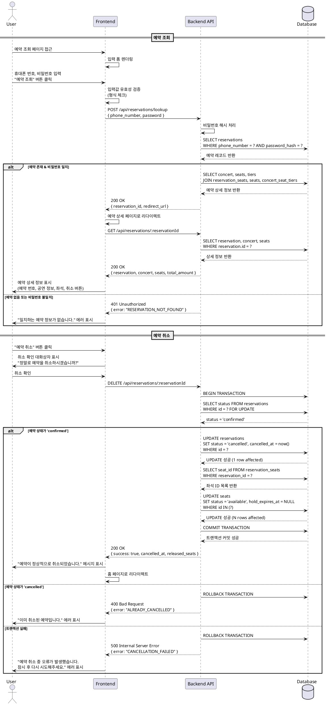

# 유스케이스 004: 예약 조회 및 취소

## Primary Actor
- 예매자 (User)

## Precondition
- 예매자가 사전에 예약을 완료하여 예약 정보(휴대폰 번호, 비밀번호)를 보유하고 있어야 함
- 예약의 `status`가 `confirmed` 상태여야 함 (이미 취소된 예약은 조회 불가)

## Trigger
- 예매자가 예약 조회 페이지(`/reservations/lookup`)에 접근하여 예약 정보를 확인하거나 취소하고자 할 때

## Main Scenario

### 4.1 예약 조회 프로세스
1. 예매자가 예약 조회 페이지(`/reservations/lookup`)에 접근한다.
2. 시스템은 예약 조회 폼(휴대폰 번호, 비밀번호 입력 필드)을 표시한다.
3. 예매자가 예약 시 입력했던 휴대폰 번호와 비밀번호를 입력하고 "예약 조회" 버튼을 클릭한다.
4. 시스템은 입력값의 유효성을 검증한다:
   - 휴대폰 번호 형식이 올바른지 확인
   - 비밀번호가 입력되었는지 확인
5. 시스템은 데이터베이스에서 해당 휴대폰 번호로 예약을 조회한다.
6. 시스템은 입력된 비밀번호를 해시 처리하여 저장된 `password_hash`와 비교 검증한다.
7. 인증이 성공하면, 시스템은 예약 상세 정보를 조회한다:
   - `reservations` 테이블에서 예약 기본 정보 조회
   - `reservation_seats`를 통해 예약된 좌석 정보 조회
   - `seats` 테이블과 조인하여 좌석 상세 정보(구역, 번호 등) 조회
   - `concert_seat_tiers`를 통해 가격 정보 조회
   - `concerts` 테이블과 조인하여 공연 정보 조회
8. 시스템은 예약 상세 페이지(`/reservations/[reservationId]`)로 리다이렉트하며 다음 정보를 표시한다:
   - 예약 번호 (reservation.id)
   - 공연 정보 (콘서트 제목, 일시, 장소)
   - 예약자 정보 (이름, 휴대폰 번호)
   - 좌석 정보 (구역, 좌석 번호, 등급, 가격)
   - 총 결제 금액
   - 예약 일시 (created_at)
   - "예약 취소" 버튼

### 4.2 예약 취소 프로세스
1. 예매자가 예약 상세 페이지에서 "예약 취소" 버튼을 클릭한다.
2. 시스템은 취소 확인 대화상자를 표시한다: "정말로 예약을 취소하시겠습니까?"
3. 예매자가 취소를 확인한다.
4. 시스템은 취소 가능 여부를 검증한다:
   - (MVP) 현재 예약 상태가 `confirmed`인지 확인 (이미 취소된 예약은 불가)
   - (향후 확장) 공연 시작 24시간 전인지 확인 등 비즈니스 규칙 적용
5. 시스템은 단일 트랜잭션으로 취소 처리를 수행한다:
   - **Step 5.1**: `reservations` 테이블에서 해당 예약의 `status`를 `cancelled`로 변경
   - **Step 5.2**: `cancelled_at` 필드에 현재 시각을 기록
   - **Step 5.3**: `reservation_seats`를 통해 연결된 모든 좌석 ID를 조회
   - **Step 5.4**: 조회된 좌석들의 `seats.status`를 `reserved`에서 `available`로 변경
   - **Step 5.5**: 좌석의 `hold_expires_at`을 NULL로 초기화
   - 트랜잭션 중 하나라도 실패하면 전체 롤백 처리
6. 시스템은 취소 성공 메시지를 표시한다: "예약이 정상적으로 취소되었습니다."
7. 시스템은 예매자를 홈 페이지(`/`)로 리다이렉트한다.

## Edge Cases

### EC-1: 예약 조회 실패 - 일치하는 정보 없음
- **상황**: 입력된 휴대폰 번호로 예약을 찾을 수 없거나, 비밀번호가 일치하지 않는 경우
- **처리**:
  - "일치하는 예약 정보가 없습니다. 휴대폰 번호와 비밀번호를 확인해주세요." 에러 메시지 표시
  - 입력 폼을 유지하여 재시도 가능하도록 함
  - 보안상 "휴대폰 번호가 없음"과 "비밀번호 불일치"를 구분하지 않음

### EC-2: 예약 조회 실패 - 이미 취소된 예약
- **상황**: 조회하려는 예약이 이미 `status = 'cancelled'` 상태인 경우
- **처리**:
  - 취소된 예약도 조회는 가능하도록 허용
  - 예약 상세 페이지에 "취소된 예약입니다" 배지 표시
  - "예약 취소" 버튼을 비활성화하고 "이미 취소된 예약입니다" 메시지 표시

### EC-3: 취소 트랜잭션 실패 - 데이터베이스 오류
- **상황**: 네트워크 문제, 데이터베이스 연결 실패, 동시성 충돌 등으로 트랜잭션 실패
- **처리**:
  - 전체 트랜잭션을 롤백하여 데이터 정합성 유지
  - "예약 취소 중 오류가 발생했습니다. 잠시 후 다시 시도해주세요." 에러 메시지 표시
  - 현재 페이지(예약 상세)를 유지하여 재시도 가능하도록 함
  - 서버 로그에 오류 상세 정보 기록

### EC-4: 취소 불가 - 비즈니스 규칙 위반 (향후 확장)
- **상황**: 공연 시작 24시간 이내 등 비즈니스 규칙상 취소가 불가능한 경우
- **처리**:
  - "공연 시작 24시간 전까지만 취소가 가능합니다." 에러 메시지 표시
  - "예약 취소" 버튼을 비활성화
  - 고객 센터 연락처 안내

### EC-5: 입력값 유효성 검증 실패
- **상황**: 휴대폰 번호 형식이 올바르지 않거나, 비밀번호가 입력되지 않은 경우
- **처리**:
  - 각 필드별 인라인 유효성 검증 에러 메시지 표시
  - 휴대폰 번호: "올바른 휴대폰 번호 형식을 입력해주세요. (예: 010-1234-5678)"
  - 비밀번호: "비밀번호를 입력해주세요."
  - 서버 요청을 보내지 않고 클라이언트에서 즉시 피드백

### EC-6: 동시 취소 시도 (Race Condition)
- **상황**: 같은 예약에 대해 여러 창/세션에서 동시에 취소를 시도하는 경우
- **처리**:
  - 데이터베이스 트랜잭션의 격리 수준(Isolation Level)을 통해 처리
  - 첫 번째 취소만 성공하고, 나머지는 "이미 취소된 예약입니다" 응답
  - 낙관적 잠금(Optimistic Lock) 또는 비관적 잠금(Pessimistic Lock) 활용

## Business Rules

### BR-1: 비밀번호 보안
- 비밀번호는 절대 평문으로 저장하지 않으며, 단방향 해시 알고리즘(bcrypt 등)을 사용하여 `password_hash`로 저장
- 비밀번호 검증 시 입력값을 해시 처리하여 저장된 해시값과 비교
- 조회 실패 시 "휴대폰 번호 없음"과 "비밀번호 불일치"를 구분하지 않아 계정 존재 여부 노출 방지

### BR-2: 소프트 삭제 정책
- 예약 취소 시 물리적 삭제(`DELETE`)를 수행하지 않음
- `reservations.status`를 `cancelled`로 변경하고 `cancelled_at`에 취소 시각 기록
- 취소된 예약 데이터는 감사(Audit) 및 통계 목적으로 영구 보관
- 필요시 `deleted_at` 필드를 추가하여 소프트 삭제 처리 가능

### BR-3: 취소 트랜잭션 원자성
- 예약 취소는 단일 데이터베이스 트랜잭션으로 처리하여 원자성(Atomicity) 보장
- 트랜잭션 구성 요소:
  1. `reservations` 상태 변경 (`confirmed` → `cancelled`)
  2. `cancelled_at` 시각 기록
  3. 연결된 모든 좌석의 `status` 변경 (`reserved` → `available`)
  4. 좌석의 `hold_expires_at` 초기화
- 하나라도 실패하면 전체 롤백하여 데이터 일관성 유지

### BR-4: 취소 가능 조건 (MVP)
- MVP 범위에서는 `status = 'confirmed'` 상태의 예약만 취소 가능
- 이미 `cancelled` 상태인 예약은 중복 취소 불가
- (향후 확장) 공연 시작 24시간 전까지만 취소 가능 등의 시간 제약 추가 가능

### BR-5: 좌석 해제 정책
- 예약 취소 시 연결된 모든 좌석이 즉시 `available` 상태로 전환
- 해제된 좌석은 다른 예매자가 즉시 선택 가능
- 좌석 해제 시 이전 선점 정보(`hold_expires_at`)를 초기화하여 데이터 정합성 유지

### BR-6: 조회 인증 정책
- 휴대폰 번호와 비밀번호 조합으로만 예약 조회 가능
- 예약 번호(reservation.id)만으로는 조회 불가 (보안 강화)
- 동일 휴대폰 번호로 여러 예약이 있는 경우, 비밀번호가 일치하는 예약만 조회

### BR-7: 데이터 접근 권한
- 예매자는 자신의 예약 정보만 조회/취소 가능
- 다른 사용자의 예약 정보는 휴대폰 번호와 비밀번호를 모두 알지 못하면 접근 불가
- (향후 확장) 운영자는 별도 관리 페이지에서 모든 예약 조회 가능

### BR-8: 취소 후 복구 불가
- 한번 취소된 예약은 복구할 수 없음
- 동일한 좌석을 다시 예약하려면 새로운 예약 프로세스를 처음부터 진행해야 함
- 취소 전 확인 대화상자를 통해 예매자에게 명확히 안내

## API 엔드포인트

### GET /api/reservations/lookup
- **설명**: 예약 조회 페이지 렌더링
- **응답**: HTML 페이지 (입력 폼)

### POST /api/reservations/lookup
- **설명**: 예약 정보 검증 및 조회
- **요청 본문**:
  ```json
  {
    "phone_number": "010-1234-5678",
    "password": "user-input-password"
  }
  ```
- **응답 (성공)**:
  ```json
  {
    "success": true,
    "data": {
      "reservation_id": "uuid",
      "redirect_url": "/reservations/{reservationId}"
    }
  }
  ```
- **응답 (실패)**:
  ```json
  {
    "success": false,
    "error": {
      "code": "RESERVATION_NOT_FOUND",
      "message": "일치하는 예약 정보가 없습니다."
    }
  }
  ```

### GET /api/reservations/:reservationId
- **설명**: 예약 상세 정보 조회 (인증 완료 후)
- **응답 (성공)**:
  ```json
  {
    "success": true,
    "data": {
      "reservation": {
        "id": "uuid",
        "concert_id": "uuid",
        "customer_name": "홍길동",
        "phone_number": "010-1234-5678",
        "status": "confirmed",
        "created_at": "2025-11-13T10:30:00Z"
      },
      "concert": {
        "id": "uuid",
        "title": "2025 콘서트",
        "event_date": "2025-12-31T19:00:00Z",
        "venue": "올림픽공원 체조경기장"
      },
      "seats": [
        {
          "seat_id": "uuid",
          "label": "A-01",
          "tier_label": "스페셜",
          "price": 250000
        }
      ],
      "total_amount": 250000
    }
  }
  ```

### DELETE /api/reservations/:reservationId
- **설명**: 예약 취소 처리
- **요청 본문**: 없음 (인증은 세션/토큰으로 처리)
- **응답 (성공)**:
  ```json
  {
    "success": true,
    "message": "예약이 정상적으로 취소되었습니다.",
    "data": {
      "cancelled_at": "2025-11-13T11:00:00Z",
      "released_seats": 1
    }
  }
  ```
- **응답 (실패 - 이미 취소됨)**:
  ```json
  {
    "success": false,
    "error": {
      "code": "ALREADY_CANCELLED",
      "message": "이미 취소된 예약입니다."
    }
  }
  ```
- **응답 (실패 - 트랜잭션 오류)**:
  ```json
  {
    "success": false,
    "error": {
      "code": "CANCELLATION_FAILED",
      "message": "예약 취소 중 오류가 발생했습니다. 잠시 후 다시 시도해주세요."
    }
  }
  ```

## 데이터 요구사항

### 조회 시 필요한 데이터
- **Input**:
  - `phone_number` (string, required): 휴대폰 번호 (형식: 010-1234-5678)
  - `password` (string, required): 예약 시 설정한 비밀번호

- **Output**:
  - `reservations` 테이블: id, concert_id, customer_name, phone_number, status, created_at
  - `concerts` 테이블: title, event_date, venue
  - `reservation_seats` 테이블: reservation_id, seat_id
  - `seats` 테이블: label, seat_tier_id
  - `concert_seat_tiers` 테이블: label, price

### 취소 시 변경되는 데이터
- **reservations 테이블**:
  - `status`: `confirmed` → `cancelled`
  - `cancelled_at`: NULL → 현재 시각 (timestamptz)

- **seats 테이블** (연결된 모든 좌석):
  - `status`: `reserved` → `available`
  - `hold_expires_at`: 기존값 → NULL

### 트랜잭션 처리
- **격리 수준**: READ COMMITTED 이상 권장
- **잠금 전략**:
  - 예약 조회 시: 읽기 잠금(Shared Lock) 불필요 (단순 조회)
  - 예약 취소 시: 쓰기 잠금(Exclusive Lock) 적용 (`SELECT ... FOR UPDATE`)
- **롤백 조건**:
  - reservations 업데이트 실패
  - seats 업데이트 실패 (일부 좌석만 업데이트되는 경우 방지)
  - 네트워크 오류, 데이터베이스 연결 끊김 등

## Sequence Diagram



## 비기능 요구사항

### NFR-1: 성능
- 예약 조회 응답 시간: 평균 500ms 이내
- 예약 취소 처리 시간: 평균 1초 이내
- 동시 조회 요청 처리: 최소 100 TPS

### NFR-2: 보안
- 비밀번호는 bcrypt 등 단방향 해시 알고리즘으로 암호화 (Salt 포함)
- HTTPS 프로토콜을 통한 데이터 전송 암호화
- SQL Injection 방지를 위한 Prepared Statement 사용
- 비밀번호 입력 실패 시 계정 존재 여부 노출 방지

### NFR-3: 가용성
- 예약 조회/취소 기능 가동률: 99.9% 이상
- 데이터베이스 트랜잭션 실패 시 자동 롤백 및 재시도 메커니즘

### NFR-4: 감사(Audit)
- 모든 예약 취소 이력을 데이터베이스에 영구 보관
- `cancelled_at` 필드를 통한 취소 시각 추적
- (향후 확장) 별도 audit_logs 테이블을 통한 상세 감사 로그 기록

### NFR-5: 사용성
- 입력 폼의 명확한 레이블 및 플레이스홀더 제공
- 실시간 입력값 유효성 검증 및 인라인 에러 메시지
- 예약 취소 전 명확한 확인 프로세스 (대화상자)
- 반응형 디자인으로 모바일 기기 지원
