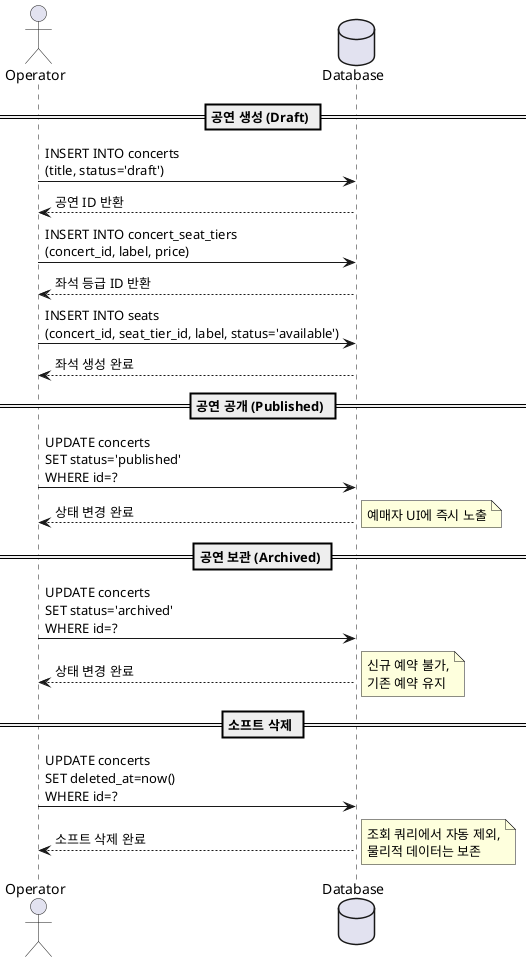
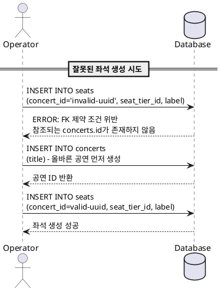
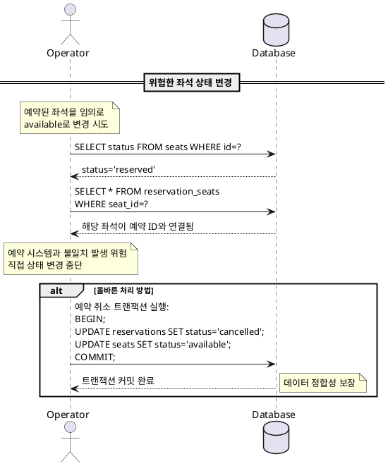

# Usecase 5: 운영 (Operator)

## Primary Actor
**운영자 (Operator)**: 공연 정보 및 좌석 데이터를 관리하는 시스템 관리자

## Precondition
- 운영자는 데이터베이스 직접 접근 권한을 보유해야 함
- 데이터베이스 스키마와 비즈니스 규칙에 대한 충분한 이해가 필요함

## Trigger
- 신규 공연을 등록하거나 기존 공연 정보를 수정/삭제해야 하는 경우
- 공연 상태를 변경하여 예약 가능/불가능 상태를 조정하는 경우
- 좌석 구성을 생성하거나 좌석 등급 정보를 수정하는 경우

---

## Main Scenario

### 1. 공연 생성 (Concert Creation)

1. 운영자는 `concerts` 테이블에 신규 공연 정보를 INSERT
2. 신규 공연의 초기 상태는 자동으로 `status = 'draft'`로 설정됨
3. 공연 기본 정보 입력:
   - `title` (공연 제목)
   - 기타 공연 상세 정보 (일시, 장소 등)
4. `concert_seat_tiers` 테이블에 해당 공연의 등급별 가격 정보를 INSERT:
   - `concert_id` (FK, 방금 생성한 공연 ID)
   - `label` (등급명: 예 - 스페셜, R석, S석)
   - `price` (등급별 가격)
5. `seats` 테이블에 좌석 배치도를 생성:
   - 각 좌석에 대해 `concert_id`, `seat_tier_id`, `label` 입력
   - 초기 상태는 자동으로 `status = 'available'`로 설정됨

### 2. 공연 상태 변경 (Concert Status Management)

#### 2.1 초안 → 공개 (Draft → Published)
1. 운영자는 공연 준비가 완료되면 `concerts` 테이블에서 해당 공연의 `status`를 `'draft'`에서 `'published'`로 UPDATE
2. 시스템은 `status = 'published'`인 공연만 예매자 UI에 노출함
3. 예매자는 이제 해당 공연을 홈페이지와 상세 페이지에서 조회 가능

#### 2.2 공개 → 보관 (Published → Archived)
1. 공연이 종료되거나 비활성화가 필요한 경우, 운영자는 `status`를 `'archived'`로 UPDATE
2. `status = 'archived'`인 공연은 신규 예약이 불가능하지만, 기존 예약 내역은 그대로 유지됨
3. 예매자 UI에서 해당 공연은 더 이상 노출되지 않음

### 3. 공연 및 좌석 수정 (Update Operations)

1. 운영자는 `concerts`, `concert_seat_tiers`, `seats` 테이블에서 필요한 컬럼을 UPDATE
2. 수정 시 `updated_at` 컬럼이 자동으로 현재 시각으로 갱신됨
3. Foreign Key 제약 조건 준수:
   - `seats.concert_id`는 반드시 유효한 `concerts.id`를 참조해야 함
   - `seats.seat_tier_id`는 반드시 유효한 `concert_seat_tiers.id`를 참조해야 함
4. 변경 사항은 즉시 시스템 전반에 일관성 있게 반영됨

### 4. 소프트 삭제 (Soft Delete)

1. 운영자는 공연, 좌석 등을 삭제해야 할 경우 물리적 DELETE 대신 소프트 삭제를 수행
2. 해당 레코드의 `deleted_at` 컬럼을 현재 시각으로 UPDATE
3. 시스템 조회 쿼리는 `deleted_at IS NULL` 조건을 포함하여 소프트 삭제된 데이터를 자동으로 제외
4. 소프트 삭제된 데이터는 물리적으로 데이터베이스에 남아있어 추후 복구 및 데이터 분석 가능

---

## Edge Cases

### 1. Foreign Key 제약 조건 위반
- **상황**: 존재하지 않는 `concert_id`나 `seat_tier_id`를 참조하여 좌석을 생성하려는 경우
- **처리**: 데이터베이스가 Foreign Key 제약 조건 위반 오류를 반환하고 INSERT/UPDATE 작업이 실패함
- **복구**: 운영자는 먼저 참조되는 부모 레코드(공연 또는 좌석 등급)를 생성한 후 다시 시도해야 함

### 2. 중복 데이터 생성 시도
- **상황**: 동일한 `concert_id`와 `label` 조합으로 좌석을 중복 생성하려는 경우
- **처리**: UNIQUE 제약 조건에 의해 INSERT가 실패함
- **복구**: 운영자는 좌석 label을 고유하게 수정하거나 기존 레코드를 UPDATE해야 함

### 3. 예약이 있는 공연을 삭제하려는 경우
- **상황**: 예약자가 이미 좌석을 예약한 공연을 삭제하려는 경우
- **정책**: 물리적 DELETE는 금지되므로 소프트 삭제(`deleted_at` 기록) 또는 상태 변경(`status = 'archived'`)으로 처리
- **효과**: 예약 내역은 그대로 유지되고, 신규 예약만 불가능하게 됨

### 4. 좌석 상태를 임의로 변경하는 경우
- **상황**: 운영자가 `seats.status`를 `'reserved'`에서 `'available'`로 직접 변경하려는 경우
- **위험**: 해당 좌석이 `reservation_seats`에 연결되어 있다면 데이터 정합성 문제 발생
- **권장**: 좌석 상태 변경은 예약 취소 트랜잭션을 통해서만 수행해야 하며, 임의 변경 시 예약 시스템과 불일치 발생 가능

### 5. 공연 상태를 published로 변경했으나 좌석이 없는 경우
- **상황**: `status = 'published'`로 변경했지만 해당 `concert_id`를 가진 좌석이 `seats` 테이블에 없는 경우
- **결과**: 예매자 UI에는 공연이 노출되지만 예약 가능한 좌석이 0석으로 표시됨
- **복구**: 운영자는 좌석 배치도를 생성한 후 다시 공개하거나, 상태를 `'draft'`로 되돌려야 함

---

## Business Rules

### 1. 공연 상태 관리 (Concert Status Lifecycle)
- 모든 신규 공연은 `status = 'draft'` 상태로 시작함
- `status = 'published'`인 공연만 예매자 UI에 노출됨
- `status = 'archived'` 공연은 신규 예약 불가하며 기존 예약 내역은 유지됨
- 공연 상태 전환 순서: `draft` → `published` → `archived`

### 2. 데이터 무결성 보장 (Data Integrity)
- 모든 좌석(`seats`)은 반드시 유효한 공연(`concerts.id`)을 참조해야 함 (Foreign Key 제약)
- 모든 좌석은 반드시 유효한 좌석 등급(`concert_seat_tiers.id`)을 참조해야 함
- 좌석 label은 동일 공연 내에서 고유해야 함 (UNIQUE 제약: `concert_id`, `label`)
- 좌석 등급 label은 동일 공연 내에서 고유해야 함 (UNIQUE 제약: `concert_id`, `label`)

### 3. 소프트 삭제 정책 (Soft Delete Policy)
- 모든 주요 테이블(`concerts`, `seats`, `concert_seat_tiers`, `reservations`)은 물리적 DELETE 금지
- 삭제 필요 시 반드시 `deleted_at` 타임스탬프를 기록하는 소프트 삭제만 허용
- 시스템 조회 쿼리는 `deleted_at IS NULL` 조건을 기본 포함하여 소프트 삭제된 데이터 제외
- 소프트 삭제된 데이터는 데이터 복구 및 감사 목적으로 영구 보존됨

### 4. 좌석 초기 상태 (Seat Initial Status)
- 신규 생성된 모든 좌석의 초기 `status`는 `'available'`이어야 함
- 좌석이 `'temporarily_held'` 상태일 때는 반드시 `hold_expires_at`이 설정되어야 함 (CHECK 제약 조건)
- 좌석이 다른 상태(`'available'`, `'reserved'`)일 때는 `hold_expires_at`이 NULL이어야 함

### 5. 데이터베이스 직접 접근 원칙 (Direct Database Access)
- 운영자는 별도의 관리 UI 없이 데이터베이스 클라이언트 도구를 통해 직접 작업 수행
- 모든 작업은 SQL을 직접 작성하여 실행하므로, 운영자는 스키마 구조와 제약 조건을 정확히 이해해야 함
- 트랜잭션 처리가 필요한 복잡한 작업(예: 공연 삭제 시 연관 좌석 소프트 삭제)은 운영자가 직접 트랜잭션으로 묶어 실행해야 함

### 6. 타임스탬프 자동 관리 (Timestamp Management)
- 모든 주요 테이블은 `created_at`, `updated_at` 컬럼을 가짐
- `created_at`은 INSERT 시점에 자동으로 `now()`로 설정됨
- `updated_at`은 UPDATE 시점에 트리거 또는 애플리케이션 레이어에서 자동으로 현재 시각으로 갱신됨
- `deleted_at`은 소프트 삭제 시에만 설정되며, CHECK 제약 조건을 통해 `created_at` 이후 시각만 허용됨

### 7. 운영 도구 및 인터페이스 요구사항 (Operational Tooling)
- **권장 도구**: pgAdmin, DBeaver, psql CLI 등 PostgreSQL 호환 데이터베이스 클라이언트
- **필수 권한**: SELECT, INSERT, UPDATE 권한 (DELETE 권한은 불필요, 소프트 삭제는 UPDATE로 처리)
- **문서화 요구**: 운영자는 모든 중요한 데이터 변경 작업을 별도 운영 로그에 기록해야 함 (누가, 언제, 무엇을, 왜 변경했는지)
- **백업 정책**: 운영자는 주요 데이터 변경 전 반드시 해당 테이블의 백업을 수행해야 함

---

## PlantUML Sequence Diagram

### 공연 생성 및 상태 변경 시퀀스

### Foreign Key 제약 조건 위반 시나리오

### 좌석 상태 임의 변경 위험 시나리오

