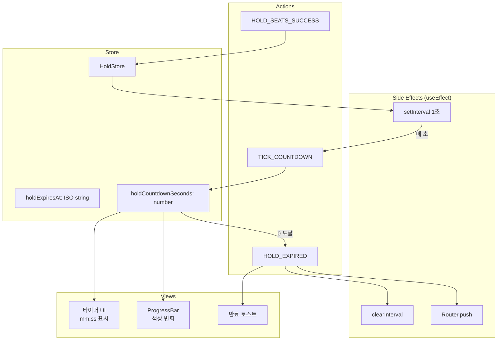
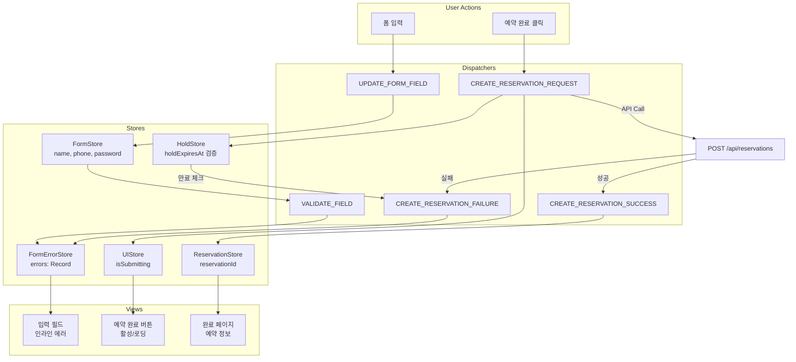
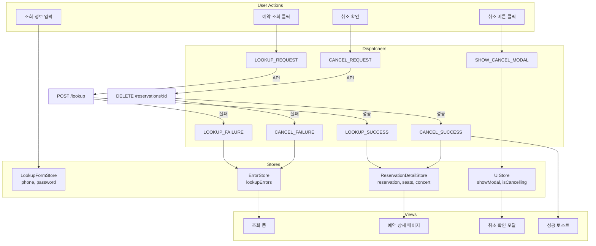

# Flux 아키텍처: 상태 흐름 시각화 및 Reducer 구현 예시

> 이 문서는 `state-definition.md`에서 정의된 상태 모델을 기반으로, Flux 패턴의 단방향 데이터 흐름(Action → Dispatcher → Store → View)을 시각화하고, `useReducer`를 활용한 최신 업계 표준 구현 방식을 제안합니다.

---

## 1. Flux 패턴 상태 흐름 시각화 (Mermaid)

### 1.1 좌석 선택 흐름 (Seat Selection Flow)

```mermaid
graph TB
    subgraph "User Actions (View)"
        A1[사용자 좌석 클릭]
        A2[예약하기 버튼 클릭]
    end
    
    subgraph "Dispatchers (Actions)"
        D1[SELECT_SEAT]
        D2[DESELECT_SEAT]
        D3[HOLD_SEATS_REQUEST]
        D4[HOLD_SEATS_SUCCESS]
        D5[HOLD_SEATS_FAILURE]
    end
    
    subgraph "Stores (State Logic)"
        S1[SelectionStore<br/>selectedSeatIds: Set]
        S2[SeatMapStore<br/>seats: Seat[]]
        S3[HoldStore<br/>heldSeatIds, holdExpiresAt]
        S4[UIStore<br/>isHoldingSeats, errors]
    end
    
    subgraph "Views (UI Components)"
        V1[좌석 배치도<br/>색상/클릭 가능 여부]
        V2[선택 현황 카드<br/>총액/좌석 수]
        V3[예약하기 버튼<br/>활성화/로딩]
    end
    
    A1 -->|좌석 ID| D1
    A1 -->|이미 선택됨| D2
    D1 --> S1
    D2 --> S1
    S1 --> V1
    S1 --> V2
    S1 --> V3
    
    A2 --> D3
    D3 --> S4
    D3 -->|API Call| API[POST /api/seats/hold]
    API -->|성공| D4
    API -->|실패| D5
    D4 --> S3
    D4 --> S1
    D5 --> S4
    S3 --> V3
    S4 --> V1
```

### 1.2 선점 타이머 흐름 (Hold Timer Flow)



### 1.3 예약 생성 흐름 (Reservation Creation Flow)



### 1.4 예약 조회 및 취소 흐름 (Lookup & Cancel Flow)



### 1.5 실시간 좌석 동기화 흐름 (Seat Polling Flow)

```mermaid
graph TB
    subgraph "Lifecycle"
        L1[페이지 진입]
        L2[페이지 이탈]
    end
    
    subgraph "Actions"
        A1[START_POLLING]
        A2[FETCH_SEATS]
        A3[UPDATE_SEATS]
        A4[STOP_POLLING]
        A5[ADJUST_FREQUENCY]
    end
    
    subgraph "Store"
        S1[SeatMapStore<br/>seats: Seat[]]
        S2[PollingStore<br/>intervalId, frequency]
        S3[HoldStore<br/>holdExpiresAt]
    end
    
    subgraph "Side Effects"
        E1[setInterval]
        E2[clearInterval]
        E3[React Query refetch]
    end
    
    subgraph "Views"
        V1[좌석 배치도<br/>실시간 업데이트]
    end
    
    L1 --> A1
    A1 --> S2
    S2 --> E1
    E1 -->|5초마다| A2
    A2 --> E3
    E3 --> A3
    A3 --> S1
    S1 --> V1
    
    S3 -->|1분 이하| A5
    A5 --> S2
    
    L2 --> A4
    A4 --> E2
```

---
## 2. useReducer 구현 예시 (업계 표준)

### 2.1 좌석 선택 Reducer

```typescript
// types/seat-selection.types.ts
export type SeatSelectionState = {
  selectedSeatIds: Set<string>;
  selectionError: string | null;
};

export type SeatSelectionAction =
  | { type: 'SELECT_SEAT'; payload: { seatId: string } }
  | { type: 'DESELECT_SEAT'; payload: { seatId: string } }
  | { type: 'CLEAR_SELECTION' }
  | { type: 'SET_ERROR'; payload: { message: string } }
  | { type: 'CLEAR_ERROR' };

// reducers/seat-selection.reducer.ts
import { SeatSelectionState, SeatSelectionAction } from '@/types/seat-selection.types';

const MAX_SEAT_SELECTION = 4;

export const seatSelectionReducer = (
  state: SeatSelectionState,
  action: SeatSelectionAction
): SeatSelectionState => {
  switch (action.type) {
    case 'SELECT_SEAT': {
      const { seatId } = action.payload;
      
      // 최대 선택 제한
      if (state.selectedSeatIds.size >= MAX_SEAT_SELECTION) {
        return {
          ...state,
          selectionError: `최대 ${MAX_SEAT_SELECTION}석까지 선택 가능합니다.`,
        };
      }
      
      // 이미 선택된 좌석
      if (state.selectedSeatIds.has(seatId)) {
        return state;
      }
      
      const newSelected = new Set(state.selectedSeatIds);
      newSelected.add(seatId);
      
      return {
        selectedSeatIds: newSelected,
        selectionError: null,
      };
    }
    
    case 'DESELECT_SEAT': {
      const { seatId } = action.payload;
      const newSelected = new Set(state.selectedSeatIds);
      newSelected.delete(seatId);
      
      return {
        selectedSeatIds: newSelected,
        selectionError: null,
      };
    }
    
    case 'CLEAR_SELECTION':
      return {
        selectedSeatIds: new Set(),
        selectionError: null,
      };
    
    case 'SET_ERROR':
      return {
        ...state,
        selectionError: action.payload.message,
      };
    
    case 'CLEAR_ERROR':
      return {
        ...state,
        selectionError: null,
      };
    
    default:
      return state;
  }
};

export const initialSeatSelectionState: SeatSelectionState = {
  selectedSeatIds: new Set(),
  selectionError: null,
};
```

### 2.2 선점 타이머 Reducer

```typescript
// types/hold-timer.types.ts
export type HoldTimerState = {
  heldSeatIds: string[];
  holdExpiresAt: string | null;
  holdCountdownSeconds: number;
  isActive: boolean;
};

export type HoldTimerAction =
  | { type: 'START_HOLD'; payload: { seatIds: string[]; expiresAt: string } }
  | { type: 'TICK_COUNTDOWN' }
  | { type: 'HOLD_EXPIRED' }
  | { type: 'CLEAR_HOLD' };

// reducers/hold-timer.reducer.ts
import { HoldTimerState, HoldTimerAction } from '@/types/hold-timer.types';

const HOLD_DURATION_SECONDS = 300; // 5분

export const holdTimerReducer = (
  state: HoldTimerState,
  action: HoldTimerAction
): HoldTimerState => {
  switch (action.type) {
    case 'START_HOLD': {
      const { seatIds, expiresAt } = action.payload;
      const now = Date.now();
      const expireTime = new Date(expiresAt).getTime();
      const remainingSeconds = Math.max(0, Math.floor((expireTime - now) / 1000));
      
      return {
        heldSeatIds: seatIds,
        holdExpiresAt: expiresAt,
        holdCountdownSeconds: remainingSeconds,
        isActive: true,
      };
    }
    
    case 'TICK_COUNTDOWN': {
      if (!state.isActive || state.holdCountdownSeconds <= 0) {
        return state;
      }
      
      const newSeconds = state.holdCountdownSeconds - 1;
      
      // 만료 시 자동으로 HOLD_EXPIRED 처리
      if (newSeconds <= 0) {
        return {
          ...state,
          holdCountdownSeconds: 0,
          isActive: false,
        };
      }
      
      return {
        ...state,
        holdCountdownSeconds: newSeconds,
      };
    }
    
    case 'HOLD_EXPIRED':
      return {
        ...state,
        holdCountdownSeconds: 0,
        isActive: false,
      };
    
    case 'CLEAR_HOLD':
      return initialHoldTimerState;
    
    default:
      return state;
  }
};

export const initialHoldTimerState: HoldTimerState = {
  heldSeatIds: [],
  holdExpiresAt: null,
  holdCountdownSeconds: 0,
  isActive: false,
};
```

### 2.3 예약 폼 Reducer

```typescript
// types/reservation-form.types.ts
export type ReservationFormState = {
  customerName: string;
  phoneNumber: string;
  password: string;
  errors: {
    customerName?: string;
    phoneNumber?: string;
    password?: string;
  };
  isDirty: boolean;
};

export type ReservationFormAction =
  | { type: 'UPDATE_FIELD'; payload: { field: keyof Omit<ReservationFormState, 'errors' | 'isDirty'>; value: string } }
  | { type: 'VALIDATE_FIELD'; payload: { field: keyof Omit<ReservationFormState, 'errors' | 'isDirty'> } }
  | { type: 'VALIDATE_ALL' }
  | { type: 'SET_ERROR'; payload: { field: string; message: string } }
  | { type: 'CLEAR_ERRORS' }
  | { type: 'RESET_FORM' };

// reducers/reservation-form.reducer.ts
import { ReservationFormState, ReservationFormAction } from '@/types/reservation-form.types';

const PHONE_REGEX = /^010-\d{4}-\d{4}$/;
const PASSWORD_MIN_LENGTH = 8;
const PASSWORD_MAX_LENGTH = 20;

const validateField = (field: string, value: string): string | undefined => {
  switch (field) {
    case 'customerName':
      if (!value.trim()) return '이름을 입력해주세요.';
      if (value.trim().length < 2) return '이름은 2자 이상이어야 합니다.';
      if (value.length > 50) return '이름은 50자 이하여야 합니다.';
      break;
    
    case 'phoneNumber':
      if (!value) return '휴대폰 번호를 입력해주세요.';
      if (!PHONE_REGEX.test(value)) return '올바른 형식으로 입력해주세요. (010-XXXX-XXXX)';
      break;
    
    case 'password':
      if (!value) return '비밀번호를 입력해주세요.';
      if (value.length < PASSWORD_MIN_LENGTH) return `비밀번호는 ${PASSWORD_MIN_LENGTH}자 이상이어야 합니다.`;
      if (value.length > PASSWORD_MAX_LENGTH) return `비밀번호는 ${PASSWORD_MAX_LENGTH}자 이하여야 합니다.`;
      break;
  }
  return undefined;
};

export const reservationFormReducer = (
  state: ReservationFormState,
  action: ReservationFormAction
): ReservationFormState => {
  switch (action.type) {
    case 'UPDATE_FIELD': {
      const { field, value } = action.payload;
      return {
        ...state,
        [field]: value,
        isDirty: true,
      };
    }
    
    case 'VALIDATE_FIELD': {
      const { field } = action.payload;
      const value = state[field];
      const error = validateField(field, value);
      
      return {
        ...state,
        errors: {
          ...state.errors,
          [field]: error,
        },
      };
    }
    
    case 'VALIDATE_ALL': {
      const nameError = validateField('customerName', state.customerName);
      const phoneError = validateField('phoneNumber', state.phoneNumber);
      const passwordError = validateField('password', state.password);
      
      return {
        ...state,
        errors: {
          customerName: nameError,
          phoneNumber: phoneError,
          password: passwordError,
        },
      };
    }
    
    case 'SET_ERROR': {
      const { field, message } = action.payload;
      return {
        ...state,
        errors: {
          ...state.errors,
          [field]: message,
        },
      };
    }
    
    case 'CLEAR_ERRORS':
      return {
        ...state,
        errors: {},
      };
    
    case 'RESET_FORM':
      return initialReservationFormState;
    
    default:
      return state;
  }
};

export const initialReservationFormState: ReservationFormState = {
  customerName: '',
  phoneNumber: '',
  password: '',
  errors: {},
  isDirty: false,
};
```

### 2.4 통합 사용 예시 (React Component)

```typescript
// components/seats/SeatSelectionPage.tsx
'use client';

import { useReducer, useEffect, useCallback } from 'react';
import { useRouter } from 'next/navigation';
import { 
  seatSelectionReducer, 
  initialSeatSelectionState 
} from '@/reducers/seat-selection.reducer';
import { 
  holdTimerReducer, 
  initialHoldTimerState 
} from '@/reducers/hold-timer.reducer';
import { useSeatMapQuery, useHoldSeatsMutation } from '@/hooks/queries/seats';

export default function SeatSelectionPage({ concertId }: { concertId: string }) {
  const router = useRouter();
  
  // 좌석 선택 상태
  const [selectionState, dispatchSelection] = useReducer(
    seatSelectionReducer,
    initialSeatSelectionState
  );
  
  // 선점 타이머 상태
  const [timerState, dispatchTimer] = useReducer(
    holdTimerReducer,
    initialHoldTimerState
  );
  
  // 서버 상태
  const { data: seatMap, refetch } = useSeatMapQuery(concertId);
  const holdMutation = useHoldSeatsMutation();
  
  // 좌석 클릭 핸들러
  const handleSeatClick = useCallback((seatId: string) => {
    const seat = seatMap?.seats.find(s => s.id === seatId);
    
    if (!seat || seat.status !== 'available') {
      dispatchSelection({ 
        type: 'SET_ERROR', 
        payload: { message: '이미 선택된 좌석입니다.' } 
      });
      return;
    }
    
    if (selectionState.selectedSeatIds.has(seatId)) {
      dispatchSelection({ type: 'DESELECT_SEAT', payload: { seatId } });
    } else {
      dispatchSelection({ type: 'SELECT_SEAT', payload: { seatId } });
    }
  }, [seatMap, selectionState.selectedSeatIds]);
  
  // 예약하기 버튼 핸들러
  const handleHoldSeats = useCallback(async () => {
    const seatIds = Array.from(selectionState.selectedSeatIds);
    
    try {
      const result = await holdMutation.mutateAsync({
        concertId,
        seatIds,
      });
      
      // 선점 성공
      dispatchTimer({
        type: 'START_HOLD',
        payload: {
          seatIds: result.heldSeats.map(s => s.id),
          expiresAt: result.holdExpiresAt,
        },
      });
      
      // 선택 초기화
      dispatchSelection({ type: 'CLEAR_SELECTION' });
      
      // 예약 페이지로 이동
      router.push(`/book?seats=${seatIds.join(',')}`);
    } catch (error) {
      dispatchSelection({
        type: 'SET_ERROR',
        payload: { message: '좌석 선점에 실패했습니다.' },
      });
      
      // 최신 좌석 상태 동기화
      refetch();
    }
  }, [selectionState.selectedSeatIds, concertId, holdMutation, router, refetch]);
  
  // 타이머 tick
  useEffect(() => {
    if (!timerState.isActive) return;
    
    const interval = setInterval(() => {
      dispatchTimer({ type: 'TICK_COUNTDOWN' });
    }, 1000);
    
    return () => clearInterval(interval);
  }, [timerState.isActive]);
  
  // 만료 처리
  useEffect(() => {
    if (timerState.holdCountdownSeconds === 0 && timerState.isActive) {
      dispatchTimer({ type: 'HOLD_EXPIRED' });
      router.push(`/concerts/${concertId}/seats`);
    }
  }, [timerState.holdCountdownSeconds, timerState.isActive, concertId, router]);
  
  // 파생 상태 계산
  const selectedSeats = seatMap?.seats.filter(s => 
    selectionState.selectedSeatIds.has(s.id)
  ) ?? [];
  
  const totalAmount = selectedSeats.reduce((sum, seat) => sum + seat.price, 0);
  const canSubmit = selectionState.selectedSeatIds.size >= 1 && 
                    selectionState.selectedSeatIds.size <= 4 &&
                    !holdMutation.isPending;
  
  return (
    <div>
      {/* 좌석 배치도 */}
      <SeatMap 
        seats={seatMap?.seats ?? []} 
        selectedIds={selectionState.selectedSeatIds}
        onSeatClick={handleSeatClick}
      />
      
      {/* 선택 현황 */}
      <SelectionSummary 
        seats={selectedSeats}
        totalAmount={totalAmount}
      />
      
      {/* 에러 표시 */}
      {selectionState.selectionError && (
        <ErrorToast message={selectionState.selectionError} />
      )}
      
      {/* 예약하기 버튼 */}
      <button
        onClick={handleHoldSeats}
        disabled={!canSubmit}
      >
        {holdMutation.isPending ? '처리중...' : `예약하기 (${selectionState.selectedSeatIds.size}석)`}
      </button>
    </div>
  );
}
```
