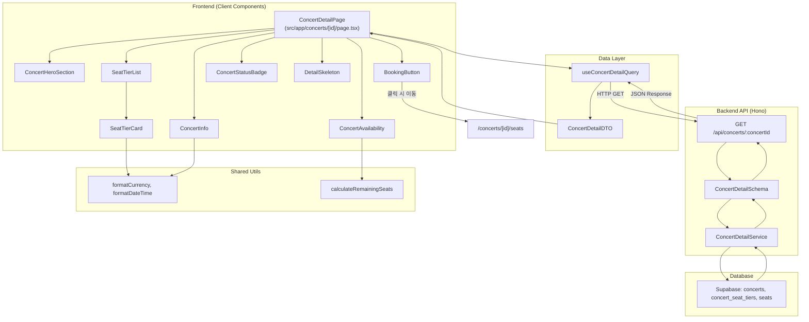

# Concert Detail Page Plan

> 역할: 특정 콘서트의 상세 정보를 표시하는 페이지. 히어로 이미지, 공연 정보, 등급별 가격 및 잔여 좌석 현황을 보여주고, 좌석 선택 페이지로 이동하는 진입점을 제공한다.

---

## 1. 개요 (Overview)

이 페이지는 다음 모듈들로 구성됩니다:

- **Module**: ConcertDetailQuery (`src/features/concert/hooks/useConcertDetailQuery.ts`) - React Query로 단일 콘서트 상세 정보 조회
- **Module**: ConcertHeroSection (`src/features/concert/components/ConcertHeroSection.tsx`) - 히어로 이미지 및 공연 제목 표시
- **Module**: ConcertInfo (`src/features/concert/components/ConcertInfo.tsx`) - 공연 일시, 장소 표시
- **Module**: SeatTierCard (`src/features/concert/components/SeatTierCard.tsx`) - 등급별 가격/잔여 좌석 카드
- **Module**: SeatTierList (`src/features/concert/components/SeatTierList.tsx`) - 등급 카드 그리드 레이아웃
- **Module**: ConcertAvailability (`src/features/concert/components/ConcertAvailability.tsx`) - 전체 잔여 좌석 현황 표시
- **Module**: BookingButton (`src/features/concert/components/BookingButton.tsx`) - 예약하기 버튼 (Sticky)
- **Module**: ConcertDetailBackendRoute (`src/features/concert/backend/route.ts`) - Hono 라우터: `GET /api/concerts/:concertId` 엔드포인트
- **Module**: ConcertDetailService (`src/features/concert/backend/service.ts`) - Supabase에서 콘서트 상세 + 등급 + 좌석 집계 조회
- **Module**: ConcertDetailSchema (`src/features/concert/backend/schema.ts`) - 요청/응답 zod 스키마
- **Module**: ConcertDetailDTO (`src/features/concert/lib/dto.ts`) - 클라이언트 측 DTO 재노출
- **Module**: ConcertStatusBadge (`src/features/concert/components/ConcertStatusBadge.tsx`) - 상태 배지 (published/archived/매진)
- **Module**: ErrorFallback (`src/components/ui/error-fallback.tsx`) - 에러 fallback UI
- **Module**: DetailSkeleton (`src/features/concert/components/DetailSkeleton.tsx`) - 로딩 스켈레톤

### 공통/재사용 가능 모듈 (Shared)
- **Module**: formatCurrency (`src/lib/utils/format.ts`) - 가격 포맷 유틸리티 (예: 250,000원)
- **Module**: formatDateTime (`src/lib/utils/format.ts`) - 날짜/시간 포맷 유틸리티 (date-fns 활용)
- **Module**: calculateRemainingSeats (`src/lib/utils/seat-calc.ts`) - 잔여 좌석 계산 로직 (공통 파생 상태)

---

## 2. Diagram (Mermaid)



---

## 3. Implementation Plan

| Module | Purpose | Public Interface | Internal Dependencies | Notes |
|--------|---------|------------------|-----------------------|-------|
| ConcertDetailQuery | 단일 콘서트 상세 조회 | `useConcertDetailQuery(concertId: string): UseQueryResult<ConcertDetailResponse, ApiError>` | `@/lib/remote/api-client`, `ConcertDetailDTO` | Query Key: `['concert', 'detail', concertId]` |
| ConcertHeroSection | 히어로 이미지 및 제목 | `props: { title: string; heroImage: string; status: ConcertStatus }` | Next.js Image, ConcertStatusBadge | placeholder 이미지: picsum.photos |
| ConcertInfo | 공연 일시, 장소 | `props: { performanceDate: string; venue: string }` | formatDateTime, lucide-react (Calendar, MapPin) | ISO 8601 → 로컬 포맷 |
| SeatTierCard | 등급별 정보 카드 | `props: { tier: SeatTier }` | formatCurrency, Badge (매진 표시) | 잔여석 10 이하 시 경고 색상 |
| SeatTierList | 등급 카드 그리드 | `props: { tiers: SeatTier[] }` | SeatTierCard | Grid 레이아웃 (md:grid-cols-2, lg:grid-cols-3) |
| ConcertAvailability | 전체 잔여 현황 | `props: { totalSeats: number; reservedSeats: number }` | calculateRemainingSeats | ProgressBar 또는 텍스트 표시 |
| BookingButton | 예약하기 버튼 | `props: { concertId: string; isSoldOut: boolean; isArchived: boolean }` | Next.js Link or Router | Sticky 하단 고정, 매진 시 비활성 |
| ConcertDetailRoute | Hono 라우터 | `registerConcertRoutes(app: Hono<AppEnv>)` | ConcertDetailService, Schema, `respond()` | 경로: `/api/concerts/:concertId` |
| ConcertDetailService | Supabase 쿼리 | `getConcertDetail(supabase: SupabaseClient, concertId: string): Promise<HandlerResult<ConcertDetailResponse, ErrorCode>>` | Supabase client, `success/failure` | 3개 쿼리 조합: concert + tiers + 좌석 집계 |
| ConcertDetailSchema | zod 스키마 | `ConcertDetailResponseSchema`, `SeatTierSchema` | `zod` | 중첩 객체: concert + tiers[] |
| ConcertDetailDTO | 프론트엔드 재노출 | `export { ConcertDetailResponseSchema, type ConcertDetailResponse, type SeatTier }` | `../backend/schema` | 클라이언트 import 편의 |
| ConcertStatusBadge | 상태 배지 | `props: { status: ConcertStatus; isSoldOut: boolean }` | shadcn-ui Badge | published(green), archived(gray), 매진(red) |
| DetailSkeleton | 로딩 스켈레톤 | `props: {}` | tailwindcss 애니메이션 | 히어로 + 카드 레이아웃 모방 |
| formatCurrency | 가격 포맷 | `formatCurrency(amount: number): string` | Intl.NumberFormat | 예: 250000 → "250,000원" |
| formatDateTime | 날짜 포맷 | `formatDateTime(iso: string, format: string): string` | date-fns | 예: "2025-12-25 19:00" |
| calculateRemainingSeats | 잔여 좌석 계산 | `calculateRemainingSeats(total: number, reserved: number): number` | - | 순수 함수 (파생 상태) |

### 3.1 Presentation QA Sheet

| Feature | Scenario | Steps | Expected | Edge |
|---------|----------|-------|----------|------|
| 콘서트 상세 조회 | 유효한 ID | `/concerts/[uuid]` 접속 | 히어로 이미지, 제목, 일시, 등급 카드 표시 | 로딩 스켈레톤 표시 |
| 매진 표시 | 전체 좌석 매진 | 모든 좌석 reserved | "매진" 배지 + 버튼 비활성 | 등급별 개별 매진 표시 |
| Archived 콘서트 | draft/archived 상태 | URL 직접 접근 | "해당 콘서트는 예약할 수 없습니다" 메시지 또는 404 | published 아닌 경우 차단 |
| 잔여석 경고 | 특정 등급 10석 이하 | 등급 카드 렌더링 | 빨간색 강조 또는 "서두르세요!" 표시 | 색상 차별화 |
| 예약하기 버튼 클릭 | 버튼 클릭 | 버튼 클릭 | `/concerts/[id]/seats` 페이지로 이동 | 매진 시 클릭 불가 |
| 에러 상태 | 유효하지 않은 ID | 존재하지 않는 UUID | 404 또는 "콘서트를 찾을 수 없습니다" 메시지 | ErrorFallback 표시 |
| 로딩 상태 | 느린 네트워크 | 데이터 로드 중 | 스켈레톤 UI 표시 | 최소 3초 시뮬레이션 |

### 3.2 Business Logic Unit Test Plan

| Module | Test Case | Input | Expected Output | Mock |
|--------|-----------|-------|-----------------|------|
| ConcertDetailService | 콘서트 조회 성공 | valid concertId | `success({ concert: {...}, tiers: [...] })` | Supabase mock (published 콘서트) |
| ConcertDetailService | 콘서트 없음 | invalid UUID | `failure(404, 'CONCERT_NOT_FOUND', '...')` | Supabase mock (null 반환) |
| ConcertDetailService | DB 연결 오류 | valid concertId | `failure(500, 'DB_ERROR', '...')` | Supabase mock (에러 throw) |
| ConcertDetailSchema | 응답 검증 성공 | valid JSON | 파싱 성공 | none |
| ConcertDetailSchema | 응답 검증 실패 | 필수 필드 누락 | zod 에러 발생 | none |
| calculateRemainingSeats | 잔여 계산 | total=500, reserved=350 | 150 | none |
| calculateRemainingSeats | 매진 | total=100, reserved=100 | 0 | none |
| formatCurrency | 가격 포맷 | 250000 | "250,000원" | none |
| formatDateTime | 날짜 포맷 | ISO 8601 | "2025년 12월 25일 19:00" | none |

### 3.3 Risk & Mitigation

- **Risk**: 등급별 집계 쿼리 성능 저하 (많은 좌석 수)
  - **Mitigation**: Supabase 인덱스 최적화, 캐싱 전략 (React Query staleTime 설정)
- **Risk**: 동시 접속 시 잔여 좌석 수 불일치
  - **Mitigation**: 상세 페이지는 참고용, 실제 선점은 좌석 선택 페이지에서 처리
- **Risk**: archived 상태 콘서트에 직접 URL 접근
  - **Mitigation**: 서비스 레이어에서 status 검증, 404 반환
- **Risk**: 히어로 이미지 로딩 실패
  - **Mitigation**: placeholder 이미지 제공 (picsum.photos 또는 기본 이미지)

### 3.4 Traceability Matrix

| 요구사항 | 문서 출처 | 대응 모듈 |
|----------|-----------|-----------|
| 콘서트 상세 정보 표시 | prd.md, userflow.md (Usecase 001-2) | ConcertDetailService, ConcertDetailQuery |
| 히어로 이미지 및 제목 | prd.md (콘서트 상세 페이지) | ConcertHeroSection |
| 등급별 가격 및 잔여석 | database.md, userflow.md (BR-003) | SeatTierCard, SeatTierList |
| 전체 잔여 좌석 현황 | userflow.md (BR-002) | ConcertAvailability, calculateRemainingSeats |
| published 상태만 노출 | userflow.md (BR-001) | ConcertDetailService (WHERE status='published') |
| 매진 처리 | prd.md, userflow.md (Edge Case 5) | ConcertStatusBadge, BookingButton |
| 소프트 삭제 정책 | database.md (BR-004) | ConcertDetailService (`deleted_at IS NULL`) |

### 3.5 TODO Summary

```text
TODO: ConcertDetailService 구현 (3개 쿼리 조합: concert + tiers + 좌석 집계)
TODO: ConcertDetailSchema 정의 (zod, 중첩 구조)
TODO: ConcertDetailRoute 등록 (Hono, /api/concerts/:concertId)
TODO: useConcertDetailQuery 훅 구현 (React Query)
TODO: ConcertHeroSection 컴포넌트 구현 (Next.js Image)
TODO: ConcertInfo 컴포넌트 구현 (날짜/장소 포맷)
TODO: SeatTierCard 컴포넌트 구현 (가격/잔여석 표시)
TODO: SeatTierList 컴포넌트 구현 (그리드 레이아웃)
TODO: ConcertAvailability 컴포넌트 구현 (진행바 또는 텍스트)
TODO: BookingButton 컴포넌트 구현 (Sticky, 매진 처리)
TODO: ConcertStatusBadge 컴포넌트 구현 (상태별 색상)
TODO: DetailSkeleton 컴포넌트 구현 (로딩 스켈레톤)
TODO: formatCurrency 유틸 구현 (Intl.NumberFormat)
TODO: formatDateTime 유틸 구현 (date-fns)
TODO: calculateRemainingSeats 유틸 구현 (순수 함수)
TODO: ConcertDetailPage 통합 (/app/concerts/[id]/page.tsx)
TODO: API 테스트 (MSW 또는 mock)
TODO: 단위 테스트 작성 (Service, Schema, Utils)
```

---

## 4. 설계 원칙

- **구현 상세 배제**: 이 문서는 인터페이스와 모듈 책임만 정의하며, 구체적인 비즈니스 로직 코드는 포함하지 않는다.
- **타입 안정성**: 모든 API 응답은 zod 스키마로 검증하고, 프론트엔드는 DTO를 통해 타입 안전하게 접근한다.
- **재사용 가능 설계**: 
  - formatCurrency, formatDateTime 등은 `src/lib/utils/`에 위치하여 다른 페이지에서도 재사용 가능
  - SeatTierCard는 홈 페이지나 검색 결과에서도 활용 가능하도록 일반화
- **단방향 데이터 흐름**: 사용자 액션(버튼 클릭) → 라우터 이동 → 좌석 선택 페이지 로드 순서 유지
- **성능 고려**: React Query의 staleTime/cacheTime을 활용하여 불필요한 재조회 방지

---

## 5. 검증 체크리스트

| 항목 | 기준 |
|------|------|
| 문서 수집 | `/docs` 1차 md 전부 반영 (prd.md, userflow.md, database.md, state-definition.md 등) |
| usecase 매핑 | Usecase 001-2 (콘서트 상세 조회) 완전 연결 |
| 상태 추출 | `concertDetail`, `seatTiers` 서버 상태 반영 |
| 모듈 경로 | AGENTS.md 구조 준수 (`src/features/concert/`, `src/app/concerts/[id]/page.tsx`) |
| 공통 모듈 분리 | formatCurrency, formatDateTime, calculateRemainingSeats는 `src/lib/utils/`에 위치 |
| 테스트 계획 | Presentation QA + Logic Unit Test 모두 존재 |
| Diagram | mermaid 문법 정상 렌더 가능 |
| Traceability | 주요 요구사항 7개 매핑 완료 |

---

## 6. Anti-Patterns (금지)

- Hono 라우트 경로에서 `/api` prefix 누락
- `concertDetail`을 클라이언트 전역 상태(Zustand)로 관리 (React Query로 충분)
- 컴포넌트 내부에서 직접 Supabase 클라이언트 생성
- 하드코딩된 콘서트 ID 또는 가격 (환경 변수 또는 동적 데이터 사용)
- 비동기 로직을 page.tsx에서 직접 처리 (`async` 함수 사용 금지, Client Component 유지)
- 잔여 좌석 계산 로직을 여러 곳에 중복 작성 (공통 유틸로 분리)

---

## 7. 실행 Pseudo

```pseudo
input: 사용자가 콘서트 상세 페이지 접속 (/concerts/[concertId])
1. ConcertDetailPage 컴포넌트 마운트
2. useConcertDetailQuery(concertId) 훅 실행
   2.1. React Query: GET /api/concerts/:concertId 호출
   2.2. Hono 라우터: ConcertDetailRoute 실행
   2.3. ConcertDetailService: Supabase 쿼리 (3개 조합)
       - concerts 테이블: 기본 정보
       - concert_seat_tiers: 등급 정보
       - seats: 좌석 집계 (total, reserved)
   2.4. 응답: ConcertDetailResponseSchema 검증
   2.5. React Query 캐시 업데이트
3. ConcertDetailPage 렌더링
   3.1. isLoading=true → DetailSkeleton 표시
   3.2. isLoading=false, data 존재 → 컴포넌트 렌더링
       - ConcertHeroSection (히어로 이미지 + 제목 + 상태 배지)
       - ConcertInfo (일시 + 장소)
       - SeatTierList (등급 카드 그리드)
       - ConcertAvailability (전체 잔여 현황)
       - BookingButton (예약하기 버튼, Sticky)
   3.3. error 존재 → ErrorFallback 표시
4. 사용자 "예약하기" 버튼 클릭 → `/concerts/[concertId]/seats` 이동
output: 좌석 선택 페이지 진입
```

---

## 8. 출력 예시

```json
{
  "pageName": "concert-detail",
  "modules": [
    "ConcertDetailQuery",
    "ConcertHeroSection",
    "ConcertInfo",
    "SeatTierCard",
    "SeatTierList",
    "ConcertAvailability",
    "BookingButton",
    "ConcertDetailRoute",
    "ConcertDetailService",
    "ConcertDetailSchema",
    "ConcertDetailDTO",
    "ConcertStatusBadge",
    "DetailSkeleton",
    "formatCurrency",
    "formatDateTime",
    "calculateRemainingSeats"
  ],
  "planPath": "/docs/pages/concert-detail/plan.md",
  "todoCount": 18
}
```

---

이 계획서는 콘서트 상세 페이지의 모든 모듈 책임과 인터페이스를 정의하여, 구현 단계에서 일관된 설계를 유지하고 테스트 가능성을 보장합니다.
