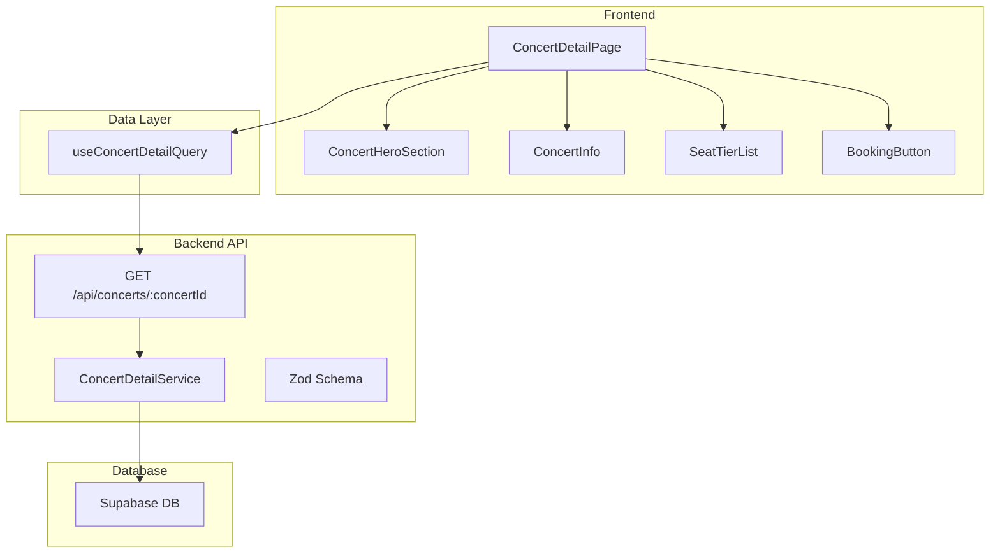

다음은 `plan.md`의 핵심 내용을 유지하며 더 간결하게 정리한 버전입니다.

---

# Concert Detail Page Plan (Concise Ver.)

> **역할**: 콘서트 상세 정보를 표시하고, 좌석 선택 페이지로 연결하는 페이지.

---

## 1. 개요 (Overview)

- **ConcertDetailQuery** (`.../hooks/useConcertDetailQuery.ts`): 콘서트 상세 정보 조회 (React Query)
- **ConcertHeroSection** (`.../components/ConcertHeroSection.tsx`): 히어로 이미지, 공연 제목 표시
- **ConcertInfo** (`.../components/ConcertInfo.tsx`): 공연 일시, 장소 표시
- **SeatTierList** (`.../components/SeatTierList.tsx`): 등급별 가격/잔여석 카드 목록
- **ConcertAvailability** (`.../components/ConcertAvailability.tsx`): 전체 잔여 좌석 현황 표시
- **BookingButton** (`.../components/BookingButton.tsx`): 예약 페이지로 이동하는 Sticky 버튼
- **ConcertDetailBackendRoute** (`.../backend/route.ts`): `GET /api/concerts/:concertId` API 엔드포인트
- **ConcertDetailService** (`.../backend/service.ts`): 콘서트 상세 정보 DB 조회 로직
- **ConcertDetailSchema** (`.../backend/schema.ts`): API 요청/응답 데이터 스키마 (zod)

---

## 2. Diagram (Mermaid)

---

## 3. Implementation Plan

### 3.1 모듈별 구현 계획

- **ConcertDetailService (Backend)**
  - Supabase 클라이언트를 사용하여 `concerts`, `concert_seat_tiers`, `seats` 테이블의 정보를 조합하여 반환합니다.
  - `status`가 'published'인 콘서트만 조회합니다.

- **ConcertDetailRoute (Backend)**
  - `/api/concerts/:concertId` 경로의 GET 요청을 처리합니다.
  - `ConcertDetailService`를 호출하고 결과를 JSON으로 반환하며, `zod` 스키마로 응답을 검증합니다.

- **ConcertDetailQuery (Frontend)**
  - `useQuery` 훅을 사용하여 API를 호출합니다.
  - Query Key: `['concert', 'detail', concertId]`

- **ConcertDetailPage (Frontend)**
  - `useConcertDetailQuery`의 `data`, `isLoading`, `error` 상태에 따라 UI를 렌더링합니다.
    - 로딩 중: 스켈레톤 UI 표시
    - 에러 발생 시: 에러 Fallback UI 표시
    - 데이터 로드 완료: `ConcertHeroSection`, `ConcertInfo`, `SeatTierList` 등 하위 컴포넌트에 데이터를 전달

- **BookingButton (Frontend)**
  - 하단에 고정(Sticky)되며, 클릭 시 `/concerts/[id]/seats` 페이지로 이동합니다.
  - 콘서트가 매진되거나 종료된 경우 비활성화됩니다.

### 3.2 Presentation QA Sheet

| 시나리오 | 실행 | 기대 결과 |
|---|---|---|
| **정상 조회** | 유효한 콘서트 ID로 페이지 접근 | 콘서트 상세 정보(이미지, 제목, 일시, 등급)가 올바르게 표시됨 |
| **매진 상태** | 모든 좌석이 예약된 콘서트 조회 | "매진" 배지가 표시되고, 예약 버튼이 비활성화됨 |
| **존재하지 않는 콘서트** | 유효하지 않은 ID로 접근 | "콘서트를 찾을 수 없습니다" 메시지 또는 404 페이지 표시 |
| **네트워크 지연** | 데이터 로딩 중 | 스켈레톤 로딩 UI가 표시됨 |
| **예약 버튼 클릭** | 예약 가능한 콘서트에서 버튼 클릭 | 좌석 선택 페이지(`/concerts/[id]/seats`)로 이동함 |

### 3.3 Business Logic Unit Test

| 모듈 | 테스트 케이스 | 입력 | 기대 결과 |
|---|---|---|---|
| **ConcertDetailService** | 유효한 ID로 조회 성공 | `validConcertId` | `success` 객체와 콘서트 데이터 반환 |
| | 존재하지 않는 ID로 조회 | `invalidConcertId` | `failure` 객체와 404 에러 코드 반환 |
| **calculateRemainingSeats** | 잔여 좌석 계산 | `total: 100`, `reserved: 80` | `20` |
| | 매진 시 계산 | `total: 100`, `reserved: 100` | `0` |
| **ConcertDetailSchema** | 유효한 API 응답 데이터 | 올바른 JSON 객체 | 스키마 검증 통과 |
| | 유효하지 않은 API 응답 데이터 | 필수 필드가 누락된 JSON | 스키마 검증 실패 (에러 발생) |