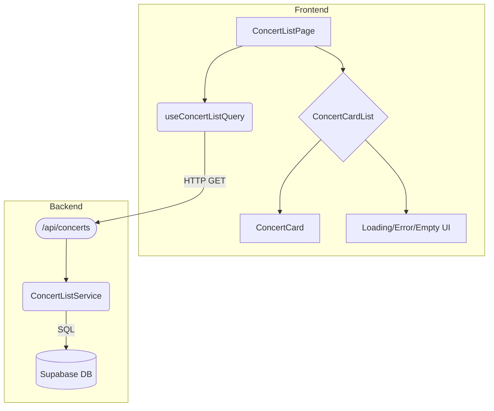

# Home Page Plan (요약)

> **문서 목적**: 콘서트 예약 시스템의 홈페이지 구현 계획을 간결하게 정의합니다.
> **대상 페이지**: `/` (콘서트 목록)

---

## 1. 개요

홈페이지는 사용자가 예약 가능한 콘서트 목록을 탐색하고 상세 페이지로 이동할 수 있는 랜딩 페이지입니다.

| 모듈명 | 경로 | 설명 |
|---|---|---|
| **ConcertListPage** | `src/app/page.tsx` | 페이지 진입점 및 레이아웃 |
| **ConcertCardList** | `.../components/concert-card-list.tsx` | 콘서트 카드 목록 UI (로딩/에러/빈 상태 처리) |
| **ConcertCard** | `.../components/concert-card.tsx` | 개별 콘서트 정보 카드 UI |
| **useConcertListQuery** | `.../hooks/useConcertListQuery.ts` | 콘서트 목록 API 호출 및 상태 관리 |
| **ConcertListRoute** | `.../backend/route.ts` | 백엔드 API 라우트 (`GET /api/concerts`) |
| **ConcertListService** | `.../backend/service.ts` | 데이터베이스 조회 로직 |

---

## 2. Diagram

---

## 3. Implementation Plan

### 3.1. Presentation Layer (`/features/concert/components`)

- **ConcertCardList**: `isLoading`, `error`, `concerts` props를 받아 상태에 따라 `ConcertListSkeleton`, `EmptyState`, `ConcertCard` 목록을 렌더링합니다.
- **ConcertCard**: 콘서트 썸네일, 제목, 날짜, 장소를 표시하며 클릭 시 상세 페이지로 이동합니다.

**QA Sheet**

| 컴포넌트 | 시나리오 | 기대 출력 |
|---|---|---|
| **ConcertCardList** | 로딩 중 (`isLoading=true`) | 스켈레톤 UI 표시 |
| | 에러 발생 (`error` 객체 존재) | 에러 메시지 표시 |
| | 데이터 없음 (`concerts=[]`) | "예약 가능한 콘서트가 없습니다." 메시지 |
| **ConcertCard** | 카드 클릭 | `/concerts/[id]` 경로로 이동 |

### 3.2. Business Logic (Backend & Query)

- **ConcertListService**: `status='published'`이고 `deleted_at IS NULL`인 콘서트 목록을 `created_at` 기준으로 내림차순 정렬하여 DB에서 조회합니다.
- **ConcertListRoute**: Service를 호출하여 결과를 JSON으로 반환합니다.
- **useConcertListQuery**: React Query를 사용하여 `/api/concerts` API를 호출하고, 클라이언트 상태(data, isLoading, error)를 관리합니다.

**Unit Test (ConcertListService)**

- **Given** `published`와 `draft` 상태의 콘서트가 존재할 때, **When** `getConcertList`를 호출하면, **Then** `published` 상태의 콘서트만 반환되어야 합니다.
- **Given** 소프트 삭제된 콘서트가 존재할 때, **When** `getConcertList`를 호출하면, **Then** `deleted_at`이 `NULL`인 콘서트만 반환되어야 합니다.
- **Given** 데이터베이스 조회에 실패하면, **Then** `CONCERT_FETCH_FAILED` 에러를 포함한 `Failure` 결과를 반환해야 합니다.