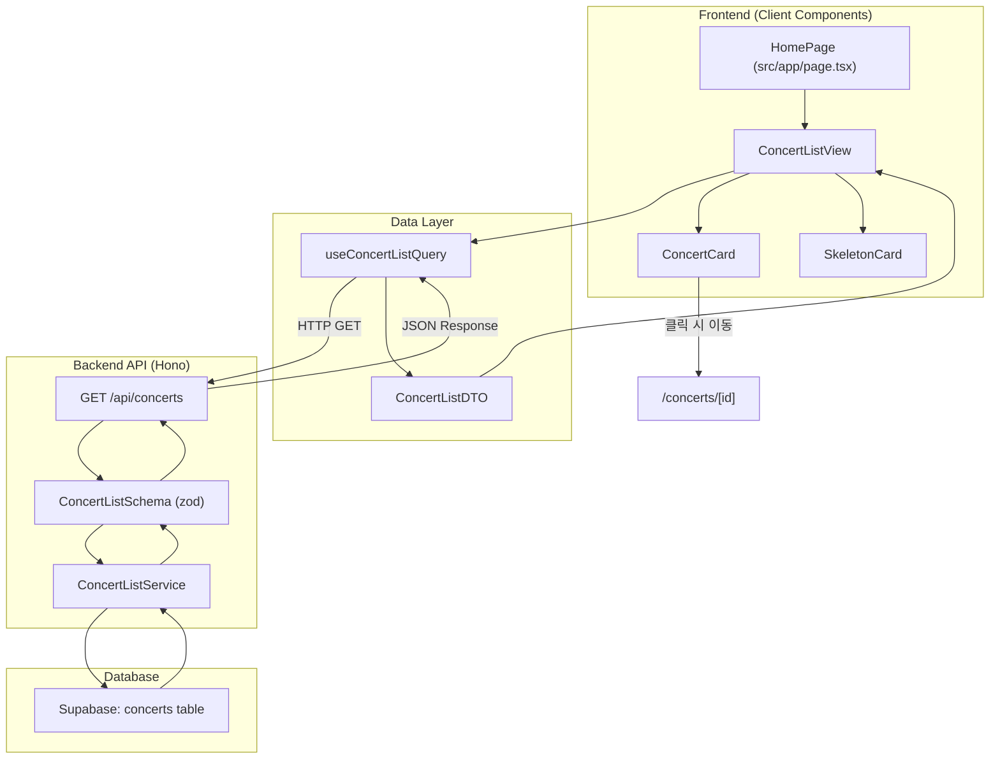

# Home Page Plan

> 역할: 콘서트 예약 시스템의 메인 랜딩 페이지. 예약 가능한 콘서트 목록을 조회하여 카드 형식으로 표시하고, 각 콘서트 상세 페이지로 이동할 수 있는 진입점을 제공한다.

---

## 1. Overview

이 페이지는 다음 모듈들로 구성됩니다:

- **Module**: ConcertListQuery (`src/features/concert/hooks/useConcertListQuery.ts`) - React Query로 공개(`published`) 콘서트 목록 조회
- **Module**: ConcertCard (`src/features/concert/components/ConcertCard.tsx`) - 개별 콘서트 정보를 카드 형식으로 렌더링
- **Module**: ConcertListView (`src/features/concert/components/ConcertListView.tsx`) - 콘서트 카드 그리드 레이아웃 및 빈 상태 처리
- **Module**: ConcertListBackendRoute (`src/features/concert/backend/route.ts`) - Hono 라우터: `GET /api/concerts` 엔드포인트 정의
- **Module**: ConcertListService (`src/features/concert/backend/service.ts`) - Supabase에서 `status='published'` 콘서트 목록 조회 로직
- **Module**: ConcertListSchema (`src/features/concert/backend/schema.ts`) - 요청/응답 zod 스키마 정의
- **Module**: ConcertListDTO (`src/features/concert/lib/dto.ts`) - 클라이언트 측 DTO 재노출 (frontend에서 import 용도)
- **Module**: ErrorBoundary (`src/components/ui/error-boundary.tsx`) - 데이터 로드 실패 시 fallback UI (shadcn-ui 설치 필요 시 고려)
- **Module**: SkeletonCard (`src/components/ui/skeleton-card.tsx`) - 로딩 중 스켈레톤 UI 컴포넌트

---

## 2. Diagram (Mermaid)



---

## 3. Implementation Plan

| Module | Purpose | Public Interface | Internal Dependencies | Notes |
|--------|---------|------------------|-----------------------|-------|
| ConcertListQuery | React Query 훅으로 콘서트 목록 서버 상태 관리 | `useConcertListQuery(): UseQueryResult<ConcertListResponse, ApiError>` | `@/lib/remote/api-client`, `ConcertListDTO` | Query Key: `['concerts', 'published']` |
| ConcertCard | 개별 콘서트 카드 UI | `props: { concert: ConcertSummary; onClick?: () => void }` | `lucide-react` (이미지 fallback), Link from Next.js | 썸네일, 제목, 상태 배지 표시 |
| ConcertListView | 콘서트 카드 그리드 레이아웃 및 빈 상태 처리 | `props: { concerts: ConcertSummary[]; isLoading: boolean; error: ApiError \| null }` | ConcertCard, SkeletonCard, ErrorBoundary | 빈 상태: "예약 가능한 콘서트가 없습니다" 메시지 |
| ConcertListRoute | Hono 라우터: `GET /api/concerts` | `registerConcertRoutes(app: Hono<AppEnv>)` | ConcertListService, ConcertListSchema, `respond()` 헬퍼 | 경로: `/api/concerts` (반드시 `/api` prefix 포함) |
| ConcertListService | Supabase 쿼리 래퍼 | `getPublishedConcerts(supabase: SupabaseClient): Promise<HandlerResult<ConcertListResponse, ErrorCode>>` | Supabase client (`c.get('supabase')`), `success/failure` 헬퍼 | 조건: `status='published' AND deleted_at IS NULL` |
| ConcertListSchema | zod 스키마 정의 | `ConcertListResponseSchema`, `ConcertSummarySchema` | `zod` | 응답 타입 export: `ConcertListResponse`, `ConcertSummary` |
| ConcertListDTO | 프론트엔드 재노출 | `export { ConcertListResponseSchema, type ConcertListResponse, type ConcertSummary } from '../backend/schema'` | `../backend/schema` | 클라이언트 측 import 편의 |
| SkeletonCard | 로딩 스켈레톤 UI | `props: { count?: number }` | tailwindcss 애니메이션 | 카드 레이아웃과 동일한 크기 유지 |
| ErrorBoundary | 에러 fallback UI | `props: { error: ApiError; retry?: () => void }` | - | 선택적: shadcn-ui `Alert` 사용 가능 |

### 3.1 Presentation QA Sheet

| Feature | Scenario | Steps | Expected | Edge |
|---------|----------|-------|----------|------|
| 콘서트 목록 조회 | 최초 진입 | 홈 페이지 접속 | published 콘서트 카드 그리드 표시 | 로딩 스피너 또는 스켈레톤 표시 |
| 빈 상태 처리 | 콘서트 없음 | published 콘서트 0개 | "예약 가능한 콘서트가 없습니다" 메시지 표시 | 재조회 버튼 포함 여부 선택 |
| 콘서트 카드 클릭 | 카드 클릭 | 콘서트 카드 클릭 | `/concerts/[concertId]` 페이지로 이동 | Next.js Link 사용 |
| 에러 상태 처리 | DB 연결 오류 | API 실패 | "오류가 발생했습니다. 다시 시도해주세요." 메시지 + 재시도 버튼 | ErrorBoundary에서 처리 |
| 매진 표시 | 잔여 좌석 0 | 콘서트 카드에 "매진" 배지 표시 | 배지 색상 차별화 (예: 빨간색) | 실제 매진 여부는 상세 페이지에서 확인 |
| 스켈레톤 로딩 | 데이터 로드 중 | 쿼리 `isLoading=true` | 카드 개수만큼 스켈레톤 표시 | 최소 3개 스켈레톤 카드 표시 |

### 3.2 Business Logic Unit Test Plan

| Module | Test Case | Input | Expected Output | Mock |
|--------|-----------|-------|-----------------|------|
| ConcertListService | 공개 콘서트 조회 성공 | `supabase.from('concerts').select()` 호출 | `success({ concerts: [...] })` 반환 | Supabase mock (published 콘서트 2개) |
| ConcertListService | 콘서트 없음 | 빈 배열 반환 | `success({ concerts: [] })` 반환 | Supabase mock (빈 배열) |
| ConcertListService | DB 연결 오류 | Supabase 쿼리 실패 | `failure(500, 'DB_ERROR', 'Database error')` 반환 | Supabase mock (에러 throw) |
| ConcertListSchema | 응답 스키마 검증 | 유효한 JSON 객체 | 파싱 성공 | none |
| ConcertListSchema | 응답 스키마 검증 실패 | 필수 필드 누락 | zod 에러 발생 | none |
| ConcertListQuery | React Query 캐시 | 두 번째 호출 | 캐시된 데이터 반환 (API 재호출 없음) | MSW 또는 axios mock |
| ConcertCard | 클릭 이벤트 | 카드 클릭 | `router.push('/concerts/[id]')` 호출 | Next.js Router mock |

### 3.3 Risk & Mitigation

- **Risk**: 콘서트 목록이 많을 경우 초기 로딩 시간 증가
  - **Mitigation**: 페이지네이션 또는 무한 스크롤 도입 (향후 확장)
- **Risk**: 썸네일 이미지가 없는 콘서트
  - **Mitigation**: placeholder 이미지 제공 (picsum.photos 또는 로컬 asset)
- **Risk**: published 상태가 아닌 콘서트에 직접 URL 접근 시도
  - **Mitigation**: 상세 페이지에서 404 또는 접근 차단 처리 (상세 페이지 plan에서 처리)

### 3.4 Traceability Matrix

| 요구사항 | 문서 출처 | 대응 모듈 |
|----------|-----------|-----------|
| 예약 가능한 콘서트 목록 조회 | prd.md, userflow.md (Usecase 001) | ConcertListService, ConcertListQuery |
| `status='published'` 필터링 | database.md, userflow.md (BR-001) | ConcertListService (WHERE 조건) |
| 카드 형식 UI | prd.md (홈 페이지) | ConcertCard, ConcertListView |
| 빈 상태 처리 | userflow.md (Edge Case 1) | ConcertListView (빈 배열 조건 분기) |
| 소프트 삭제 정책 | database.md, userflow.md (BR-004) | ConcertListService (`deleted_at IS NULL` 조건) |
| 로딩 상태 표시 | state-definition.md (isLoadingConcerts) | SkeletonCard, ConcertListView |

### 3.5 TODO Summary

```text
TODO: ConcertListService 구현 (Supabase 쿼리 래퍼)
TODO: ConcertListSchema 정의 (zod 스키마)
TODO: ConcertListRoute 등록 (Hono 라우터)
TODO: useConcertListQuery 훅 구현 (React Query)
TODO: ConcertCard 컴포넌트 구현 (썸네일, 제목, 배지)
TODO: ConcertListView 컴포넌트 구현 (그리드 레이아웃)
TODO: SkeletonCard 컴포넌트 구현 (로딩 스켈레톤)
TODO: ErrorBoundary 컴포넌트 구현 (에러 fallback)
TODO: HomePage 통합 (ConcertListView 마운트)
TODO: API 클라이언트 테스트 (MSW 또는 mock)
TODO: 단위 테스트 작성 (ConcertListService, Schema)
```

---

## 4. 설계 원칙

- **구현 상세 배제**: 이 문서는 인터페이스와 모듈 책임만 정의하며, 구체적인 비즈니스 로직 코드는 포함하지 않는다.
- **타입 안정성**: 모든 API 응답은 zod 스키마로 검증하고, 프론트엔드는 DTO를 통해 타입 안전하게 접근한다.
- **재사용 가능 설계**: ConcertCard는 향후 다른 페이지(검색 결과, 추천 목록 등)에서도 재사용 가능하도록 props 인터페이스를 일반화한다.
- **단방향 데이터 흐름**: 사용자 액션(카드 클릭) → 라우터 이동 → 상세 페이지 로드 순서를 유지한다.

---

## 5. 검증 체크리스트

| 항목 | 기준 |
|------|------|
| 문서 수집 | `/docs` 1차 md 전부 반영 (prd.md, userflow.md, database.md, state-definition.md 등) |
| usecase 매핑 | Usecase 001 (콘서트 탐색) 완전 연결 |
| 상태 추출 | `publishedConcertList`, `isLoadingConcerts` 서버 상태 반영 |
| 모듈 경로 | AGENTS.md 구조 준수 (`src/features/concert/`, `src/app/page.tsx`) |
| 테스트 계획 | Presentation QA + Logic Unit Test 모두 존재 |
| Diagram | mermaid 문법 정상 렌더 가능 |
| Traceability | 주요 요구사항 5개 이상 매핑 완료 |

---

## 6. Anti-Patterns (금지)

- Hono 라우트 경로에서 `/api` prefix 누락
- `publishedConcertList` 를 클라이언트 전역 상태(Zustand)로 관리 (React Query로 충분)
- 콘서트 카드 내부에서 직접 Supabase 클라이언트 생성
- 하드코딩된 콘서트 ID 또는 URL (환경 변수 또는 동적 라우팅 사용)
- 비동기 로직을 page.tsx에서 직접 처리 (`async` 함수 사용 금지, Client Component 유지)

---

## 7. 실행 Pseudo

```pseudo
input: 사용자 홈 페이지 접속 (/)
1. HomePage 컴포넌트 마운트
2. useConcertListQuery() 훅 실행
   2.1. React Query: GET /api/concerts 호출
   2.2. Hono 라우터: ConcertListRoute 실행
   2.3. ConcertListService: Supabase 쿼리 (status='published', deleted_at IS NULL)
   2.4. 응답: ConcertListResponseSchema 검증
   2.5. React Query 캐시 업데이트
3. ConcertListView 렌더링
   3.1. isLoading=true → SkeletonCard 표시
   3.2. isLoading=false, data 존재 → ConcertCard 그리드 표시
   3.3. isLoading=false, data 없음 → 빈 상태 메시지 표시
   3.4. error 존재 → ErrorBoundary fallback 표시
4. 사용자 카드 클릭 → Next.js Link로 `/concerts/[concertId]` 이동
output: 콘서트 상세 페이지 진입
```

---

## 8. 출력 예시

```json
{
  "pageName": "home",
  "modules": [
    "ConcertListQuery",
    "ConcertCard",
    "ConcertListView",
    "ConcertListRoute",
    "ConcertListService",
    "ConcertListSchema",
    "ConcertListDTO",
    "SkeletonCard",
    "ErrorBoundary"
  ],
  "planPath": "/docs/pages/home/plan.md",
  "todoCount": 11
}
```

---

이 계획서는 홈 페이지의 모든 모듈 책임과 인터페이스를 정의하여, 구현 단계에서 일관된 설계를 유지하고 테스트 가능성을 보장합니다.
