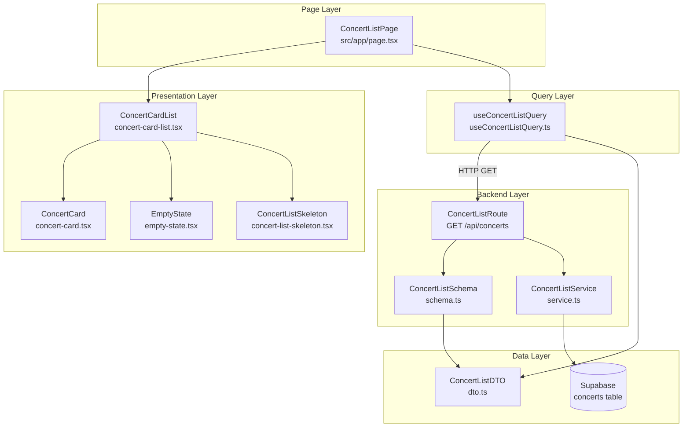
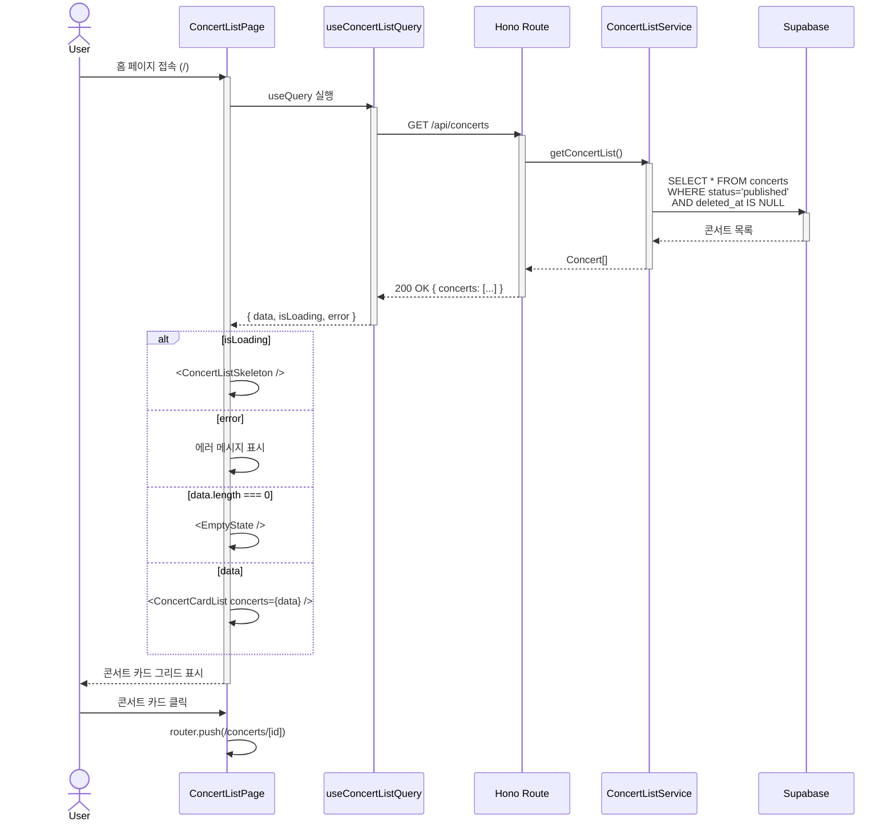

# Home Page Plan

> **문서 목적**: 콘서트 예약 시스템의 홈 페이지 구현을 위한 상세 계획  
> **참조 문서**: `/docs/prd.md`, `/docs/userflow.md`, `/docs/001/spec.md`, `/docs/state-definition.md`, `/docs/state-management.md`, `/docs/flux-architecture.md`  
> **대상 페이지**: `/` (홈 - 콘서트 목록)  
> **담당 Usecase**: UC-001 (콘서트 탐색 및 상세 조회 - 목록 파트)

---

## 1. Overview

홈 페이지는 예약 가능한 콘서트 목록을 카드 형식으로 표시하는 랜딩 페이지입니다. 사용자는 이 페이지에서 `status='published'` 상태의 콘서트를 탐색하고, 관심 있는 콘서트를 선택하여 상세 페이지로 이동할 수 있습니다.

### 1.1 Module List

| 모듈명 | 경로 | 책임 | 타입 |
|--------|------|------|------|
| **ConcertListPage** | `src/app/page.tsx` | 홈 페이지 라우트 컴포넌트, 레이아웃 구성 | Page (Client) |
| **ConcertCardList** | `src/features/concert/components/concert-card-list.tsx` | 콘서트 카드 그리드 렌더링, 로딩/에러/빈 상태 처리 | Presentation |
| **ConcertCard** | `src/features/concert/components/concert-card.tsx` | 개별 콘서트 정보 카드 (썸네일, 제목, 기본 정보) | Presentation |
| **EmptyState** | `src/features/concert/components/empty-state.tsx` | 콘서트가 없을 때 표시되는 빈 상태 컴포넌트 | Presentation |
| **ConcertListSkeleton** | `src/features/concert/components/concert-list-skeleton.tsx` | 로딩 중 스켈레톤 UI | Presentation |
| **useConcertListQuery** | `src/features/concert/hooks/useConcertListQuery.ts` | React Query 훅 (GET /api/concerts), 캐싱 및 리페칭 | Query Hook |
| **ConcertListRoute** | `src/features/concert/backend/route.ts` | Hono 라우터 (`GET /api/concerts`) | Backend Route |
| **ConcertListService** | `src/features/concert/backend/service.ts` | Supabase 쿼리 로직 (published 콘서트 조회) | Backend Service |
| **ConcertListSchema** | `src/features/concert/backend/schema.ts` | Zod 스키마 (요청/응답 검증) | Schema |
| **ConcertListDTO** | `src/features/concert/lib/dto.ts` | 클라이언트 측 타입 재노출 | DTO |

### 1.2 Core Requirements

**기능 요구사항**:
- `status='published'` 콘서트만 조회 및 표시
- 소프트 삭제 정책 준수 (`deleted_at IS NULL`)
- 카드 형식 그리드 레이아웃
- 로딩 상태 표시 (스켈레톤)
- 에러 상태 처리
- 빈 상태 처리 (콘서트 없음)
- 콘서트 카드 클릭 시 상세 페이지 이동

**비기능 요구사항**:
- 초기 로딩 시간 < 2초
- 반응형 레이아웃 (모바일/태블릿/데스크톱)
- 접근성 (키보드 네비게이션, alt 텍스트)

---

## 2. Diagram (Mermaid)

### 2.1 모듈 관계도



### 2.2 데이터 흐름



---

## 3. Implementation Plan

### 3.1 모듈별 상세 계획

#### 3.1.1 Backend Layer

##### **ConcertListRoute** (`src/features/concert/backend/route.ts`)

**인터페이스**:
```typescript
export function registerConcertRoutes(app: Hono<AppEnv>): void;
// 라우트: GET /api/concerts
```

**책임**:
- Hono 라우터 등록
- 요청 검증 (쿼리 파라미터 없음, 추후 필터링 확장 가능)
- 서비스 호출 및 응답 반환
- 에러 핸들링

**의존성**:
- `Hono`, `AppEnv` (context)
- `ConcertListService`
- `ConcertListResponseSchema`
- `respond` (응답 헬퍼)

**구현 포인트**:
```typescript
app.get('/api/concerts', async (c) => {
  const logger = c.get('logger');
  const supabase = c.get('supabase');
  
  const result = await ConcertListService.getConcertList(supabase, logger);
  return respond(c, result);
});
```

---

##### **ConcertListService** (`src/features/concert/backend/service.ts`)

**인터페이스**:
```typescript
interface ConcertListItem {
  id: string;
  title: string;
  thumbnail: string | null;
  status: 'published';
  performanceDate: string; // ISO 8601
  venue: string;
  createdAt: string; // ISO 8601
}

export async function getConcertList(
  supabase: SupabaseClient,
  logger: AppLogger
): Promise<HandlerResult<ConcertListItem[], typeof errorCodes[keyof typeof errorCodes]>>;
```

**책임**:
- Supabase 쿼리 실행
- `status='published'` 필터링
- 소프트 삭제 정책 적용 (`deleted_at IS NULL`)
- 정렬 (최신순: `created_at DESC`)
- 에러 처리 (`CONCERT_FETCH_FAILED`)

**SQL 쿼리**:
```sql
SELECT
  id,
  title,
  thumbnail,
  status,
  performance_date,
  venue,
  created_at
FROM concerts
WHERE status = 'published'
  AND deleted_at IS NULL
ORDER BY created_at DESC;
```

**에러 코드**:
```typescript
export const errorCodes = {
  CONCERT_FETCH_FAILED: 'CONCERT_FETCH_FAILED',
} as const;
```

---

##### **ConcertListSchema** (`src/features/concert/backend/schema.ts`)

**인터페이스**:
```typescript
export const ConcertListItemSchema = z.object({
  id: z.string().uuid(),
  title: z.string(),
  thumbnail: z.string().url().nullable(),
  status: z.literal('published'),
  performanceDate: z.string(), // ISO 8601
  venue: z.string(),
  createdAt: z.string(), // ISO 8601
});

export const ConcertListResponseSchema = z.object({
  concerts: z.array(ConcertListItemSchema),
});

export type ConcertListItem = z.infer<typeof ConcertListItemSchema>;
export type ConcertListResponse = z.infer<typeof ConcertListResponseSchema>;
```

---

#### 3.1.2 Query Layer

##### **useConcertListQuery** (`src/features/concert/hooks/useConcertListQuery.ts`)

**인터페이스**:
```typescript
export function useConcertListQuery(): UseQueryResult<ConcertListResponse, ApiError> {
  return useQuery({
    queryKey: ['concerts', 'published'],
    queryFn: async () => {
      const response = await apiClient.get<ConcertListResponse>('/api/concerts');
      return ConcertListResponseSchema.parse(response.data);
    },
    staleTime: 1000 * 60, // 1분
    gcTime: 1000 * 60 * 5, // 5분
  });
}
```

**책임**:
- API 호출 (`GET /api/concerts`)
- 응답 검증 (Zod 스키마)
- 캐싱 전략 (staleTime: 1분)
- 리페칭 트리거 (예약/취소 후)

---

#### 3.1.3 Presentation Layer

##### **ConcertCardList** (`src/features/concert/components/concert-card-list.tsx`)

**인터페이스**:
```typescript
interface ConcertCardListProps {
  concerts: ConcertListItem[];
  isLoading: boolean;
  error: ApiError | null;
}

export function ConcertCardList({ concerts, isLoading, error }: ConcertCardListProps): JSX.Element;
```

**책임**:
- 로딩 상태: `<ConcertListSkeleton />`
- 에러 상태: 에러 메시지 표시
- 빈 상태: `<EmptyState />`
- 데이터 상태: 그리드 레이아웃으로 `<ConcertCard />` 렌더링

**레이아웃**:
- Grid: `grid grid-cols-1 md:grid-cols-2 lg:grid-cols-3 gap-6`

---

##### **ConcertCard** (`src/features/concert/components/concert-card.tsx`)

**인터페이스**:
```typescript
interface ConcertCardProps {
  concert: ConcertListItem;
}

export function ConcertCard({ concert }: ConcertCardProps): JSX.Element;
```

**책임**:
- 썸네일 이미지 표시 (없으면 placeholder)
- 콘서트 제목
- 공연 일시 (포맷: `YYYY년 MM월 DD일 HH:mm`)
- 장소
- 클릭 시 상세 페이지 이동 (`/concerts/[id]`)

**UI 요소**:
- `Card` (shadcn-ui)
- `Link` (Next.js)
- `Image` (Next.js, picsum.photos placeholder)

---

##### **EmptyState** (`src/features/concert/components/empty-state.tsx`)

**인터페이스**:
```typescript
export function EmptyState(): JSX.Element;
```

**책임**:
- "현재 예약 가능한 콘서트가 없습니다." 메시지
- 아이콘 표시 (lucide-react: `CalendarX`)

---

##### **ConcertListSkeleton** (`src/features/concert/components/concert-list-skeleton.tsx`)

**인터페이스**:
```typescript
export function ConcertListSkeleton(): JSX.Element;
```

**책임**:
- 카드 형태 스켈레톤 3개 표시
- 그리드 레이아웃과 동일한 구조

---

#### 3.1.4 Page Layer

##### **ConcertListPage** (`src/app/page.tsx`)

**인터페이스**:
```typescript
'use client';

export default function ConcertListPage(): JSX.Element;
```

**책임**:
- `useConcertListQuery` 호출
- 상태별 분기 처리
- 레이아웃 구성 (헤더, 컨테이너)

**구조**:
```tsx
'use client';

export default function ConcertListPage() {
  const { data, isLoading, error } = useConcertListQuery();

  return (
    <div className="container mx-auto px-4 py-8">
      <h1 className="text-3xl font-bold tracking-tight mb-8">
        예약 가능한 콘서트
      </h1>
      <ConcertCardList
        concerts={data?.concerts ?? []}
        isLoading={isLoading}
        error={error}
      />
    </div>
  );
}
```

---

### 3.2 Presentation QA Sheet

| 컴포넌트 | 테스트 시나리오 | 입력 | 기대 출력 |
|----------|----------------|------|-----------|
| **ConcertCardList** | 로딩 상태 | `isLoading=true` | `<ConcertListSkeleton />` 표시 |
| | 에러 상태 | `error={message: '...'}` | 에러 메시지 표시 |
| | 빈 상태 | `concerts=[]` | `<EmptyState />` 표시 |
| | 정상 상태 | `concerts=[{...}, {...}]` | 그리드 레이아웃으로 카드 표시 |
| **ConcertCard** | 썸네일 있음 | `concert.thumbnail="url"` | 이미지 표시 |
| | 썸네일 없음 | `concert.thumbnail=null` | placeholder 이미지 표시 |
| | 카드 클릭 | 클릭 이벤트 | `/concerts/[id]` 이동 |
| | 날짜 포맷 | `performanceDate="2025-12-15T19:00:00Z"` | "2025년 12월 15일 19:00" |
| **EmptyState** | 렌더링 | - | "예약 가능한 콘서트가 없습니다." 메시지 |
| **ConcertListSkeleton** | 렌더링 | - | 3개의 스켈레톤 카드 |

---

### 3.3 Business Logic Unit Test Plan

#### ConcertListService Tests

```typescript
describe('ConcertListService.getConcertList', () => {
  it('published 콘서트만 조회', async () => {
    // Given: DB에 published, draft, archived 콘서트 존재
    // When: getConcertList 호출
    // Then: published만 반환
  });

  it('deleted_at이 NULL인 콘서트만 조회', async () => {
    // Given: 소프트 삭제된 콘서트 존재
    // When: getConcertList 호출
    // Then: deleted_at IS NULL만 반환
  });

  it('최신순 정렬 (created_at DESC)', async () => {
    // Given: 여러 날짜의 콘서트
    // When: getConcertList 호출
    // Then: created_at 내림차순
  });

  it('Supabase 오류 시 failure 반환', async () => {
    // Given: Supabase 쿼리 실패
    // When: getConcertList 호출
    // Then: failure(500, 'CONCERT_FETCH_FAILED')
  });

  it('콘서트가 없으면 빈 배열 반환', async () => {
    // Given: published 콘서트 없음
    // When: getConcertList 호출
    // Then: success({ concerts: [] })
  });
});
```

#### useConcertListQuery Tests

```typescript
describe('useConcertListQuery', () => {
  it('API 호출 성공 시 data 반환', async () => {
    // Given: API 성공 응답
    // When: 훅 실행
    // Then: data.concerts 존재
  });

  it('API 호출 실패 시 error 설정', async () => {
    // Given: API 실패 응답
    // When: 훅 실행
    // Then: error 존재
  });

  it('캐싱 동작 확인 (staleTime 1분)', async () => {
    // Given: 이전 쿼리 결과 존재
    // When: 1분 이내 재호출
    // Then: API 호출 없이 캐시 반환
  });
});
```

---

### 3.4 Risk & Mitigation

| 리스크 | 발생 가능성 | 영향도 | 완화 방안 |
|--------|------------|--------|----------|
| **DB 쿼리 성능 저하** (콘서트 수 증가 시) | 중 | 중 | `status`, `deleted_at` 복합 인덱스 추가, 페이지네이션 구현 (추후) |
| **썸네일 이미지 로딩 지연** | 높음 | 낮음 | CDN 사용, Next.js Image 최적화, lazy loading |
| **API 호출 실패** (네트워크 오류) | 중 | 중 | React Query retry 전략 (3회), 에러 메시지 표시 |
| **스키마 불일치** (DB 컬럼 변경) | 낮음 | 높음 | Zod 스키마 검증, 마이그레이션 테스트 |
| **빈 상태 UX** (콘서트 없음) | 중 | 낮음 | 명확한 빈 상태 메시지, 관리자 안내 링크 (추후) |

---

### 3.5 Traceability Matrix

| 요구사항 ID | 요구사항 설명 | 구현 모듈 | 테스트 케이스 |
|------------|-------------|----------|--------------|
| **FR-001** | published 콘서트만 표시 | ConcertListService | Service.test.ts #1 |
| **FR-002** | 소프트 삭제 정책 준수 | ConcertListService | Service.test.ts #2 |
| **FR-003** | 카드 그리드 레이아웃 | ConcertCardList | QA Sheet #4 |
| **FR-004** | 로딩 상태 표시 | ConcertCardList | QA Sheet #1 |
| **FR-005** | 에러 상태 처리 | ConcertCardList | QA Sheet #2 |
| **FR-006** | 빈 상태 처리 | EmptyState | QA Sheet #5 |
| **FR-007** | 콘서트 클릭 시 상세 이동 | ConcertCard | QA Sheet #3 |
| **NFR-001** | 초기 로딩 < 2초 | useConcertListQuery (캐싱) | 성능 테스트 |
| **NFR-002** | 반응형 레이아웃 | Grid 클래스 (Tailwind) | 브라우저 테스트 |

---

### 3.6 TODO Summary

#### Phase 1: Backend (우선순위 높음)
- [ ] `ConcertListSchema` 정의 (Zod)
- [ ] `ConcertListService.getConcertList` 구현
- [ ] `ConcertListRoute` 등록 (Hono)
- [ ] 에러 코드 정의 (`errorCodes`)
- [ ] Unit Test 작성 (Service)

#### Phase 2: Query Layer
- [ ] `useConcertListQuery` 훅 구현
- [ ] API 클라이언트 연동 (`@/lib/remote/api-client`)
- [ ] 캐싱 전략 설정 (React Query)

#### Phase 3: Presentation
- [ ] `ConcertCard` 컴포넌트 구현
- [ ] `ConcertCardList` 컴포넌트 구현
- [ ] `EmptyState` 컴포넌트 구현
- [ ] `ConcertListSkeleton` 컴포넌트 구현
- [ ] Presentation QA 테스트

#### Phase 4: Page Integration
- [ ] `src/app/page.tsx` 통합
- [ ] 레이아웃 스타일링 (Tailwind)
- [ ] 접근성 검증 (키보드, alt)
- [ ] 반응형 테스트 (모바일/태블릿/데스크톱)

#### Phase 5: Migration & Data
- [ ] `concerts` 테이블 인덱스 추가 (status, deleted_at)
- [ ] 샘플 데이터 시드 (published 콘서트 3개)
- [ ] E2E 테스트

---


---

## 4. 설계 원칙

### 4.1 Separation of Concerns
- **Presentation**: UI 렌더링만 담당, 비즈니스 로직 포함 금지
- **Query**: 서버 상태 관리 전담 (React Query)
- **Service**: Supabase 쿼리 로직 캡슐화
- **Schema**: 타입 안정성 보장 (Zod)

### 4.2 DRY (Don't Repeat Yourself)
- `ConcertListItem` 타입을 DTO로 재노출하여 프론트엔드/백엔드 공유
- 에러 핸들링 로직은 `respond` 헬퍼로 통일
- 스켈레톤 UI는 재사용 가능한 컴포넌트로 분리

### 4.3 Single Responsibility
- 각 모듈은 하나의 명확한 책임만 가짐
- `ConcertCard`는 카드 렌더링만, 상태 관리는 `useConcertListQuery`

### 4.4 Fail-Safe
- API 실패 시 에러 메시지 표시
- 썸네일 없으면 placeholder 표시
- 빈 상태 처리 (콘서트 없음)

### 4.5 Performance
- React Query 캐싱 (staleTime: 1분)
- Next.js Image 최적화
- 인덱스 활용 (DB 쿼리)

---

## 5. 검증 체크리스트

### 5.1 기능 검증
- [ ] `status='published'` 콘서트만 표시되는가?
- [ ] `deleted_at IS NULL` 조건이 적용되는가?
- [ ] 최신순 정렬이 동작하는가?
- [ ] 로딩 상태에서 스켈레톤이 표시되는가?
- [ ] 에러 발생 시 에러 메시지가 표시되는가?
- [ ] 콘서트가 없을 때 빈 상태가 표시되는가?
- [ ] 콘서트 카드 클릭 시 상세 페이지로 이동하는가?

### 5.2 코드 품질
- [ ] 모든 컴포넌트에 `"use client"` 디렉티브가 있는가?
- [ ] Zod 스키마로 응답을 검증하는가?
- [ ] 에러 코드가 문자열 리터럴로 정의되었는가?
- [ ] Hono 라우트 경로에 `/api` prefix가 있는가?
- [ ] `respond(c, result)` 패턴을 사용하는가?

### 5.3 UX/UI
- [ ] 반응형 레이아웃이 동작하는가? (모바일/태블릿/데스크톱)
- [ ] 이미지에 alt 텍스트가 있는가?
- [ ] 키보드만으로 카드에 접근 가능한가?
- [ ] 로딩 시간이 2초 이내인가?

### 5.4 데이터 무결성
- [ ] DB 마이그레이션이 적용되었는가?
- [ ] 인덱스가 생성되었는가?
- [ ] 샘플 데이터가 시드되었는가?

---

## 6. Anti-Patterns (금지)

### 6.1 금지된 패턴
❌ **Server Component에서 `"use client"` 제거하지 말 것**  
✅ 모든 컴포넌트는 Client Component로 유지 (`"use client"`)

❌ **`z.string().datetime()` 사용 금지**  
✅ ISO 8601 문자열은 `z.string()` 사용

❌ **Hono 라우트에서 `/api` prefix 누락**  
✅ 반드시 `app.get('/api/concerts', ...)`

❌ **`logger.log()` 사용**  
✅ `logger.info()`, `logger.error()` 사용

❌ **에러 코드를 객체로 정의**  
```typescript
// ❌ 잘못된 예
export const errorCodes = {
  CONCERT_FETCH_FAILED: { code: 'CONCERT_FETCH_FAILED' },
};

// ✅ 올바른 예
export const errorCodes = {
  CONCERT_FETCH_FAILED: 'CONCERT_FETCH_FAILED',
} as const;
```

❌ **물리적 DELETE 사용**  
✅ 소프트 삭제 (`deleted_at` 설정)

❌ **파생 상태를 별도로 저장**  
✅ 필요 시 `useMemo`로 계산

---

## 7. 실행 Pseudo

### 7.1 사용자 흐름 (User Flow)

```
1. 사용자가 브라우저에서 '/' 접속
2. ConcertListPage 렌더링
   ├─ useConcertListQuery 실행
   │  └─ GET /api/concerts 호출
   └─ 상태별 분기
      ├─ isLoading=true → ConcertListSkeleton 표시
      ├─ error → 에러 메시지 표시
      ├─ concerts=[] → EmptyState 표시
      └─ concerts=[...] → ConcertCardList 렌더링
         └─ 각 콘서트마다 ConcertCard 렌더링
3. 사용자가 콘서트 카드 클릭
4. Next.js 라우터가 /concerts/[id]로 이동
```

### 7.2 API 흐름 (API Flow)

```
1. Hono Route: GET /api/concerts
2. ConcertListService.getConcertList 호출
   ├─ Supabase 쿼리 실행
   │  SELECT * FROM concerts
   │  WHERE status='published'
   │    AND deleted_at IS NULL
   │  ORDER BY created_at DESC
   ├─ 성공 시: success({ concerts: [...] })
   └─ 실패 시: failure(500, 'CONCERT_FETCH_FAILED')
3. respond(c, result) 호출
4. HTTP 응답 반환
   ├─ 200 OK: { concerts: [...] }
   └─ 500 Error: { errorCode, message }
```

### 7.3 상태 관리 흐름 (State Flow)

```
1. useConcertListQuery 실행
   ├─ React Query 캐시 확인
   │  └─ 캐시 없음 or stale → API 호출
   └─ { data, isLoading, error } 반환
2. ConcertCardList 렌더링
   ├─ isLoading=true → 스켈레톤
   ├─ error → 에러
   ├─ data.concerts=[] → 빈 상태
   └─ data.concerts=[...] → 카드 그리드
3. 사용자 인터랙션 (카드 클릭)
   └─ Next.js Link로 페이지 이동
```

---

## 8. 출력 예시

### 8.1 API 응답 예시

#### 성공 응답 (200 OK)

```json
{
  "concerts": [
    {
      "id": "123e4567-e89b-12d3-a456-426614174000",
      "title": "2025 신년 콘서트",
      "thumbnail": "https://picsum.photos/seed/concert1/400/300",
      "status": "published",
      "performanceDate": "2025-12-31T19:00:00Z",
      "venue": "올림픽공원 체조경기장",
      "createdAt": "2025-11-01T10:00:00Z"
    },
    {
      "id": "223e4567-e89b-12d3-a456-426614174001",
      "title": "봄맞이 클래식 페스티벌",
      "thumbnail": null,
      "status": "published",
      "performanceDate": "2026-03-15T18:30:00Z",
      "venue": "예술의전당 콘서트홀",
      "createdAt": "2025-10-15T14:00:00Z"
    }
  ]
}
```

#### 에러 응답 (500 Internal Server Error)

```json
{
  "errorCode": "CONCERT_FETCH_FAILED",
  "message": "콘서트 목록을 불러오는 중 오류가 발생했습니다."
}
```

### 8.2 UI 렌더링 예시

#### 정상 상태 (콘서트 3개)

```
┌─────────────────────────────────────────────┐
│  예약 가능한 콘서트                           │
├─────────────────────────────────────────────┤
│  ┌───────┐  ┌───────┐  ┌───────┐           │
│  │ Card1 │  │ Card2 │  │ Card3 │           │
│  │[Image]│  │[Image]│  │[Image]│           │
│  │ 제목  │  │ 제목  │  │ 제목  │           │
│  │ 날짜  │  │ 날짜  │  │ 날짜  │           │
│  │ 장소  │  │ 장소  │  │ 장소  │           │
│  └───────┘  └───────┘  └───────┘           │
└─────────────────────────────────────────────┘
```

#### 로딩 상태

```
┌─────────────────────────────────────────────┐
│  예약 가능한 콘서트                           │
├─────────────────────────────────────────────┤
│  ┌───────┐  ┌───────┐  ┌───────┐           │
│  │░░░░░░░│  │░░░░░░░│  │░░░░░░░│           │
│  │░░░░░░░│  │░░░░░░░│  │░░░░░░░│           │
│  │░░░░░░░│  │░░░░░░░│  │░░░░░░░│           │
│  │░░░░░░░│  │░░░░░░░│  │░░░░░░░│           │
│  └───────┘  └───────┘  └───────┘           │
└─────────────────────────────────────────────┘
```

#### 빈 상태

```
┌─────────────────────────────────────────────┐
│  예약 가능한 콘서트                           │
├─────────────────────────────────────────────┤
│                                             │
│           📅 (CalendarX 아이콘)             │
│                                             │
│     현재 예약 가능한 콘서트가 없습니다.      │
│                                             │
└─────────────────────────────────────────────┘
```

#### 에러 상태

```
┌─────────────────────────────────────────────┐
│  예약 가능한 콘서트                           │
├─────────────────────────────────────────────┤
│                                             │
│           ⚠️ (Alert 아이콘)                 │
│                                             │
│   콘서트 목록을 불러오는 중 오류가            │
│   발생했습니다. 잠시 후 다시 시도해주세요.    │
│                                             │
│          [다시 시도] 버튼                    │
└─────────────────────────────────────────────┘
```

### 8.3 콘서트 카드 상세

```
┌─────────────────────────┐
│  [썸네일 이미지]         │
│  400x300                │
├─────────────────────────┤
│  2025 신년 콘서트        │
│  2025년 12월 31일 19:00  │
│  📍 올림픽공원 체조경기장 │
└─────────────────────────┘
   (클릭 시 /concerts/[id] 이동)
```

---

## 9. 결론

이 계획 문서는 홈 페이지(콘서트 목록) 구현을 위한 모든 필수 요소를 정의했습니다:

✅ **모듈 분리**: Backend (Route/Service/Schema), Query (Hook), Presentation (Components), Page  
✅ **데이터 흐름**: Mermaid 다이어그램으로 시각화  
✅ **테스트 계획**: Unit Test, QA Sheet, Traceability Matrix  
✅ **리스크 관리**: 주요 리스크와 완화 방안 명시  
✅ **설계 원칙**: Separation of Concerns, DRY, SRP, Fail-Safe  
✅ **검증 체크리스트**: 기능, 코드 품질, UX/UI, 데이터 무결성  
✅ **Anti-Patterns**: 금지된 패턴 명시  

이 문서를 기반으로 구현을 진행하면 일관성 있고 테스트 가능하며 유지보수가 용이한 홈 페이지를 완성할 수 있습니다.

---

## 5. 검증 체크리스트

| 항목 | 기준 |
|------|------|
| 문서 수집 | `/docs` 1차 md 전부 반영 (prd.md, userflow.md, database.md, state-definition.md 등) |
| usecase 매핑 | Usecase 001 (콘서트 탐색) 완전 연결 |
| 상태 추출 | `publishedConcertList`, `isLoadingConcerts` 서버 상태 반영 |
| 모듈 경로 | AGENTS.md 구조 준수 (`src/features/concert/`, `src/app/page.tsx`) |
| 테스트 계획 | Presentation QA + Logic Unit Test 모두 존재 |
| Diagram | mermaid 문법 정상 렌더 가능 |
| Traceability | 주요 요구사항 5개 이상 매핑 완료 |

---

## 6. Anti-Patterns (금지)

- Hono 라우트 경로에서 `/api` prefix 누락
- `publishedConcertList` 를 클라이언트 전역 상태(Zustand)로 관리 (React Query로 충분)
- 콘서트 카드 내부에서 직접 Supabase 클라이언트 생성
- 하드코딩된 콘서트 ID 또는 URL (환경 변수 또는 동적 라우팅 사용)
- 비동기 로직을 page.tsx에서 직접 처리 (`async` 함수 사용 금지, Client Component 유지)

---

## 7. 실행 Pseudo

```pseudo
input: 사용자 홈 페이지 접속 (/)
1. HomePage 컴포넌트 마운트
2. useConcertListQuery() 훅 실행
   2.1. React Query: GET /api/concerts 호출
   2.2. Hono 라우터: ConcertListRoute 실행
   2.3. ConcertListService: Supabase 쿼리 (status='published', deleted_at IS NULL)
   2.4. 응답: ConcertListResponseSchema 검증
   2.5. React Query 캐시 업데이트
3. ConcertListView 렌더링
   3.1. isLoading=true → SkeletonCard 표시
   3.2. isLoading=false, data 존재 → ConcertCard 그리드 표시
   3.3. isLoading=false, data 없음 → 빈 상태 메시지 표시
   3.4. error 존재 → ErrorBoundary fallback 표시
4. 사용자 카드 클릭 → Next.js Link로 `/concerts/[concertId]` 이동
output: 콘서트 상세 페이지 진입
```

---

## 8. 출력 예시

```json
{
  "pageName": "home",
  "modules": [
    "ConcertListQuery",
    "ConcertCard",
    "ConcertListView",
    "ConcertListRoute",
    "ConcertListService",
    "ConcertListSchema",
    "ConcertListDTO",
    "SkeletonCard",
    "ErrorBoundary"
  ],
  "planPath": "/docs/pages/home/plan.md",
  "todoCount": 11
}
```

---

이 계획서는 홈 페이지의 모든 모듈 책임과 인터페이스를 정의하여, 구현 단계에서 일관된 설계를 유지하고 테스트 가능성을 보장합니다.
