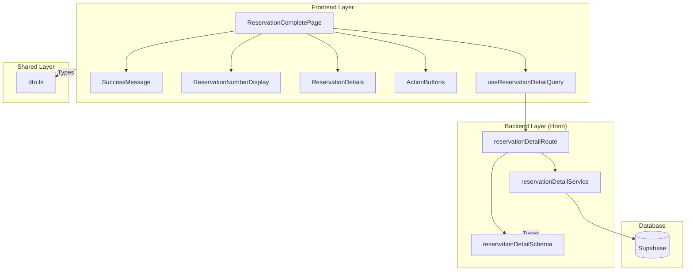

# 예약 완료 페이지 구현 계획 (Reservation Complete)

## 1. 개요 (Overview)

| 모듈 | 위치 | 설명 |
|---|---|---|
| **ReservationCompletePage** | `src/app/reservations/complete/page.tsx` | 예약 완료 페이지의 진입점. 클라이언트 컴포넌트로 구성. |
| **SuccessMessage** | `src/features/reservation/components/success-message.tsx` | 예약 성공 메시지 및 축하 UI를 표시하는 컴포넌트. |
| **ReservationNumberDisplay** | `src/features/reservation/components/reservation-number-display.tsx` | 고유 예약 번호를 강조하여 표시하는 컴포넌트. |
| **ReservationDetails** | `src/features/reservation/components/reservation-details.tsx` | 예약 상세 정보(공연, 좌석, 총액)를 표시하는 컴포넌트. |
| **ActionButtons** | `src/features/reservation/components/action-buttons.tsx` | '홈으로 가기', '예약 조회하기' 버튼을 제공하는 컴포넌트. |
| **useReservationDetailQuery** | `src/features/reservation/hooks/use-reservation-detail-query.ts` | React Query를 사용해 예약 상세 정보를 조회하는 훅. |
| **reservationDetailRoute** | `src/features/reservation/backend/route.ts` | 예약 상세 조회 API 엔드포인트 (`GET /api/reservations/:id`). |
| **reservationDetailService** | `src/features/reservation/backend/service.ts` | 예약 상세 조회의 비즈니스 로직. |
| **reservationDetailSchema** | `src/features/reservation/backend/schema.ts` | Zod를 사용한 예약 상세 조회 응답 스키마 정의. |
| **dto** | `src/features/reservation/lib/dto.ts` | 백엔드 스키마를 프론트엔드에서 재사용하도록 노출. |

---

## 2. Diagram: 모듈 간 관계 (Mermaid)

---

## 3. Implementation Plan

### 3.1. Backend Layer

#### **3.1.1. Schema (`schema.ts`)**

**구현 내용**:
- `ReservationDetailResponseSchema`: 예약 상세 조회 응답 DTO
  - `reservationId`: UUID
  - `reservationNumber`: 문자열 (예: `RES20250113001`)
  - `customerName`: 문자열
  - `phoneNumber`: 문자열
  - `status`: `confirmed` | `cancelled`
  - `concertId`: UUID
  - `concertTitle`: 문자열
  - `concertDate`: ISO 8601 문자열
  - `concertVenue`: 문자열
  - `seats`: 좌석 상세 배열
    - `seatId`: UUID
    - `label`: 문자열 (예: `A-01`)
    - `tierLabel`: 문자열 (예: `스페셜`)
    - `price`: 숫자
  - `totalAmount`: 숫자
  - `seatCount`: 숫자
  - `createdAt`: ISO 8601 문자열

**Unit Test**:
- ✅ **성공**: 유효한 응답 데이터 파싱 성공
- ❌ **실패**: 필수 필드 누락 시 검증 실패
- ❌ **실패**: 잘못된 타입 데이터 시 검증 실패

---

#### **3.1.2. Service (`service.ts`)**

**구현 내용**:
- `getReservationDetail(client, reservationId)`: 예약 상세 조회 로직
  1. **예약 기본 정보 조회**:
     - `reservations` 테이블에서 `id`로 조회
     - 예약이 없으면 → `failure(404, NOT_FOUND)`
  2. **연관 데이터 조회**:
     - `concerts` 테이블 조인하여 공연 정보 추출
     - `reservation_seats` 테이블 조인하여 좌석 매핑 조회
     - `seats` 테이블 조인하여 좌석 상세 정보 추출
     - `concert_seat_tiers` 테이블 조인하여 가격 정보 추출
  3. **총액 계산**: 모든 좌석 가격의 합
  4. **응답 데이터 구성 및 반환**

**Unit Test**:
- ✅ **성공**: 유효한 `reservationId`로 상세 정보 조회 성공
- ✅ **성공**: 응답 데이터에 공연 정보, 좌석 목록, 총액이 포함됨
- ❌ **실패**: 존재하지 않는 `reservationId`로 조회 시 `NOT_FOUND` 반환
- ❌ **실패**: DB 오류 발생 시 적절한 에러 반환

---

#### **3.1.3. Route (`route.ts`)**

**구현 내용**:
- `GET /api/reservations/:id` 엔드포인트:
  1. 경로 파라미터 `id`를 UUID로 검증
  2. 검증 실패 시 → `400 Bad Request`
  3. `reservationDetailService.getReservationDetail()` 호출
  4. 서비스 결과를 `respond(c, result)`로 반환
  5. 성공 시 → `200 OK` 응답

**Integration Test (API 레벨)**:
- ✅ **성공**: 유효한 `reservationId`로 200 응답 및 상세 정보 반환
- ❌ **실패**: 잘못된 UUID 형식으로 400 응답
- ❌ **실패**: 존재하지 않는 예약으로 404 응답

---

### 3.2. Frontend Layer

#### **3.2.1. Hooks**

##### **useReservationDetailQuery**

**구현 내용**:
- React Query의 `useQuery` 훅 사용
- API 엔드포인트: `GET /api/reservations/:id`
- Query Key: `['reservation', 'detail', reservationId]`
- 데이터 조회 성공 시 캐싱
- 에러 발생 시 에러 상태 관리

**QA Sheet**:
- ✅ 페이지 진입 시 자동으로 데이터 조회가 실행되는가?
- ✅ 로딩 상태(`isLoading`)가 올바르게 표시되는가?
- ✅ 조회 성공 시 데이터가 정확히 반영되는가?
- ✅ 404 에러 발생 시 적절한 에러 메시지가 표시되는가?

---

#### **3.2.2. Components**

##### **SuccessMessage**

**구현 내용**:
- Props: 없음 (정적 메시지)
- 예약 성공 축하 메시지 표시
- 아이콘(체크마크) 및 강조된 텍스트 사용
- 예시 메시지: "예약이 성공적으로 완료되었습니다!"

**QA Sheet**:
- ✅ 성공 메시지가 눈에 띄게 표시되는가?
- ✅ 아이콘과 텍스트가 조화롭게 배치되는가?
- ✅ 모바일 화면에서도 잘 보이는가?

---

##### **ReservationNumberDisplay**

**구현 내용**:
- Props: `reservationNumber: string`
- 예약 번호를 강조된 스타일로 표시
- 복사 버튼 제공 (클립보드 복사 기능)
- 예시: `예약 번호: RES20250113001` + [복사] 버튼

**QA Sheet**:
- ✅ 예약 번호가 크고 명확하게 표시되는가?
- ✅ 복사 버튼 클릭 시 클립보드에 정상적으로 복사되는가?
- ✅ 복사 성공 시 피드백(토스트 등)이 표시되는가?

---

##### **ReservationDetails**

**구현 내용**:
- Props: `reservation: ReservationDetailResponse`
- 예약 상세 정보를 섹션별로 표시:
  1. **공연 정보**: 제목, 날짜, 장소
  2. **예약자 정보**: 이름, 휴대폰 번호
  3. **좌석 정보**: 좌석 목록 (등급, 번호, 가격)
  4. **결제 정보**: 총액, 좌석 수
  5. **예약 일시**: `createdAt`
- shadcn/ui의 `Card` 컴포넌트 활용

**QA Sheet**:
- ✅ 모든 정보가 읽기 쉽게 구조화되어 표시되는가?
- ✅ 좌석 정보가 목록 형태로 명확히 표시되는가?
- ✅ 총액이 강조되어 표시되는가?
- ✅ 모바일 화면에서도 레이아웃이 깨지지 않는가?

---

##### **ActionButtons**

**구현 내용**:
- Props: 없음 (정적 버튼)
- 두 개의 버튼 제공:
  1. **홈으로 가기**: `/` 경로로 이동
  2. **예약 조회하기**: `/reservations/lookup` 경로로 이동
- shadcn/ui의 `Button` 컴포넌트 사용

**QA Sheet**:
- ✅ 두 버튼이 명확히 구분되어 표시되는가?
- ✅ 버튼 클릭 시 올바른 페이지로 이동하는가?
- ✅ 모바일에서도 터치하기 쉬운 크기인가?

---

##### **ReservationCompletePage**

**구현 내용**:
- 페이지 진입 시 URL 쿼리 파라미터에서 `id` 추출
- `useReservationDetailQuery` 훅으로 예약 상세 정보 조회
- 로딩 상태: 스켈레톤 UI 또는 로딩 스피너 표시
- 에러 상태: 에러 메시지 및 홈으로 가기 버튼 표시
- 성공 상태: 다음 컴포넌트 순서로 구성
  1. `SuccessMessage`
  2. `ReservationNumberDisplay`
  3. `ReservationDetails`
  4. `ActionButtons`

**QA Sheet**:
- ✅ 페이지 진입 시 `id` 파라미터가 없으면 적절히 처리되는가?
- ✅ 로딩 중 상태가 사용자에게 명확히 표시되는가?
- ✅ 예약 정보 조회 실패 시 에러 메시지가 표시되고 홈으로 이동할 수 있는가?
- ✅ 예약 상세 정보가 모두 정확히 표시되는가?
- ✅ 전체 페이지 레이아웃이 직관적이고 아름다운가?

---

## 4. Data Flow Summary

1. **페이지 진입**: 예약 생성 성공 후 `/reservations/complete?id={reservationId}`로 리다이렉트
2. **ID 추출**: URL에서 `reservationId` 추출
3. **데이터 조회**: `GET /api/reservations/:id` API 호출
4. **서버 조회**: DB에서 예약, 공연, 좌석 정보를 조인하여 반환
5. **화면 표시**:
   - 성공 메시지 표시
   - 예약 번호 강조 표시
   - 예약 상세 정보 표시
   - 액션 버튼 제공
6. **사용자 액션**: 홈으로 이동 또는 예약 조회 페이지로 이동

---

## 5. Non-Functional Requirements

### 5.1. Performance
- 예약 상세 조회 API 응답 시간: 평균 300ms 이하
- 페이지 초기 렌더링 시간: 1초 이내

### 5.2. Usability
- 예약 번호가 눈에 띄게 표시되어야 함
- 예약 상세 정보가 명확하고 읽기 쉽게 구성되어야 함
- 모바일 반응형 레이아웃 지원

### 5.3. Accessibility
- 모든 텍스트 콘텐츠가 스크린 리더로 읽을 수 있어야 함
- 버튼에 적절한 aria-label 속성 설정
- 키보드 내비게이션 지원

### 5.4. Security
- 예약 상세 조회 시 인증 없이도 조회 가능 (MVP 범위)
- 향후 확장 시 인증 토큰 또는 비밀번호 확인 추가 고려

---

## 6. Edge Cases

### 6.1. 예약 ID 없음
- **상황**: URL에 `id` 파라미터가 없는 경우
- **처리**: 에러 메시지 표시 후 홈으로 리다이렉트

### 6.2. 잘못된 예약 ID
- **상황**: 존재하지 않는 `reservationId`로 조회
- **처리**: "예약 정보를 찾을 수 없습니다." 메시지 표시 후 홈으로 가기 버튼 제공

### 6.3. 네트워크 오류
- **상황**: API 호출 중 네트워크 오류 발생
- **처리**: "잠시 후 다시 시도해주세요." 메시지 표시 및 재시도 버튼 제공

### 6.4. 취소된 예약
- **상황**: 조회된 예약의 `status`가 `cancelled`인 경우
- **처리**: MVP 범위에서는 동일하게 표시, 향후 "취소된 예약입니다" 배지 추가 고려

---

## 7. Related Documents
- `/docs/003/spec.md` - Use Case 003: 예약 정보 입력 및 확정
- `/docs/004/spec.md` - Use Case 004: 예약 조회 및 취소
- `/docs/prd.md` - 제품 요구사항 정의서
- `/docs/requirement.md` - 기능 요구사항 정의
