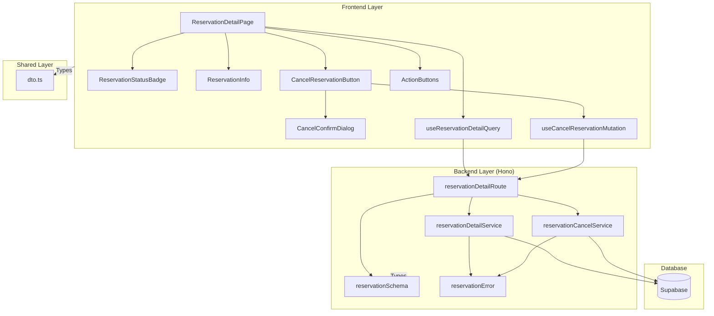

# 예약 내역 상세 페이지 구현 계획 (Reservation Detail)

## 1. 개요 (Overview)

| 모듈 | 위치 | 설명 |
|---|---|---|
| **ReservationDetailPage** | `src/app/reservations/[reservationId]/page.tsx` | 예약 내역 상세 페이지의 진입점. 클라이언트 컴포넌트로 구성. |
| **ReservationStatusBadge** | `src/features/reservation/components/reservation-status-badge.tsx` | 예약 상태(확정/취소)를 배지로 표시하는 컴포넌트. |
| **ReservationInfo** | `src/features/reservation/components/reservation-info.tsx` | 예약 상세 정보(공연, 좌석, 총액)를 표시하는 컴포넌트. |
| **CancelReservationButton** | `src/features/reservation/components/cancel-reservation-button.tsx` | 예약 취소 버튼. 확인 모달 및 취소 로직 포함. |
| **CancelConfirmDialog** | `src/features/reservation/components/cancel-confirm-dialog.tsx` | 예약 취소 확인 대화상자 컴포넌트. |
| **ActionButtons** | `src/features/reservation/components/action-buttons.tsx` | '홈으로 가기', '예약 조회하기' 버튼을 제공하는 컴포넌트. |
| **useReservationDetailQuery** | `src/features/reservation/hooks/use-reservation-detail-query.ts` | React Query를 사용해 예약 상세 정보를 조회하는 훅. |
| **useCancelReservationMutation** | `src/features/reservation/hooks/use-cancel-reservation-mutation.ts` | React Query를 사용해 예약 취소 API를 호출하는 Mutation 훅. |
| **reservationDetailRoute** | `src/features/reservation/backend/route.ts` | 예약 상세 조회 및 취소 API 엔드포인트 (`GET /api/reservations/:id`, `DELETE /api/reservations/:id`). |
| **reservationDetailService** | `src/features/reservation/backend/service.ts` | 예약 상세 조회 및 취소의 비즈니스 로직. |
| **reservationCancelService** | `src/features/reservation/backend/service.ts` | 예약 취소의 핵심 비즈니스 로직. 트랜잭션 포함. |
| **reservationSchema** | `src/features/reservation/backend/schema.ts` | Zod를 사용한 예약 상세 및 취소 요청/응답 스키마 정의. |
| **reservationError** | `src/features/reservation/backend/error.ts` | 예약 관련 에러 코드 정의 (이미 취소됨, 예약 없음 등). |
| **dto** | `src/features/reservation/lib/dto.ts` | 백엔드 스키마를 프론트엔드에서 재사용하도록 노출. |

---

## 2. Diagram: 모듈 간 관계 (Mermaid)



---

## 3. Implementation Plan

### 3.1. Backend Layer

#### **3.1.1. Schema (`schema.ts`)**

**구현 내용**:
- `ReservationDetailResponseSchema`: 예약 상세 조회 응답 DTO (예약 완료 페이지와 동일)
  - `reservationId`: UUID
  - `reservationNumber`: 문자열
  - `customerName`: 문자열
  - `phoneNumber`: 문자열
  - `status`: `confirmed` | `cancelled`
  - `concertId`: UUID
  - `concertTitle`: 문자열
  - `concertDate`: ISO 8601 문자열
  - `concertVenue`: 문자열
  - `seats`: 좌석 상세 배열
  - `totalAmount`: 숫자
  - `seatCount`: 숫자
  - `createdAt`: ISO 8601 문자열
  - `cancelledAt`: ISO 8601 문자열 | null

- `CancelReservationResponseSchema`: 예약 취소 성공 응답 DTO
  - `message`: 문자열 (예: "예약이 정상적으로 취소되었습니다.")
  - `cancelledAt`: ISO 8601 문자열
  - `releasedSeats`: 숫자

**Unit Test**:
- ✅ **성공**: 유효한 응답 데이터 파싱 성공
- ❌ **실패**: 필수 필드 누락 시 검증 실패
- ❌ **실패**: 잘못된 타입 데이터 시 검증 실패

---

#### **3.1.2. Error (`error.ts`)**

**구현 내용**:
- 에러 코드 상수 정의:
  ```typescript
  export const reservationErrorCodes = {
    NOT_FOUND: 'NOT_FOUND',
    ALREADY_CANCELLED: 'ALREADY_CANCELLED',
    CANCELLATION_FAILED: 'CANCELLATION_FAILED',
    DB_ERROR: 'DB_ERROR',
  } as const;
  
  export type ReservationServiceError = 
    (typeof reservationErrorCodes)[keyof typeof reservationErrorCodes];
  ```

---

#### **3.1.3. Service (`service.ts`)**

##### **getReservationDetail**

**구현 내용**:
- 예약 상세 조회 로직 (예약 완료 페이지와 동일)
- 예약 기본 정보 + 공연 정보 + 좌석 정보 조인

**Unit Test**:
- ✅ **성공**: 유효한 `reservationId`로 상세 정보 조회 성공
- ✅ **성공**: `status`가 `confirmed` 또는 `cancelled` 모두 조회 가능
- ❌ **실패**: 존재하지 않는 `reservationId`로 조회 시 `NOT_FOUND` 반환

---

##### **cancelReservation**

**구현 내용**:
- `cancelReservation(client, reservationId)`: 예약 취소 핵심 로직
  1. **예약 존재 여부 확인**:
     - `reservations` 테이블에서 `id`로 조회 (`SELECT ... FOR UPDATE`)
     - 예약이 없으면 → `failure(404, NOT_FOUND)`
  2. **취소 가능 여부 확인**:
     - 현재 `status`가 `confirmed`인지 확인
     - 이미 `cancelled` 상태면 → `failure(400, ALREADY_CANCELLED)`
  3. **트랜잭션 시작** (`BEGIN`)
  4. **예약 상태 업데이트** (`reservations` 테이블):
     - `status`: `confirmed` → `cancelled`
     - `cancelled_at`: 현재 시각
  5. **연결된 좌석 ID 조회** (`reservation_seats` 테이블)
  6. **좌석 상태 해제** (`seats` 테이블):
     - `status`: `reserved` → `available`
     - `hold_expires_at`: `NULL`
  7. **트랜잭션 커밋** (`COMMIT`)
  8. 성공 응답 반환

**Unit Test**:
- ✅ **성공**: `confirmed` 상태의 예약 취소 성공
- ✅ **성공**: 취소 후 예약 상태가 `cancelled`로 변경됨
- ✅ **성공**: 취소 후 연결된 좌석들이 `available` 상태로 변경됨
- ❌ **실패**: 이미 `cancelled` 상태인 예약 취소 시도 → `ALREADY_CANCELLED` 반환
- ❌ **실패**: 존재하지 않는 예약 취소 시도 → `NOT_FOUND` 반환
- ❌ **실패**: 트랜잭션 중 DB 오류 발생 시 롤백 및 `CANCELLATION_FAILED` 반환

---

#### **3.1.4. Route (`route.ts`)**

**구현 내용**:
- `GET /api/reservations/:id` 엔드포인트: (예약 완료 페이지와 동일)
- `DELETE /api/reservations/:id` 엔드포인트:
  1. 경로 파라미터 `id`를 UUID로 검증
  2. 검증 실패 시 → `400 Bad Request`
  3. `reservationCancelService.cancelReservation()` 호출
  4. 서비스 결과를 `respond(c, result)`로 반환
  5. 성공 시 → `200 OK` 응답

**Integration Test (API 레벨)**:
- ✅ **성공**: 유효한 `reservationId`로 200 응답 및 취소 완료 메시지 반환
- ❌ **실패**: 잘못된 UUID 형식으로 400 응답
- ❌ **실패**: 존재하지 않는 예약으로 404 응답
- ❌ **실패**: 이미 취소된 예약으로 400 응답 (ALREADY_CANCELLED)

---

### 3.2. Frontend Layer

#### **3.2.1. Hooks**

##### **useReservationDetailQuery**

**구현 내용**:
- 예약 완료 페이지의 훅과 동일
- React Query의 `useQuery` 사용
- API: `GET /api/reservations/:id`

**QA Sheet**:
- ✅ 페이지 진입 시 자동으로 데이터 조회가 실행되는가?
- ✅ 로딩 상태가 올바르게 표시되는가?
- ✅ 취소된 예약도 정상적으로 조회되는가?

---

##### **useCancelReservationMutation**

**구현 내용**:
- React Query의 `useMutation` 훅 사용
- API 엔드포인트: `DELETE /api/reservations/:id`
- 성공 시:
  - 성공 토스트 메시지 표시
  - 예약 상세 데이터 무효화 (refetch)
  - 홈 페이지로 리다이렉트 또는 현재 페이지에 "취소됨" 상태 표시
- 실패 시:
  - 에러 메시지를 토스트로 표시

**QA Sheet**:
- ✅ API 호출 중 로딩 상태가 올바르게 표시되는가?
- ✅ 취소 성공 시 UI가 업데이트되는가?
- ✅ 이미 취소된 예약 취소 시도 시 적절한 에러 메시지가 표시되는가?
- ✅ 네트워크 오류 시 재시도 안내가 표시되는가?

---

#### **3.2.2. Components**

##### **ReservationStatusBadge**

**구현 내용**:
- Props: `status: 'confirmed' | 'cancelled'`
- 예약 상태에 따라 다른 스타일의 배지 표시
  - `confirmed`: 녹색 배지, "예약 확정"
  - `cancelled`: 회색 배지, "예약 취소됨"
- shadcn/ui의 `Badge` 컴포넌트 사용

**QA Sheet**:
- ✅ 상태에 따라 배지 색상 및 텍스트가 정확히 표시되는가?
- ✅ 배지가 눈에 띄게 배치되는가?

---

##### **ReservationInfo**

**구현 내용**:
- Props: `reservation: ReservationDetailResponse`
- 예약 상세 정보를 섹션별로 표시 (예약 완료 페이지와 동일)
- 취소된 예약의 경우 `cancelledAt` 표시

**QA Sheet**:
- ✅ 모든 정보가 읽기 쉽게 구조화되어 표시되는가?
- ✅ 취소된 예약의 경우 취소 일시가 표시되는가?

---

##### **CancelConfirmDialog**

**구현 내용**:
- Props:
  - `isOpen: boolean`
  - `onConfirm: () => void`
  - `onCancel: () => void`
- 예약 취소 확인 대화상자
- 메시지: "정말로 예약을 취소하시겠습니까?"
- 버튼: "취소", "확인"
- shadcn/ui의 `AlertDialog` 컴포넌트 사용

**QA Sheet**:
- ✅ 대화상자가 적절한 타이밍에 열리고 닫히는가?
- ✅ "확인" 버튼 클릭 시 `onConfirm` 콜백이 호출되는가?
- ✅ "취소" 버튼 또는 Escape 키로 대화상자를 닫을 수 있는가?

---

##### **CancelReservationButton**

**구현 내용**:
- Props: `reservationId: string`, `status: string`
- `status`가 `confirmed`일 때만 활성화
- 버튼 클릭 시 `CancelConfirmDialog` 표시
- 대화상자에서 "확인" 클릭 시 `useCancelReservationMutation` 호출
- 로딩 중일 때 스피너 표시 및 비활성화
- 버튼 텍스트: "예약 취소"

**QA Sheet**:
- ✅ 이미 취소된 예약의 경우 버튼이 비활성화되는가?
- ✅ 확인 대화상자가 올바르게 표시되는가?
- ✅ API 호출 중 로딩 스피너가 표시되는가?
- ✅ 중복 클릭이 방지되는가?

---

##### **ActionButtons**

**구현 내용**:
- 예약 완료 페이지의 컴포넌트와 동일
- '홈으로 가기', '예약 조회하기' 버튼 제공

---

##### **ReservationDetailPage**

**구현 내용**:
- 페이지 진입 시 URL 경로 파라미터에서 `reservationId` 추출
- `useReservationDetailQuery` 훅으로 예약 상세 정보 조회
- 로딩 상태: 스켈레톤 UI 표시
- 에러 상태: 에러 메시지 및 홈으로 가기 버튼 표시
- 성공 상태: 다음 컴포넌트 순서로 구성
  1. `ReservationStatusBadge`
  2. `ReservationInfo`
  3. `CancelReservationButton` (`status`가 `confirmed`일 때만)
  4. `ActionButtons`

**QA Sheet**:
- ✅ 페이지 진입 시 `reservationId`가 없으면 적절히 처리되는가?
- ✅ 로딩 중 상태가 사용자에게 명확히 표시되는가?
- ✅ 예약 정보 조회 실패 시 에러 메시지가 표시되는가?
- ✅ 예약 상태(확정/취소)에 따라 UI가 정확히 표시되는가?
- ✅ 예약 취소 기능이 정상 동작하는가?
- ✅ 전체 페이지 레이아웃이 직관적이고 아름다운가?

---

## 4. Data Flow Summary

### 4.1. 예약 상세 조회
1. **페이지 진입**: 예약 조회 후 `/reservations/{reservationId}`로 리다이렉트 또는 예약 완료 후 직접 이동
2. **ID 추출**: URL에서 `reservationId` 추출
3. **데이터 조회**: `GET /api/reservations/:id` API 호출
4. **서버 조회**: DB에서 예약 + 공연 + 좌석 정보 조인하여 반환
5. **화면 표시**: 예약 상태, 상세 정보, 취소 버튼(조건부) 표시

### 4.2. 예약 취소
1. **버튼 클릭**: "예약 취소" 버튼 클릭
2. **확인 대화상자**: "정말로 취소하시겠습니까?" 표시
3. **확인**: 사용자가 "확인" 클릭
4. **API 요청**: `DELETE /api/reservations/:id` 호출
5. **서버 처리**:
   - 예약 상태 확인 (`confirmed`인지)
   - 트랜잭션으로 예약 `cancelled` 상태로 변경
   - 연결된 좌석 `available` 상태로 변경
6. **응답 처리**:
   - 성공 → 성공 토스트 표시, 데이터 refetch, 홈으로 리다이렉트
   - 이미 취소됨 → "이미 취소된 예약입니다." 메시지 표시
   - 기타 오류 → 에러 메시지 표시

---

## 5. Non-Functional Requirements

### 5.1. Performance
- 예약 상세 조회 API 응답 시간: 평균 300ms 이하
- 예약 취소 API 응답 시간: 평균 1초 이하

### 5.2. Usability
- 예약 상태가 명확히 구분되어 표시되어야 함
- 취소 버튼은 취소 가능한 예약에서만 활성화
- 확인 대화상자로 실수 방지

### 5.3. Reliability
- 트랜잭션 원자성 보장으로 데이터 정합성 유지
- 롤백 시 모든 변경 사항 완전 복구

### 5.4. Security
- 예약 취소 시 인증 없이 누구나 취소 가능 (MVP 범위)
- 향후 확장 시 비밀번호 재확인 또는 인증 토큰 요구 고려

---

## 6. Edge Cases

### 6.1. 예약 ID 없음
- **상황**: URL에 `reservationId` 파라미터가 없는 경우
- **처리**: 에러 메시지 표시 후 홈으로 리다이렉트

### 6.2. 잘못된 예약 ID
- **상황**: 존재하지 않는 `reservationId`로 조회
- **처리**: "예약 정보를 찾을 수 없습니다." 메시지 표시

### 6.3. 이미 취소된 예약
- **상황**: `status`가 `cancelled`인 예약 조회
- **처리**: 정상적으로 상세 정보 표시, "예약 취소" 버튼 비활성화, "예약 취소됨" 배지 표시

### 6.4. 중복 취소 시도
- **상황**: 이미 취소된 예약을 다시 취소 시도
- **처리**: "이미 취소된 예약입니다." 에러 메시지 표시

### 6.5. 트랜잭션 실패
- **상황**: DB 오류로 취소 트랜잭션 실패
- **처리**: 전체 롤백, "예약 취소 중 오류가 발생했습니다. 잠시 후 다시 시도해주세요." 메시지 표시

### 6.6. 네트워크 오류
- **상황**: API 호출 중 네트워크 오류 발생
- **처리**: "잠시 후 다시 시도해주세요." 메시지 표시

---

## 7. Related Documents
- `/docs/004/spec.md` - Use Case 004: 예약 조회 및 취소
- `/docs/prd.md` - 제품 요구사항 정의서
- `/docs/requirement.md` - 기능 요구사항 정의
- `/docs/database.md` - 데이터베이스 스키마 및 정책
