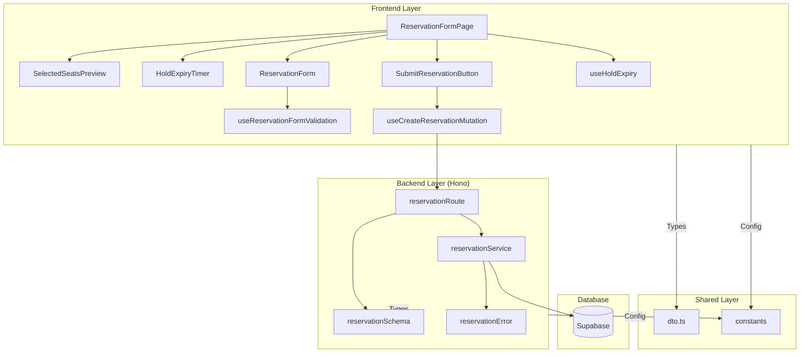

# 예약 정보 입력 페이지 구현 계획 (Reservation Form)

## 1. 개요 (Overview)

| 모듈 | 위치 | 설명 |
|---|---|---|
| **ReservationFormPage** | `src/app/book/page.tsx` | 예약 정보 입력 페이지의 진입점. 클라이언트 컴포넌트로 구성. |
| **SelectedSeatsPreview** | `src/features/reservation/components/selected-seats-preview.tsx` | 선점한 좌석 정보(구역, 번호, 가격, 총액)를 재확인용으로 표시하는 컴포넌트. |
| **HoldExpiryTimer** | `src/features/reservation/components/hold-expiry-timer.tsx` | 선점 만료까지 남은 시간을 실시간으로 표시하는 카운트다운 타이머. |
| **ReservationForm** | `src/features/reservation/components/reservation-form.tsx` | 예약자 정보(이름, 휴대폰, 비밀번호) 입력 폼. react-hook-form 사용. |
| **SubmitReservationButton** | `src/features/reservation/components/submit-reservation-button.tsx` | 예약 완료를 요청하는 버튼. 로딩 및 비활성화 상태 관리. |
| **useReservationFormValidation** | `src/features/reservation/hooks/use-reservation-form-validation.ts` | 입력값 유효성 검증 규칙을 관리하는 훅 (react-hook-form + zod). |
| **useCreateReservationMutation** | `src/features/reservation/hooks/use-create-reservation-mutation.ts` | React Query를 사용해 예약 생성 API를 호출하는 Mutation 훅. |
| **useHoldExpiry** | `src/features/reservation/hooks/use-hold-expiry.ts` | 선점 만료 시각을 추적하고 만료 시 리다이렉트 처리하는 훅. |
| **reservationRoute** | `src/features/reservation/backend/route.ts` | 예약 생성 API 엔드포인트 (`POST /api/reservations`). |
| **reservationService** | `src/features/reservation/backend/service.ts` | 예약 생성의 핵심 비즈니스 로직. 트랜잭션을 통한 예약/좌석 상태 업데이트. |
| **reservationSchema** | `src/features/reservation/backend/schema.ts` | Zod를 사용한 예약 생성 요청/응답 스키마 정의. |
| **reservationError** | `src/features/reservation/backend/error.ts` | 예약 관련 에러 코드 정의 (선점 만료, 상태 불일치 등). |
| **dto** | `src/features/reservation/lib/dto.ts` | 백엔드 스키마를 프론트엔드에서 재사용하도록 노출. |
| **constants** | `src/features/reservation/constants/index.ts` | 예약 관련 상수 (선점 시간, 비밀번호 규칙 등). |

---

## 2. Diagram: 모듈 간 관계 (Mermaid)



---

## 3. Implementation Plan

### 3.1. Backend Layer

#### **3.1.1. Schema (`schema.ts`)**

**구현 내용**:
- `CreateReservationRequestSchema`: 예약 생성 요청 DTO
  - `seatIds`: UUID 배열 (최소 1개, 최대 4개)
  - `customerName`: 2~50자 문자열
  - `phoneNumber`: `010-XXXX-XXXX` 형식 정규식 검증
  - `password`: 8~20자 문자열
- `CreateReservationResponseSchema`: 예약 생성 성공 응답 DTO
  - `reservationId`: UUID
  - `reservationNumber`: 문자열 (예: `RES20250113001`)
  - `customerName`: 문자열
  - `phoneNumber`: 문자열
  - `concertId`: UUID
  - `concertTitle`: 문자열
  - `seats`: 좌석 상세 배열 (seatId, label, tierLabel, price)
  - `totalAmount`: 숫자
  - `seatCount`: 숫자
  - `createdAt`: ISO 8601 문자열
- `SeatDetailSchema`: 좌석 상세 정보 (재사용 가능)

**Unit Test**:
- ✅ **성공**: 유효한 요청 데이터 파싱 성공
- ❌ **실패**: `seatIds` 배열이 비어있거나 5개 이상일 때 검증 실패
- ❌ **실패**: `phoneNumber` 형식이 잘못된 경우 검증 실패
- ❌ **실패**: `password` 길이가 8자 미만일 때 검증 실패

---

#### **3.1.2. Error (`error.ts`)**

**구현 내용**:
- 에러 코드 상수 정의:
  ```typescript
  export const reservationErrorCodes = {
    VALIDATION_ERROR: 'VALIDATION_ERROR',
    SEAT_HOLD_EXPIRED: 'SEAT_HOLD_EXPIRED',
    SEAT_NOT_HELD: 'SEAT_NOT_HELD',
    DB_TRANSACTION_FAILED: 'DB_TRANSACTION_FAILED',
    INVALID_CONCERT: 'INVALID_CONCERT',
  } as const;
  
  export type ReservationServiceError = 
    (typeof reservationErrorCodes)[keyof typeof reservationErrorCodes];
  ```

---

#### **3.1.3. Service (`service.ts`)**

**구현 내용**:
- `createReservation(client, request)`: 예약 생성 핵심 로직
  1. **선점 유효성 재검증**:
     - 전달받은 `seatIds`로 `seats` 테이블 조회
     - 각 좌석의 `status`가 `temporarily_held`인지 확인
     - 각 좌석의 `hold_expires_at`이 `now()` 이후인지 확인
     - 하나라도 조건 불만족 시 → `failure(409, SEAT_HOLD_EXPIRED)`
  2. **비밀번호 해싱**: bcrypt 사용 (salt rounds: 10)
  3. **트랜잭션 시작** (`BEGIN`)
  4. **예약 레코드 INSERT** (`reservations` 테이블):
     - `concert_id`: 좌석 정보에서 추출
     - `customer_name`, `phone_number`, `password_hash`: 요청 데이터
     - `status`: `confirmed`
  5. **예약-좌석 매핑 INSERT** (`reservation_seats` 테이블, N건)
  6. **좌석 상태 업데이트** (`seats` 테이블):
     - `status`: `temporarily_held` → `reserved`
     - `hold_expires_at`: `NULL`
  7. **트랜잭션 커밋** (`COMMIT`)
  8. 성공 시 예약 상세 정보 반환

**Unit Test**:
- ✅ **성공**: 모든 좌석이 유효하게 선점된 상태에서 예약 생성 성공
- ✅ **성공**: 예약 생성 후 좌석 상태가 `reserved`로 변경됨
- ❌ **실패**: 선점 시간이 만료된 좌석이 포함된 경우 → `SEAT_HOLD_EXPIRED` 반환
- ❌ **실패**: 이미 `reserved` 상태인 좌석이 포함된 경우 → `SEAT_NOT_HELD` 반환
- ❌ **실패**: 트랜잭션 중 DB 오류 발생 시 롤백 및 `DB_TRANSACTION_FAILED` 반환
- ✅ **검증**: 비밀번호가 bcrypt로 해싱되어 저장됨 (평문 저장 X)

---

#### **3.1.4. Route (`route.ts`)**

**구현 내용**:
- `POST /api/reservations` 엔드포인트:
  1. 요청 본문을 `CreateReservationRequestSchema`로 검증
  2. 검증 실패 시 → `400 Bad Request`, `VALIDATION_ERROR`
  3. `reservationService.createReservation()` 호출
  4. 서비스 결과를 `respond(c, result)`로 반환
  5. 성공 시 → `201 Created` 응답

**Integration Test (API 레벨)**:
- ✅ **성공**: 유효한 요청 본문으로 201 응답 및 예약 정보 반환
- ❌ **실패**: 잘못된 형식의 `phoneNumber`로 400 응답
- ❌ **실패**: 선점 만료된 좌석으로 409 응답 (SEAT_HOLD_EXPIRED)
- ❌ **실패**: 빈 `seatIds` 배열로 400 응답

---

### 3.2. Frontend Layer

#### **3.2.1. Constants (`constants/index.ts`)**

**구현 내용**:
```typescript
export const HOLD_DURATION_MINUTES = 5;
export const PASSWORD_MIN_LENGTH = 8;
export const PASSWORD_MAX_LENGTH = 20;
export const PHONE_NUMBER_REGEX = /^010-\d{4}-\d{4}$/;
```

---

#### **3.2.2. Hooks**

##### **useReservationFormValidation**

**구현 내용**:
- react-hook-form과 zod resolver 사용
- 입력값 검증 규칙:
  - `customerName`: 2~50자, 필수
  - `phoneNumber`: 정규식 `^010-\d{4}-\d{4}$`, 필수
  - `password`: 8~20자, 필수
- 실시간 검증 피드백 제공

**QA Sheet**:
- ✅ 각 필드의 유효성 검증이 실시간으로 동작하는가?
- ✅ 에러 메시지가 한국어로 명확하게 표시되는가?
- ✅ 제출 버튼 클릭 시 모든 필드 검증 후 진행하는가?

---

##### **useCreateReservationMutation**

**구현 내용**:
- React Query의 `useMutation` 훅 사용
- API 엔드포인트: `POST /api/reservations`
- 성공 시 → `/reservations/complete?id={reservationId}`로 리다이렉트
- 실패 시 → 에러 메시지를 토스트로 표시

**QA Sheet**:
- ✅ API 호출 중 로딩 상태가 올바르게 표시되는가?
- ✅ 성공 시 예약 완료 페이지로 자동 리다이렉트되는가?
- ✅ 선점 만료 에러 시 좌석 선택 페이지로 리다이렉트되는가?
- ✅ 네트워크 오류 시 사용자에게 재시도 안내가 표시되는가?

---

##### **useHoldExpiry**

**구현 내용**:
- 선점 만료 시각(`hold_expires_at`)을 props로 받아 관리
- `setInterval`을 사용해 1초마다 남은 시간 계산
- 남은 시간이 0 이하가 되면:
  - 토스트 메시지 표시: "선점 시간이 만료되었습니다."
  - 좌석 선택 페이지(`/concerts/[concertId]/seats`)로 리다이렉트

**QA Sheet**:
- ✅ 타이머가 정확히 1초 단위로 업데이트되는가?
- ✅ 만료 시 자동으로 좌석 선택 페이지로 이동하는가?
- ✅ 컴포넌트 언마운트 시 타이머가 정리(cleanup)되는가?

---

#### **3.2.3. Components**

##### **SelectedSeatsPreview**

**구현 내용**:
- Props: `seats: Array<{ label, tierLabel, price }>`
- 선택한 좌석 목록을 카드 형태로 표시
- 각 좌석의 등급, 번호, 가격을 명시
- 총 합계 금액을 하단에 강조 표시

**QA Sheet**:
- ✅ 좌석 정보가 읽기 쉽게 정렬되어 표시되는가?
- ✅ 총액이 올바르게 계산되어 표시되는가?
- ✅ 모바일 화면에서도 레이아웃이 깨지지 않는가?

---

##### **HoldExpiryTimer**

**구현 내용**:
- Props: `expiresAt: string` (ISO 8601 형식)
- `useHoldExpiry` 훅을 사용해 남은 시간 계산
- `MM:SS` 형식으로 카운트다운 표시
- 1분 미만일 때 빨간색으로 강조

**QA Sheet**:
- ✅ 남은 시간이 실시간으로 정확히 표시되는가?
- ✅ 1분 미만일 때 시각적 강조가 적용되는가?
- ✅ 만료 시 타이머가 `00:00`을 표시하고 멈추는가?

---

##### **ReservationForm**

**구현 내용**:
- `useReservationFormValidation` 훅을 사용해 폼 관리
- 입력 필드:
  - 이름 (text input)
  - 휴대폰 번호 (text input, placeholder: `010-1234-5678`)
  - 비밀번호 (password input)
- 각 필드 아래에 에러 메시지 표시 영역
- shadcn/ui의 `Form`, `Input`, `Label` 컴포넌트 사용

**QA Sheet**:
- ✅ 입력값 변경 시 실시간 검증이 동작하는가?
- ✅ 에러 메시지가 필드 하단에 명확히 표시되는가?
- ✅ 자동완성(autocomplete) 속성이 적절히 설정되었는가?
- ✅ 접근성(a11y) 요구사항을 충족하는가? (label, aria 속성)

---

##### **SubmitReservationButton**

**구현 내용**:
- `useCreateReservationMutation`의 `isPending` 상태를 props로 받음
- 폼 검증 실패 시 버튼 비활성화
- 로딩 중일 때 스피너 표시 및 비활성화
- 버튼 텍스트: "예약 완료"

**QA Sheet**:
- ✅ 폼 검증 실패 시 버튼이 비활성화되는가?
- ✅ API 호출 중 로딩 스피너가 표시되는가?
- ✅ 중복 클릭이 방지되는가?

---

##### **ReservationFormPage**

**구현 내용**:
- 페이지 진입 시 URL 쿼리 파라미터 또는 클라이언트 상태에서 `seatIds`와 `hold_expires_at` 추출
- `SelectedSeatsPreview`로 좌석 정보 표시
- `HoldExpiryTimer`로 만료 시간 표시
- `ReservationForm`으로 사용자 입력 수집
- `SubmitReservationButton`으로 예약 제출
- 선점 만료 시 `useHoldExpiry`가 자동으로 리다이렉트 처리

**QA Sheet**:
- ✅ 페이지 진입 시 선점한 좌석 정보가 올바르게 표시되는가?
- ✅ 타이머와 폼 입력이 동시에 정상 동작하는가?
- ✅ 예약 성공 시 예약 완료 페이지로 매끄럽게 이동하는가?
- ✅ 선점 만료 시 사용자에게 명확한 피드백이 제공되는가?
- ✅ 전체 사용자 플로우가 직관적이고 에러 없이 진행되는가?

---

## 4. Data Flow Summary

1. **페이지 진입**: 좌석 선택 페이지에서 선점 성공 후 `/book?seatIds=...&expiresAt=...`로 리다이렉트
2. **데이터 표시**: URL에서 추출한 `seatIds`로 좌석 정보 조회 및 표시
3. **입력 수집**: 사용자가 이름, 휴대폰 번호, 비밀번호 입력
4. **검증**: 클라이언트 측에서 react-hook-form + zod로 1차 검증
5. **API 요청**: `POST /api/reservations` 호출
6. **서버 검증**: 서버에서 선점 유효성 재검증 및 트랜잭션 처리
7. **응답 처리**:
   - 성공 → 예약 완료 페이지로 리다이렉트
   - 선점 만료 → 좌석 선택 페이지로 리다이렉트 (토스트 메시지)
   - 기타 오류 → 현재 페이지에 에러 메시지 표시

---

## 5. Non-Functional Requirements

### 5.1. Performance
- 예약 생성 API 응답 시간: 평균 500ms 이하
- 폼 입력 검증 피드백: 100ms 이내

### 5.2. Security
- 비밀번호는 bcrypt로 해싱 (salt rounds: 10)
- HTTPS 통신 필수 (프로덕션)
- SQL Injection 방지 (Parameterized Query)

### 5.3. Usability
- 입력 폼에서 실시간 유효성 검사 피드백 제공
- 선점 시간 만료 시 명확한 안내 메시지
- 모바일 반응형 레이아웃 지원

### 5.4. Reliability
- 트랜잭션 원자성 보장으로 데이터 정합성 유지
- 롤백 시 모든 변경 사항 완전 복구

---

## 6. Related Documents
- `/docs/003/spec.md` - Use Case 003: 예약 정보 입력 및 확정
- `/docs/prd.md` - 제품 요구사항 정의서
- `/docs/database.md` - 데이터베이스 스키마 및 정책