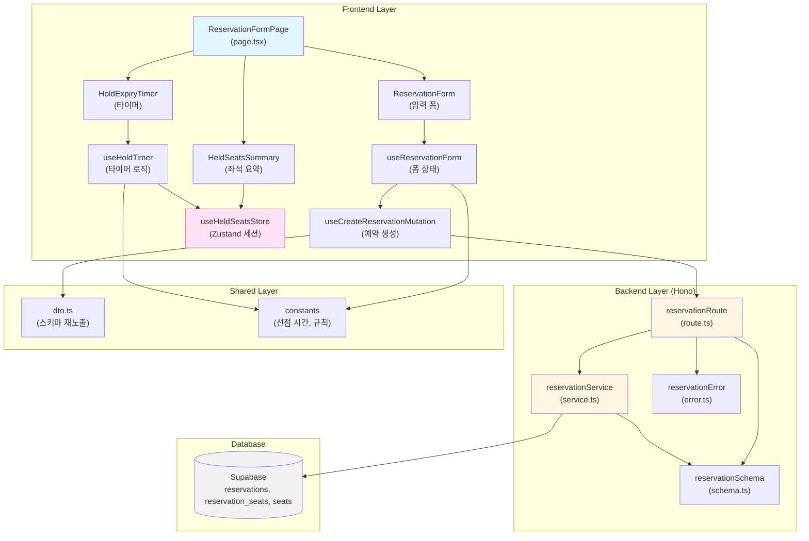

# 예약 정보 입력 및 좌석 선점 정책 페이지 모듈화 설계 (Reservation Form & Hold Policy Page)

## 개요 (Overview)

예약 정보 입력 페이지(`/book`)는 사용자가 좌석 선택 페이지에서 임시 선점한 좌석에 대해 예약자 정보(이름, 휴대폰 번호, 비밀번호)를 입력하고 최종 예약을 확정하는 핵심 기능을 제공합니다. 이 페이지는 **5분의 선점 시간 제한** 내에서 작동하며, 선점 유효성 재검증과 트랜잭션 원자성을 보장하여 데이터 정합성을 유지합니다.

### 주요 모듈 목록

| 모듈 | 위치 | 설명 |
|------|------|------|
| **ReservationFormPage** | `src/app/book/page.tsx` | 예약 정보 입력 페이지 라우트 컴포넌트 |
| **HoldExpiryTimer** | `src/features/reservation/components/hold-expiry-timer.tsx` | 선점 만료 카운트다운 타이머 |
| **HeldSeatsSummary** | `src/features/reservation/components/held-seats-summary.tsx` | 선점된 좌석 정보 요약 카드 |
| **ReservationForm** | `src/features/reservation/components/reservation-form.tsx` | 예약자 정보 입력 폼 |
| **useReservationForm** | `src/features/reservation/hooks/use-reservation-form.ts` | 폼 상태 관리 및 유효성 검사 훅 (react-hook-form) |
| **useCreateReservationMutation** | `src/features/reservation/hooks/use-create-reservation-mutation.ts` | 예약 생성 요청 훅 (React Query) |
| **useHoldTimer** | `src/features/reservation/hooks/use-hold-timer.ts` | 선점 시간 타이머 로직 훅 |
| **useHeldSeatsStore** | `src/features/reservation/stores/held-seats-store.ts` | 선점 정보 임시 저장소 (Zustand) |
| **reservationRoute** | `src/features/reservation/backend/route.ts` | Hono 라우터 (예약 생성 API) |
| **reservationService** | `src/features/reservation/backend/service.ts` | 비즈니스 로직 (선점 유효성 재검증, 예약 생성 트랜잭션) |
| **reservationSchema** | `src/features/reservation/backend/schema.ts` | Zod 스키마 정의 (요청/응답) |
| **reservationError** | `src/features/reservation/backend/error.ts` | 에러 코드 정의 |
| **dto** | `src/features/reservation/lib/dto.ts` | 클라이언트 측 DTO 재노출 |
| **constants** | `src/features/reservation/constants/index.ts` | 선점 시간, 유효성 검사 규칙 등 상수 |

---

## Diagram: 모듈 간 관계 (Mermaid)



---

## Implementation Plan

### 1. Backend Layer

#### 1.1 Schema 정의 (`src/features/reservation/backend/schema.ts`)

**목적**: 예약 생성 API의 요청/응답 데이터 구조를 Zod 스키마로 정의

**구현 계획**:

```typescript
import { z } from 'zod';

// 휴대폰 번호 정규식 (010-XXXX-XXXX)
const PHONE_NUMBER_REGEX = /^010-\d{4}-\d{4}$/;

// 비밀번호 규칙: 8~20자, 영문/숫자/특수문자 중 2가지 이상
const PASSWORD_MIN_LENGTH = 8;
const PASSWORD_MAX_LENGTH = 20;

// 예약 생성 요청 스키마
export const CreateReservationRequestSchema = z.object({
  seatIds: z.array(z.string().uuid()).min(1).max(4),
  customerName: z.string().min(2).max(50).trim(),
  phoneNumber: z.string().regex(PHONE_NUMBER_REGEX, {
    message: '휴대폰 번호는 010-XXXX-XXXX 형식이어야 합니다.',
  }),
  password: z.string().min(PASSWORD_MIN_LENGTH).max(PASSWORD_MAX_LENGTH),
});

export type CreateReservationRequest = z.infer<typeof CreateReservationRequestSchema>;

// 예약된 좌석 정보 스키마
export const ReservedSeatInfoSchema = z.object({
  seatId: z.string().uuid(),
  label: z.string(),
  tierLabel: z.string(),
  price: z.number(),
});

export type ReservedSeatInfo = z.infer<typeof ReservedSeatInfoSchema>;

// 예약 생성 응답 스키마
export const CreateReservationResponseSchema = z.object({
  reservationId: z.string().uuid(),
  reservationNumber: z.string(),
  customerName: z.string(),
  phoneNumber: z.string(),
  concertId: z.string().uuid(),
  concertTitle: z.string(),
  seats: z.array(ReservedSeatInfoSchema),
  totalAmount: z.number(),
  seatCount: z.number(),
  createdAt: z.string(),
});

export type CreateReservationResponse = z.infer<typeof CreateReservationResponseSchema>;

// DB 테이블 row 스키마
export const ReservationTableRowSchema = z.object({
  id: z.string().uuid(),
  concert_id: z.string().uuid(),
  customer_name: z.string(),
  phone_number: z.string(),
  password_hash: z.string(),
  status: z.enum(['confirmed', 'cancelled']),
  created_at: z.string(),
  updated_at: z.string(),
});

export type ReservationTableRow = z.infer<typeof ReservationTableRowSchema>;

// 선점 유효성 검증용 스키마
export const SeatHoldValidationSchema = z.object({
  id: z.string().uuid(),
  status: z.enum(['available', 'temporarily_held', 'reserved']),
  hold_expires_at: z.string().nullable(),
});

export type SeatHoldValidation = z.infer<typeof SeatHoldValidationSchema>;
```

**Unit Test 시나리오**:
- ✅ 유효한 customerName (2~50자) 파싱 성공
- ❌ customerName 공백만으로 구성 시 거부
- ✅ 유효한 phoneNumber (010-1234-5678) 파싱 성공
- ❌ phoneNumber 형식 불일치 (예: 01012345678) 거부
- ✅ 유효한 password (8~20자) 파싱 성공
- ❌ password 길이 7자 이하 또는 21자 이상 거부
- ✅ seatIds 배열 길이 1~4 범위 내 허용
- ❌ seatIds 빈 배열 또는 5개 이상 거부

---

#### 1.2 Error 정의 (`src/features/reservation/backend/error.ts`)

**목적**: 예약 생성 과정에서 발생 가능한 에러 코드 정의

**구현 계획**:

```typescript
export const reservationErrorCodes = {
  // 유효성 검사 관련
  validationError: 'RESERVATION_VALIDATION_ERROR',
  
  // 선점 관련
  seatHoldExpired: 'SEAT_HOLD_EXPIRED',
  seatNotHeld: 'SEAT_NOT_HELD',
  
  // 트랜잭션 관련
  dbTransactionFailed: 'DB_TRANSACTION_FAILED',
  
  // 조회 관련
  concertNotFound: 'CONCERT_NOT_FOUND',
  seatsNotFound: 'SEATS_NOT_FOUND',
} as const;

export type ReservationServiceError =
  (typeof reservationErrorCodes)[keyof typeof reservationErrorCodes];
```

**Unit Test 시나리오**:
- ✅ 모든 에러 코드가 고유한 문자열 값으로 정의됨
- ✅ `ReservationServiceError` 타입이 올바르게 추론됨

---

#### 1.3 Service 로직 (`src/features/reservation/backend/service.ts`)

**목적**: 예약 생성 비즈니스 로직 구현 (선점 유효성 재검증, 트랜잭션 처리)

**구현 계획**:

##### 1.3.1 `validateSeatHolds(client, seatIds)`

**목적**: 선점된 좌석들이 여전히 유효한지(temporarily_held 상태이며 만료되지 않음) 검증

```typescript
import type { SupabaseClient } from '@supabase/supabase-js';
import { failure, success, type HandlerResult } from '@/backend/http/response';
import { reservationErrorCodes, type ReservationServiceError } from './error';

const validateSeatHolds = async (
  client: SupabaseClient,
  seatIds: string[]
): Promise<HandlerResult<boolean, ReservationServiceError, { expiredSeats?: string[] }>> => {
  const { data, error } = await client
    .from('seats')
    .select('id, status, hold_expires_at')
    .in('id', seatIds);

  if (error) {
    return failure(500, reservationErrorCodes.seatsNotFound, error.message);
  }

  if (!data || data.length !== seatIds.length) {
    return failure(
      409,
      reservationErrorCodes.seatNotHeld,
      'Some seats are not found or not held.',
      { expiredSeats: seatIds }
    );
  }

  const now = new Date();
  const invalidSeats = data.filter((seat) => {
    if (seat.status !== 'temporarily_held') return true;
    if (!seat.hold_expires_at) return true;
    return new Date(seat.hold_expires_at) <= now;
  });

  if (invalidSeats.length > 0) {
    return failure(
      409,
      reservationErrorCodes.seatHoldExpired,
      'Seat hold has expired.',
      { expiredSeats: invalidSeats.map((s) => s.id) }
    );
  }

  return success(true);
};
```

**Unit Test 시나리오**:
- ✅ 모든 좌석이 `temporarily_held` 상태이고 만료되지 않았을 때 성공 반환
- ❌ 좌석 중 하나라도 `available` 상태면 `seatNotHeld` 반환
- ❌ 좌석 중 하나라도 `hold_expires_at`이 현재 시각보다 과거면 `seatHoldExpired` 반환
- ❌ 요청한 seatIds 개수와 조회된 좌석 개수가 불일치하면 `seatNotHeld` 반환
- ✅ 반환된 details에 만료된 좌석 ID 목록 포함

---

##### 1.3.2 `generateReservationNumber()`

**목적**: 고유한 예약 번호 생성 (형식: `RES{YYYYMMDD}{일련번호 3자리}`)

```typescript
const generateReservationNumber = (): string => {
  const now = new Date();
  const year = now.getFullYear();
  const month = String(now.getMonth() + 1).padStart(2, '0');
  const day = String(now.getDate()).padStart(2, '0');
  const serial = String(Math.floor(Math.random() * 1000)).padStart(3, '0');
  
  return `RES${year}${month}${day}${serial}`;
};
```

**Unit Test 시나리오**:
- ✅ 생성된 예약 번호가 `RES20250113XXX` 형식과 일치
- ✅ 일련번호가 항상 3자리 (001, 099, 999 등)
- ⚠️ (추후 개선) DB 시퀀스 사용하여 유일성 보장

---

##### 1.3.3 `createReservation(client, request)`

**목적**: 예약 생성 트랜잭션 실행 (reservations INSERT, reservation_seats INSERT, seats UPDATE)

```typescript
import bcrypt from 'bcryptjs';
import { CreateReservationRequestSchema, type CreateReservationRequest, type CreateReservationResponse } from './schema';

const BCRYPT_SALT_ROUNDS = 10;

export const createReservation = async (
  client: SupabaseClient,
  request: CreateReservationRequest
): Promise<HandlerResult<CreateReservationResponse, ReservationServiceError, unknown>> => {
  // 1. 요청 데이터 검증
  const parsed = CreateReservationRequestSchema.safeParse(request);
  if (!parsed.success) {
    return failure(
      400,
      reservationErrorCodes.validationError,
      'Invalid request data.',
      parsed.error.format()
    );
  }

  const { seatIds, customerName, phoneNumber, password } = parsed.data;

  // 2. 선점 유효성 재검증
  const validationResult = await validateSeatHolds(client, seatIds);
  if (!validationResult.ok) {
    return validationResult as HandlerResult<CreateReservationResponse, ReservationServiceError, unknown>;
  }

  // 3. 비밀번호 해싱
  const passwordHash = await bcrypt.hash(password, BCRYPT_SALT_ROUNDS);

  // 4. 좌석 정보 조회 (concert_id, price 등)
  const { data: seatsData, error: seatsError } = await client
    .from('seats')
    .select('id, concert_id, label, seat_tier_id, concert_seat_tiers(label, price)')
    .in('id', seatIds);

  if (seatsError || !seatsData || seatsData.length === 0) {
    return failure(500, reservationErrorCodes.seatsNotFound, 'Failed to fetch seat details.');
  }

  const concertId = seatsData[0].concert_id;
  const totalAmount = seatsData.reduce((sum, seat) => {
    const tier = seat.concert_seat_tiers as { label: string; price: number } | null;
    return sum + (tier?.price ?? 0);
  }, 0);

  // 5. 콘서트 정보 조회
  const { data: concertData, error: concertError } = await client
    .from('concerts')
    .select('id, title')
    .eq('id', concertId)
    .maybeSingle();

  if (concertError || !concertData) {
    return failure(404, reservationErrorCodes.concertNotFound, 'Concert not found.');
  }

  // 6. 트랜잭션 시작 (Supabase는 명시적 트랜잭션을 지원하지 않으므로 RPC 함수 사용 권장)
  // MVP에서는 순차적 처리로 구현하되, 실패 시 롤백 로직 포함
  
  // 6-1. reservations INSERT
  const reservationNumber = generateReservationNumber();
  const { data: reservationData, error: reservationError } = await client
    .from('reservations')
    .insert({
      concert_id: concertId,
      customer_name: customerName,
      phone_number: phoneNumber,
      password_hash: passwordHash,
      status: 'confirmed',
    })
    .select('id, created_at')
    .single();

  if (reservationError || !reservationData) {
    return failure(
      500,
      reservationErrorCodes.dbTransactionFailed,
      'Failed to create reservation.',
      reservationError
    );
  }

  const reservationId = reservationData.id;

  // 6-2. reservation_seats INSERT
  const reservationSeatsData = seatIds.map((seatId) => ({
    reservation_id: reservationId,
    seat_id: seatId,
  }));

  const { error: reservationSeatsError } = await client
    .from('reservation_seats')
    .insert(reservationSeatsData);

  if (reservationSeatsError) {
    // 롤백: reservations DELETE
    await client.from('reservations').delete().eq('id', reservationId);
    return failure(
      500,
      reservationErrorCodes.dbTransactionFailed,
      'Failed to map reservation to seats.',
      reservationSeatsError
    );
  }

  // 6-3. seats UPDATE (status = 'reserved', hold_expires_at = null)
  const { error: seatsUpdateError } = await client
    .from('seats')
    .update({
      status: 'reserved',
      hold_expires_at: null,
    })
    .in('id', seatIds);

  if (seatsUpdateError) {
    // 롤백: reservations, reservation_seats DELETE
    await client.from('reservation_seats').delete().eq('reservation_id', reservationId);
    await client.from('reservations').delete().eq('id', reservationId);
    return failure(
      500,
      reservationErrorCodes.dbTransactionFailed,
      'Failed to update seat status.',
      seatsUpdateError
    );
  }

  // 7. 응답 데이터 구성
  const response: CreateReservationResponse = {
    reservationId,
    reservationNumber,
    customerName,
    phoneNumber,
    concertId,
    concertTitle: concertData.title,
    seats: seatsData.map((seat) => {
      const tier = seat.concert_seat_tiers as { label: string; price: number } | null;
      return {
        seatId: seat.id,
        label: seat.label,
        tierLabel: tier?.label ?? 'Unknown',
        price: tier?.price ?? 0,
      };
    }),
    totalAmount,
    seatCount: seatIds.length,
    createdAt: reservationData.created_at,
  };

  return success(response, 201);
};
```

**Unit Test 시나리오**:
- ✅ 유효한 요청으로 예약 생성 성공 시 201 응답, reservationId 포함
- ✅ password_hash가 bcrypt로 해싱되어 저장됨
- ✅ reservations, reservation_seats, seats 테이블 모두 정확히 업데이트됨
- ❌ 선점 유효성 검증 실패 시 `seatHoldExpired` 반환, 예약 생성되지 않음
- ❌ reservations INSERT 실패 시 `dbTransactionFailed` 반환
- ❌ reservation_seats INSERT 실패 시 롤백되어 reservations 레코드 삭제됨
- ❌ seats UPDATE 실패 시 롤백되어 모든 레코드 삭제됨
- ✅ totalAmount가 좌석들의 price 합계와 일치

---

#### 1.4 Route 정의 (`src/features/reservation/backend/route.ts`)

**목적**: Hono 라우터에 예약 생성 엔드포인트 등록

**구현 계획**:

```typescript
import type { Hono } from 'hono';
import { failure, respond } from '@/backend/http/response';
import { getLogger, getSupabase, type AppEnv } from '@/backend/hono/context';
import { CreateReservationRequestSchema } from './schema';
import { createReservation } from './service';
import { reservationErrorCodes } from './error';

export const registerReservationRoutes = (app: Hono<AppEnv>) => {
  // POST /api/reservations
  app.post('/api/reservations', async (c) => {
    const body = await c.req.json();
    const parsed = CreateReservationRequestSchema.safeParse(body);

    if (!parsed.success) {
      return respond(
        c,
        failure(
          400,
          reservationErrorCodes.validationError,
          'Invalid request data.',
          parsed.error.format()
        )
      );
    }

    const supabase = getSupabase(c);
    const logger = getLogger(c);

    const result = await createReservation(supabase, parsed.data);

    if (!result.ok) {
      if (result.error.code === reservationErrorCodes.dbTransactionFailed) {
        logger.error('Reservation creation transaction failed', result.error.message);
      }

      if (result.error.code === reservationErrorCodes.seatHoldExpired) {
        logger.warn('Seat hold expired during reservation creation', result.error.details);
      }
    }

    return respond(c, result);
  });
};
```

**통합 테스트** (Postman/REST Client):
- ✅ `POST /api/reservations` 유효한 요청으로 201 응답 수신
- ❌ `POST /api/reservations` 잘못된 phoneNumber 형식으로 400 응답
- ❌ `POST /api/reservations` seatIds 빈 배열로 400 응답
- ❌ `POST /api/reservations` 선점 만료된 좌석으로 409 응답
- ✅ 응답에 reservationId, reservationNumber, seats 포함

---

#### 1.5 Hono 앱에 라우터 등록 (`src/backend/hono/app.ts`)

**수정 계획**:

```typescript
import { registerReservationRoutes } from '@/features/reservation/backend/route';

export const createHonoApp = () => {
  // ... existing code ...
  
  registerExampleRoutes(app);
  registerSeatSelectionRoutes(app);
  registerReservationRoutes(app); // 추가
  
  singletonApp = app;
  return app;
};
```

---

### 2. Shared Layer

#### 2.1 DTO 재노출 (`src/features/reservation/lib/dto.ts`)

**목적**: 백엔드 스키마를 프론트엔드에서 재사용

**구현 계획**:

```typescript
export {
  CreateReservationRequestSchema,
  CreateReservationResponseSchema,
  ReservedSeatInfoSchema,
  type CreateReservationRequest,
  type CreateReservationResponse,
  type ReservedSeatInfo,
} from '@/features/reservation/backend/schema';
```

---

#### 2.2 Constants (`src/features/reservation/constants/index.ts`)

**목적**: 선점 시간, 폼 유효성 규칙 등 상수 정의

**구임 계획**:

```typescript
export const HOLD_DURATION_MINUTES = 5;
export const HOLD_DURATION_MS = HOLD_DURATION_MINUTES * 60 * 1000;

export const FORM_VALIDATION_RULES = {
  customerName: {
    minLength: 2,
    maxLength: 50,
  },
  phoneNumber: {
    regex: /^010-\d{4}-\d{4}$/,
    placeholder: '010-1234-5678',
  },
  password: {
    minLength: 8,
    maxLength: 20,
  },
} as const;

export const HOLD_WARNING_THRESHOLD_SEC = 60; // 1분 남았을 때 경고
```

---

### 3. Frontend Layer

#### 3.1 Stores

##### 3.1.1 `useHeldSeatsStore` (`src/features/reservation/stores/held-seats-store.ts`)

**목적**: 좌석 선점 페이지에서 예약 정보 입력 페이지로 선점 정보를 전달하는 임시 세션 스토어 (Zustand)

**구현 계획**:

```typescript
'use client';

import { create } from 'zustand';

export interface HeldSeatInfo {
  seatId: string;
  label: string;
  tierLabel: string;
  price: number;
}

export interface HeldSeatsState {
  concertId: string | null;
  concertTitle: string | null;
  heldSeats: HeldSeatInfo[];
  holdExpiresAt: string | null;
  totalAmount: number;
  
  setHeldInfo: (info: {
    concertId: string;
    concertTitle: string;
    heldSeats: HeldSeatInfo[];
    holdExpiresAt: string;
    totalAmount: number;
  }) => void;
  
  clearHeldInfo: () => void;
  
  consumeHeldInfo: () => {
    concertId: string;
    concertTitle: string;
    heldSeats: HeldSeatInfo[];
    holdExpiresAt: string;
    totalAmount: number;
  } | null;
}

export const useHeldSeatsStore = create<HeldSeatsState>((set, get) => ({
  concertId: null,
  concertTitle: null,
  heldSeats: [],
  holdExpiresAt: null,
  totalAmount: 0,
  
  setHeldInfo: (info) => {
    set({
      concertId: info.concertId,
      concertTitle: info.concertTitle,
      heldSeats: info.heldSeats,
      holdExpiresAt: info.holdExpiresAt,
      totalAmount: info.totalAmount,
    });
  },
  
  clearHeldInfo: () => {
    set({
      concertId: null,
      concertTitle: null,
      heldSeats: [],
      holdExpiresAt: null,
      totalAmount: 0,
    });
  },
  
  consumeHeldInfo: () => {
    const state = get();
    
    if (!state.concertId || !state.holdExpiresAt || state.heldSeats.length === 0) {
      return null;
    }
    
    const info = {
      concertId: state.concertId,
      concertTitle: state.concertTitle ?? '',
      heldSeats: state.heldSeats,
      holdExpiresAt: state.holdExpiresAt,
      totalAmount: state.totalAmount,
    };
    
    // 소비 후 초기화
    set({
      concertId: null,
      concertTitle: null,
      heldSeats: [],
      holdExpiresAt: null,
      totalAmount: 0,
    });
    
    return info;
  },
}));
```

**QA Sheet**:
| 시나리오 | 예상 결과 | 실제 결과 | 통과 여부 |
|---------|----------|----------|----------|
| setHeldInfo 호출 시 | state에 정보 저장됨 | | |
| consumeHeldInfo 호출 시 | 정보 반환 후 state 초기화됨 | | |
| consumeHeldInfo 두 번 호출 시 | 두 번째는 null 반환 | | |
| clearHeldInfo 호출 시 | state 즉시 초기화됨 | | |

---

#### 3.2 Hooks

##### 3.2.1 `useHoldTimer` (`src/features/reservation/hooks/use-hold-timer.ts`)

**목적**: 선점 만료 시간 카운트다운 타이머 로직

**구현 계획**:

```typescript
'use client';

import { useState, useEffect, useCallback } from 'react';
import { HOLD_WARNING_THRESHOLD_SEC } from '@/features/reservation/constants';

export interface UseHoldTimerOptions {
  holdExpiresAt: string; // ISO 8601 format
  onExpire?: () => void;
}

export const useHoldTimer = ({ holdExpiresAt, onExpire }: UseHoldTimerOptions) => {
  const [remainingSeconds, setRemainingSeconds] = useState<number>(0);
  const [isExpired, setIsExpired] = useState(false);

  const calculateRemaining = useCallback(() => {
    const expiresAt = new Date(holdExpiresAt).getTime();
    const now = Date.now();
    const diff = expiresAt - now;

    if (diff <= 0) {
      setRemainingSeconds(0);
      setIsExpired(true);
      return 0;
    }

    const seconds = Math.floor(diff / 1000);
    setRemainingSeconds(seconds);
    return seconds;
  }, [holdExpiresAt]);

  useEffect(() => {
    const remaining = calculateRemaining();

    if (remaining <= 0) {
      onExpire?.();
      return;
    }

    const intervalId = setInterval(() => {
      const newRemaining = calculateRemaining();

      if (newRemaining <= 0) {
        clearInterval(intervalId);
        onExpire?.();
      }
    }, 1000);

    return () => clearInterval(intervalId);
  }, [calculateRemaining, onExpire]);

  const minutes = Math.floor(remainingSeconds / 60);
  const seconds = remainingSeconds % 60;
  const isWarning = remainingSeconds <= HOLD_WARNING_THRESHOLD_SEC;

  return {
    remainingSeconds,
    minutes,
    seconds,
    isExpired,
    isWarning,
    formattedTime: `${String(minutes).padStart(2, '0')}:${String(seconds).padStart(2, '0')}`,
  };
};
```

**QA Sheet**:
| 시나리오 | 예상 결과 | 실제 결과 | 통과 여부 |
|---------|----------|----------|----------|
| holdExpiresAt이 5분 후일 때 | remainingSeconds = 300 | | |
| 1초 경과 시 | remainingSeconds가 1 감소 | | |
| remainingSeconds가 0이 되면 | isExpired = true, onExpire 호출됨 | | |
| remainingSeconds ≤ 60 시 | isWarning = true | | |
| formattedTime이 "04:59" 형식 | MM:SS 포맷 일치 | | |

---

##### 3.2.2 `useReservationForm` (`src/features/reservation/hooks/use-reservation-form.ts`)

**목적**: react-hook-form을 사용한 예약자 정보 입력 폼 상태 관리 및 유효성 검사

**구현 계획**:

```typescript
'use client';

import { useForm } from 'react-hook-form';
import { zodResolver } from '@hookform/resolvers/zod';
import { z } from 'zod';
import { FORM_VALIDATION_RULES } from '@/features/reservation/constants';

const ReservationFormSchema = z.object({
  customerName: z
    .string()
    .min(FORM_VALIDATION_RULES.customerName.minLength, '이름은 최소 2자 이상이어야 합니다.')
    .max(FORM_VALIDATION_RULES.customerName.maxLength, '이름은 최대 50자 이하이어야 합니다.')
    .trim(),
  phoneNumber: z
    .string()
    .regex(FORM_VALIDATION_RULES.phoneNumber.regex, '휴대폰 번호는 010-XXXX-XXXX 형식이어야 합니다.'),
  password: z
    .string()
    .min(FORM_VALIDATION_RULES.password.minLength, '비밀번호는 최소 8자 이상이어야 합니다.')
    .max(FORM_VALIDATION_RULES.password.maxLength, '비밀번호는 최대 20자 이하이어야 합니다.'),
});

export type ReservationFormData = z.infer<typeof ReservationFormSchema>;

export const useReservationForm = () => {
  return useForm<ReservationFormData>({
    resolver: zodResolver(ReservationFormSchema),
    defaultValues: {
      customerName: '',
      phoneNumber: '',
      password: '',
    },
    mode: 'onBlur',
  });
};
```

**QA Sheet**:
| 시나리오 | 예상 결과 | 실제 결과 | 통과 여부 |
|---------|----------|----------|----------|
| customerName 빈 값 제출 시 | errors.customerName 메시지 표시 | | |
| phoneNumber 형식 불일치 시 | errors.phoneNumber 메시지 표시 | | |
| password 길이 7자 이하 시 | errors.password 메시지 표시 | | |
| 모든 필드 유효 시 | errors 없음, handleSubmit 실행됨 | | |

---

##### 3.2.3 `useCreateReservationMutation` (`src/features/reservation/hooks/use-create-reservation-mutation.ts`)

**목적**: 예약 생성 요청을 처리하는 React Query Mutation 훅

**구현 계획**:

```typescript
'use client';

import { useMutation } from '@tanstack/react-query';
import { apiClient, extractApiErrorMessage } from '@/lib/remote/api-client';
import {
  CreateReservationRequestSchema,
  CreateReservationResponseSchema,
  type CreateReservationRequest,
  type CreateReservationResponse,
} from '@/features/reservation/lib/dto';

const createReservation = async (
  request: CreateReservationRequest
): Promise<CreateReservationResponse> => {
  try {
    const validated = CreateReservationRequestSchema.parse(request);
    const { data } = await apiClient.post('/api/reservations', validated);
    return CreateReservationResponseSchema.parse(data);
  } catch (error) {
    const message = extractApiErrorMessage(error, 'Failed to create reservation.');
    throw new Error(message);
  }
};

export const useCreateReservationMutation = () =>
  useMutation({
    mutationFn: createReservation,
  });
```

**QA Sheet**:
| 시나리오 | 예상 결과 | 실제 결과 | 통과 여부 |
|---------|----------|----------|----------|
| 유효한 요청으로 예약 생성 시 | data에 reservationId, reservationNumber 포함 | | |
| 선점 만료된 좌석으로 요청 시 | error.message에 "expired" 포함 | | |
| 네트워크 오류 발생 시 | error.message에 "Failed to create reservation" 포함 | | |
| isPending 상태가 올바르게 변화 | true → false | | |

---

#### 3.3 Components

##### 3.3.1 `HoldExpiryTimer` (`src/features/reservation/components/hold-expiry-timer.tsx`)

**목적**: 선점 만료 시간 카운트다운 타이머 UI

**Props**:

```typescript
type HoldExpiryTimerProps = {
  holdExpiresAt: string; // ISO 8601
  onExpire: () => void;
};
```

**구현 계획**:

```tsx
'use client';

import { useHoldTimer } from '@/features/reservation/hooks/use-hold-timer';
import { Badge } from '@/components/ui/badge';
import { Clock } from 'lucide-react';

export const HoldExpiryTimer = ({ holdExpiresAt, onExpire }: HoldExpiryTimerProps) => {
  const { formattedTime, isWarning, isExpired } = useHoldTimer({ holdExpiresAt, onExpire });

  if (isExpired) {
    return (
      <Badge variant="destructive" className="text-lg px-4 py-2">
        <Clock className="mr-2 h-5 w-5" />
        선점 시간 만료
      </Badge>
    );
  }

  return (
    <Badge variant={isWarning ? 'warning' : 'default'} className="text-lg px-4 py-2">
      <Clock className="mr-2 h-5 w-5" />
      남은 시간: {formattedTime}
    </Badge>
  );
};
```

**QA Sheet**:
| 시나리오 | 예상 결과 | 실제 결과 | 통과 여부 |
|---------|----------|----------|----------|
| remainingSeconds > 60 시 | Badge variant="default" | | |
| remainingSeconds ≤ 60 시 | Badge variant="warning" | | |
| isExpired = true 시 | "선점 시간 만료" 텍스트 표시 | | |
| formattedTime이 1초마다 업데이트 | 타이머 동작 | | |

---

##### 3.3.2 `HeldSeatsSummary` (`src/features/reservation/components/held-seats-summary.tsx`)

**목적**: 선점된 좌석 정보 요약 카드

**Props**:

```typescript
type HeldSeatsSummaryProps = {
  concertTitle: string;
  heldSeats: HeldSeatInfo[];
  totalAmount: number;
};
```

**구현 계획**:

```tsx
'use client';

import { Card, CardContent, CardHeader, CardTitle } from '@/components/ui/card';
import { Separator } from '@/components/ui/separator';

export const HeldSeatsSummary = ({ concertTitle, heldSeats, totalAmount }: HeldSeatsSummaryProps) => {
  const formatPrice = (price: number) => price.toLocaleString('ko-KR');

  return (
    <Card>
      <CardHeader>
        <CardTitle>선택한 좌석 정보</CardTitle>
      </CardHeader>
      <CardContent>
        <div className="mb-4">
          <p className="text-sm text-gray-500">콘서트</p>
          <p className="text-lg font-semibold">{concertTitle}</p>
        </div>
        
        <Separator className="my-4" />
        
        <div className="space-y-2">
          {heldSeats.map((seat) => (
            <div key={seat.seatId} className="flex justify-between">
              <span className="text-sm">
                {seat.label} ({seat.tierLabel})
              </span>
              <span className="text-sm font-medium">{formatPrice(seat.price)}원</span>
            </div>
          ))}
        </div>
        
        <Separator className="my-4" />
        
        <div className="flex justify-between text-lg font-bold">
          <span>총 금액</span>
          <span>{formatPrice(totalAmount)}원</span>
        </div>
      </CardContent>
    </Card>
  );
};
```

**QA Sheet**:
| 시나리오 | 예상 결과 | 실제 결과 | 통과 여부 |
|---------|----------|----------|----------|
| heldSeats 배열 렌더링 | 모든 좌석 정보 표시 | | |
| totalAmount 포맷 | 천 단위 쉼표 "250,000원" | | |
| concertTitle 표시 | 콘서트 제목 정확히 표시 | | |

---

##### 3.3.3 `ReservationForm` (`src/features/reservation/components/reservation-form.tsx`)

**목적**: 예약자 정보 입력 폼

**Props**:

```typescript
type ReservationFormProps = {
  onSubmit: (data: ReservationFormData) => void;
  isSubmitting: boolean;
};
```

**구현 계획**:

```tsx
'use client';

import { useReservationForm } from '@/features/reservation/hooks/use-reservation-form';
import { Button } from '@/components/ui/button';
import { Input } from '@/components/ui/input';
import { Label } from '@/components/ui/label';
import { Card, CardContent, CardHeader, CardTitle } from '@/components/ui/card';

export const ReservationForm = ({ onSubmit, isSubmitting }: ReservationFormProps) => {
  const {
    register,
    handleSubmit,
    formState: { errors, isValid },
  } = useReservationForm();

  return (
    <Card>
      <CardHeader>
        <CardTitle>예약자 정보</CardTitle>
      </CardHeader>
      <CardContent>
        <form onSubmit={handleSubmit(onSubmit)} className="space-y-4">
          <div>
            <Label htmlFor="customerName">이름</Label>
            <Input
              id="customerName"
              {...register('customerName')}
              placeholder="홍길동"
              disabled={isSubmitting}
            />
            {errors.customerName && (
              <p className="text-sm text-red-500 mt-1">{errors.customerName.message}</p>
            )}
          </div>

          <div>
            <Label htmlFor="phoneNumber">휴대폰 번호</Label>
            <Input
              id="phoneNumber"
              {...register('phoneNumber')}
              placeholder="010-1234-5678"
              disabled={isSubmitting}
            />
            {errors.phoneNumber && (
              <p className="text-sm text-red-500 mt-1">{errors.phoneNumber.message}</p>
            )}
          </div>

          <div>
            <Label htmlFor="password">비밀번호 (예약 조회용)</Label>
            <Input
              id="password"
              type="password"
              {...register('password')}
              placeholder="8자 이상"
              disabled={isSubmitting}
            />
            {errors.password && (
              <p className="text-sm text-red-500 mt-1">{errors.password.message}</p>
            )}
          </div>

          <Button
            type="submit"
            className="w-full"
            disabled={!isValid || isSubmitting}
          >
            {isSubmitting ? '예약 중...' : '예약 완료'}
          </Button>
        </form>
      </CardContent>
    </Card>
  );
};
```

**QA Sheet**:
| 시나리오 | 예상 결과 | 실제 결과 | 통과 여부 |
|---------|----------|----------|----------|
| 모든 필드 유효 시 | 버튼 활성화 | | |
| 필드 유효성 검사 실패 시 | 에러 메시지 표시 | | |
| isSubmitting = true 시 | 모든 입력 필드 비활성화, 버튼 "예약 중..." | | |
| onSubmit 호출 시 | 폼 데이터 전달됨 | | |

---

#### 3.4 Page Component

##### 3.4.1 `ReservationFormPage` (`src/app/book/page.tsx`)

**목적**: 예약 정보 입력 페이지 라우트 컴포넌트

**구현 계획**:

```tsx
'use client';

import { useEffect } from 'react';
import { useRouter } from 'next/navigation';
import { useHeldSeatsStore } from '@/features/reservation/stores/held-seats-store';
import { useCreateReservationMutation } from '@/features/reservation/hooks/use-create-reservation-mutation';
import type { ReservationFormData } from '@/features/reservation/hooks/use-reservation-form';
import { HoldExpiryTimer } from '@/features/reservation/components/hold-expiry-timer';
import { HeldSeatsSummary } from '@/features/reservation/components/held-seats-summary';
import { ReservationForm } from '@/features/reservation/components/reservation-form';
import { useToast } from '@/hooks/use-toast';

export default function ReservationFormPage() {
  const router = useRouter();
  const { toast } = useToast();
  const consumeHeldInfo = useHeldSeatsStore((state) => state.consumeHeldInfo);
  const createReservationMutation = useCreateReservationMutation();

  const heldInfo = consumeHeldInfo();

  useEffect(() => {
    if (!heldInfo) {
      toast({
        title: '잘못된 접근',
        description: '좌석을 먼저 선택해주세요.',
        variant: 'destructive',
      });
      router.push('/');
    }
  }, [heldInfo, router, toast]);

  const handleExpire = () => {
    toast({
      title: '선점 시간 만료',
      description: '좌석 선점 시간이 만료되었습니다. 좌석 선택 단계로 이동합니다.',
      variant: 'destructive',
    });
    router.push(`/concerts/${heldInfo?.concertId}/seats`);
  };

  const handleSubmit = async (data: ReservationFormData) => {
    if (!heldInfo) return;

    try {
      const response = await createReservationMutation.mutateAsync({
        seatIds: heldInfo.heldSeats.map((s) => s.seatId),
        customerName: data.customerName,
        phoneNumber: data.phoneNumber,
        password: data.password,
      });

      toast({
        title: '예약 완료',
        description: `예약 번호: ${response.reservationNumber}`,
      });

      router.push(`/reservations/complete?id=${response.reservationId}`);
    } catch (error) {
      toast({
        title: '예약 실패',
        description: (error as Error).message,
        variant: 'destructive',
      });
    }
  };

  if (!heldInfo) {
    return <div>Loading...</div>;
  }

  return (
    <div className="container mx-auto py-8 max-w-4xl">
      <h1 className="text-3xl font-bold mb-4">예약 정보 입력</h1>

      <div className="flex justify-center mb-6">
        <HoldExpiryTimer holdExpiresAt={heldInfo.holdExpiresAt} onExpire={handleExpire} />
      </div>

      <div className="grid grid-cols-1 lg:grid-cols-2 gap-8">
        <HeldSeatsSummary
          concertTitle={heldInfo.concertTitle}
          heldSeats={heldInfo.heldSeats}
          totalAmount={heldInfo.totalAmount}
        />

        <ReservationForm
          onSubmit={handleSubmit}
          isSubmitting={createReservationMutation.isPending}
        />
      </div>
    </div>
  );
}
```

**QA Sheet**:
| 시나리오 | 예상 결과 | 실제 결과 | 통과 여부 |
|---------|----------|----------|----------|
| heldInfo가 없을 때 | 홈 페이지로 리다이렉트 | | |
| 페이지 로딩 시 | 선점 정보 표시 | | |
| 타이머 만료 시 | 좌석 선택 페이지로 리다이렉트 | | |
| 예약 완료 버튼 클릭 시 | createReservationMutation 호출됨 | | |
| 예약 성공 시 | `/reservations/complete` 페이지로 리다이렉트 | | |
| 예약 실패 시 | 에러 토스트 메시지 표시 | | |

---

## 구현 우선순위 (Implementation Priority)

### Phase 1: Backend Foundation (Day 1-2)
1. ✅ Schema 정의 (`schema.ts`)
2. ✅ Error 정의 (`error.ts`)
3. ✅ Constants 정의 (`constants/index.ts`)
4. ✅ Service 로직 - `validateSeatHolds` (`service.ts`)
5. ✅ Service 로직 - `generateReservationNumber` (`service.ts`)

### Phase 2: Reservation Transaction (Day 3-4)
6. ✅ Service 로직 - `createReservation` with 트랜잭션 (`service.ts`)
7. ✅ Route 등록 - POST `/api/reservations` (`route.ts`)
8. ✅ Hono 앱에 라우터 등록 (`app.ts`)
9. ✅ Backend Unit Tests

### Phase 3: Frontend Stores & Hooks (Day 5)
10. ✅ DTO 재노출 (`dto.ts`)
11. ✅ `useHeldSeatsStore` Zustand 스토어
12. ✅ `useHoldTimer` 훅
13. ✅ `useReservationForm` 훅
14. ✅ `useCreateReservationMutation` 훅

### Phase 4: UI Components (Day 6)
15. ✅ `HoldExpiryTimer` 컴포넌트
16. ✅ `HeldSeatsSummary` 컴포넌트
17. ✅ `ReservationForm` 컴포넌트

### Phase 5: Integration (Day 7)
18. ✅ `ReservationFormPage` 통합
19. ✅ E2E 테스트 (좌석 선점 → 예약 정보 입력 → 예약 완료)
20. ✅ Edge Case 처리 및 QA

### Phase 6: Optional Enhancements
21. ⚠️ 예약 번호 생성 로직 개선 (DB 시퀀스 사용)
22. ⚠️ 비밀번호 강도 검사 UI 추가
23. ⚠️ 선점 시간 연장 기능 (추후 개선)

---

## 참고 사항 (Notes)

### 선점 정책 확인 사항
- ✅ **선점 유효성 재검증**: 예약 생성 전 `validateSeatHolds` 함수로 선점 상태 및 만료 시간 재검증
- ✅ **트랜잭션 원자성**: reservations, reservation_seats, seats 업데이트는 단일 트랜잭션으로 처리 (실패 시 롤백)
- ✅ **비밀번호 보안**: bcrypt 해싱 (salt rounds: 10) 사용
- ✅ **타이머 관리**: 클라이언트 측 타이머로 사용자 경험 개선, 서버 측 재검증으로 정합성 보장
- ✅ **세션 스토어**: Zustand로 페이지 간 선점 정보 전달, 소비 후 즉시 초기화

### Convention 준수
- ✅ Hono 라우트 경로는 `/api` prefix 포함
- ✅ `AppLogger`는 `info`, `error`, `warn`, `debug` 메서드만 사용
- ✅ `respond(c, result)` 패턴 사용
- ✅ 모든 컴포넌트는 `'use client'` 지시어 포함
- ✅ React Query 훅은 `staleTime` 설정으로 캐싱 최적화
- ✅ react-hook-form + Zod resolver 조합으로 폼 유효성 검사

### 확장 고려 사항
- Supabase RPC 함수를 사용한 명시적 트랜잭션 구현 (현재는 순차 처리 + 롤백)
- 예약 번호 생성 시 DB 시퀀스 사용하여 유일성 완벽 보장
- 선점 시간 연장 기능 (사용자가 버튼 클릭 시 +5분 연장)
- 비밀번호 강도 검사 UI (실시간 피드백)

---

## 관련 문서 (Related Documents)
- `/docs/database.md` - 데이터베이스 스키마 및 정책
- `/docs/prd.md` - 제품 요구사항 정의서
- `/docs/userflow.md` - 사용자 플로우 정의
- `/docs/003/spec.md` - Use Case 003: 예약 정보 입력 및 확정
- `/docs/state-management.md` - 상태 관리 설계
- `/docs/pages/seat-selection/plan.md` - 좌석 선택 페이지 설계
- `AGENTS.md` - Senior Developer Guidelines
