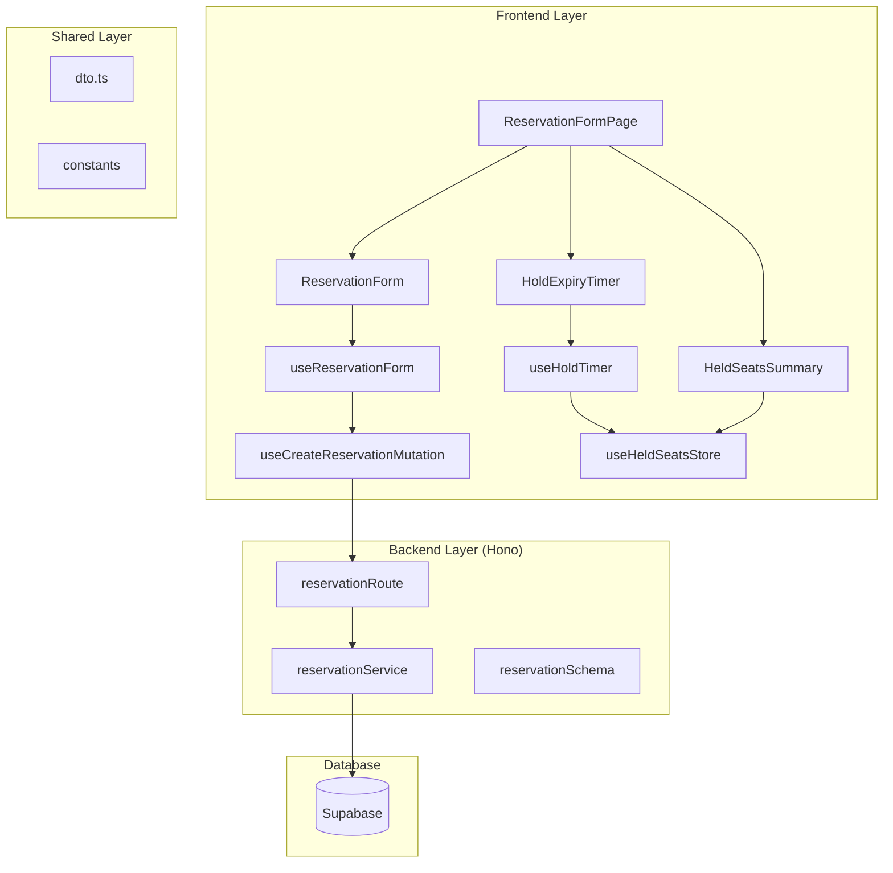

다음은 제공된 `plan.md`의 핵심 내용을 유지하며 더 간결하게 수정한 버전입니다.

---

### 예약 정보 입력 및 좌석 선점 페이지 모듈화 설계 (요약)

#### 개요 (Overview)

사용자가 선점한 좌석의 예약 정보를 5분 내에 입력하고 확정하는 페이지(`src/app/book/page.tsx`)를 설계합니다.

| 모듈 | 위치 | 설명 |
|---|---|---|
| **ReservationFormPage** | `.../app/book/page.tsx` | 페이지 라우트 컴포넌트 |
| **HoldExpiryTimer** | `.../components/hold-expiry-timer.tsx` | 선점 만료 카운트다운 타이머 UI |
| **HeldSeatsSummary** | `.../components/held-seats-summary.tsx` | 선점 좌석 정보 요약 UI |
| **ReservationForm** | `.../components/reservation-form.tsx` | 예약자 정보 입력 폼 UI |
| **useReservationForm** | `.../hooks/use-reservation-form.ts` | 폼 상태 및 유효성 검사 훅 |
| **useCreateReservationMutation** | `.../hooks/use-create-reservation-mutation.ts` | 예약 생성 API 요청 훅 (React Query) |
| **useHoldTimer** | `.../hooks/use-hold-timer.ts` | 선점 시간 카운트다운 로직 훅 |
| **useHeldSeatsStore** | `.../stores/held-seats-store.ts` | 선점 정보 임시 저장소 (Zustand) |
| **reservationRoute** | `.../backend/route.ts` | 예약 생성 API 라우트 (Hono) |
| **reservationService** | `.../backend/service.ts` | 예약 생성 비즈니스 로직 |
| **reservationSchema** | `.../backend/schema.ts` | API 요청/응답 데이터 스키마 (Zod) |

---

#### Diagram: 모듈 간 관계 (Mermaid)

---

#### Implementation Plan

##### 1. Backend Layer

*   **Schema 정의 (`.../backend/schema.ts`)**
    *   **목적**: Zod를 사용하여 예약 생성 API의 요청(`CreateReservationRequest`) 및 응답(`CreateReservationResponse`) 스키마를 정의합니다.
    *   **Unit Test**: 이름, 휴대폰 번호, 비밀번호 형식 및 길이에 대한 유효성 검사 시나리오를 테스트합니다.

*   **Service 로직 (`.../backend/service.ts`)**
    *   **목적**: 예약 생성의 핵심 비즈니스 로직을 구현합니다.
    *   **주요 기능**:
        1.  `validateSeatHolds`: DB에서 좌석의 선점 상태(`temporarily_held`)와 만료 시간을 재검증합니다.
        2.  `createReservation`: 다음을 포함하는 DB 트랜잭션을 실행합니다.
            *   `reservations` 테이블에 예약 정보 INSERT
            *   `reservation_seats` 테이블에 좌석 매핑 정보 INSERT
            *   `seats` 테이블의 상태를 `reserved`로 UPDATE
            *   실패 시 모든 변경 사항을 롤백합니다.
    *   **Unit Test**:
        *   정상적인 예약 생성(201) 및 데이터 정합성을 검증합니다.
        *   선점 만료(409) 시 예약이 거부되는지 확인합니다.
        *   DB 트랜잭션 실패 시 롤백 로직이 정상 동작하는지 검증합니다.

*   **Route 정의 (`.../backend/route.ts`)**
    *   **목적**: `POST /api/reservations` 엔드포인트를 Hono 라우터에 등록하고, `reservationService`와 연결합니다.

##### 2. Frontend Layer

*   **상태 관리 (`.../stores/held-seats-store.ts`)**
    *   **목적**: Zustand를 사용하여 좌석 선택 페이지에서 전달받은 선점 정보(좌석, 만료 시간)를 임시 저장합니다. 정보 사용 후에는 즉시 초기화하는 `consume` 패턴을 적용합니다.
    *   **QA Sheet**:
        *   `setHeldInfo`: 정보가 스토어에 올바르게 저장되는지 확인합니다.
        *   `consumeHeldInfo`: 정보 반환 후 스토어 상태가 초기화되는지 확인합니다.

*   **Hooks 로직**
    *   **`useHoldTimer`**: 선점 만료까지 남은 시간을 1초마다 계산하고, 만료 시 `onExpire` 콜백을 실행하는 훅입니다.
        *   **QA Sheet**: 타이머가 정확히 동작하는지, 만료 시 콜백이 호출되는지, 1분 미만일 때 경고 상태(`isWarning`)가 활성화되는지 확인합니다.
    *   **`useReservationForm`**: `react-hook-form`과 Zod를 사용하여 예약자 정보 폼의 상태와 유효성 검사를 관리합니다.
        *   **QA Sheet**: 각 입력 필드의 유효성 규칙(필수, 형식, 길이) 위반 시 에러 메시지가 표시되는지 확인합니다.
    *   **`useCreateReservationMutation`**: React Query의 `useMutation`으로 예약 생성 API를 호출하고, 서버의 응답(성공/실패) 및 로딩 상태를 관리합니다.
        *   **QA Sheet**: API 호출 시 로딩 상태(`isPending`)가 올바르게 변경되는지, 성공/실패에 따라 `data` 또는 `error` 상태가 업데이트되는지 확인합니다.

*   **UI Components**
    *   **`HoldExpiryTimer`**: `useHoldTimer` 훅을 사용하여 남은 시간을 `MM:SS` 형식으로 표시합니다.
        *   **QA Sheet**: 남은 시간에 따라 기본/경고/만료 상태의 UI가 올바르게 표시되는지 확인합니다.
    *   **`HeldSeatsSummary`**: 선점된 좌석 목록과 총 결제 금액을 시각적으로 요약하여 보여줍니다.
        *   **QA Sheet**: 전달된 좌석 정보와 금액이 정확하게 렌더링되는지 확인합니다.
    *   **`ReservationForm`**: 이름, 휴대폰 번호, 비밀번호 입력 필드와 제출 버튼을 포함한 폼 UI입니다.
        *   **QA Sheet**: `isSubmitting` 상태일 때 입력 필드와 버튼이 비활성화되는지 확인합니다.

*   **페이지 컴포넌트 (`.../app/book/page.tsx`)**
    *   **목적**: 위 모듈들을 통합하여 예약 정보 입력 페이지를 완성합니다.
    *   **주요 로직**:
        1.  페이지 진입 시 `useHeldSeatsStore`에서 선점 정보를 가져옵니다. 정보가 없으면 홈으로 리다이렉트합니다.
        2.  `HoldExpiryTimer`가 만료되면 좌석 선택 페이지로 리다이렉트합니다.
        3.  `ReservationForm` 제출 시 `useCreateReservationMutation`을 호출하여 예약을 생성하고, 결과에 따라 예약 완료 페이지로 이동하거나 에러 메시지를 표시합니다.
    *   **QA Sheet**:
        *   선점 정보가 없을 때 접근이 차단되는지 확인합니다.
        *   타이머 만료, 예약 성공, 예약 실패 시나리오별 페이지 이동 및 알림이 정상 동작하는지 확인합니다.