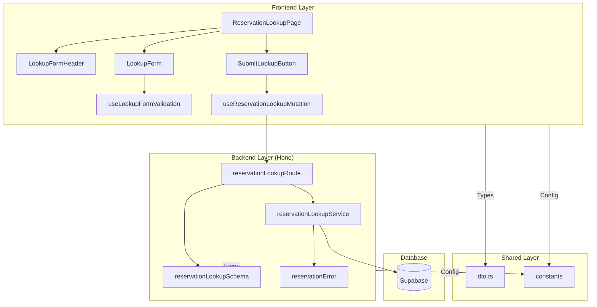

# 예약 조회 페이지 구현 계획 (Reservation Lookup)

## 1. 개요 (Overview)

| 모듈 | 위치 | 설명 |
|---|---|---|
| **ReservationLookupPage** | `src/app/reservations/lookup/page.tsx` | 예약 조회 페이지의 진입점. 클라이언트 컴포넌트로 구성. |
| **LookupForm** | `src/features/reservation/components/lookup-form.tsx` | 휴대폰 번호와 비밀번호 입력 폼. react-hook-form 사용. |
| **LookupFormHeader** | `src/features/reservation/components/lookup-form-header.tsx` | 페이지 제목 및 안내 메시지를 표시하는 컴포넌트. |
| **SubmitLookupButton** | `src/features/reservation/components/submit-lookup-button.tsx` | 예약 조회를 요청하는 버튼. 로딩 및 비활성화 상태 관리. |
| **useLookupFormValidation** | `src/features/reservation/hooks/use-lookup-form-validation.ts` | 입력값 유효성 검증 규칙을 관리하는 훅 (react-hook-form + zod). |
| **useReservationLookupMutation** | `src/features/reservation/hooks/use-reservation-lookup-mutation.ts` | React Query를 사용해 예약 조회 API를 호출하는 Mutation 훅. |
| **reservationLookupRoute** | `src/features/reservation/backend/route.ts` | 예약 조회 API 엔드포인트 (`POST /api/reservations/lookup`). |
| **reservationLookupService** | `src/features/reservation/backend/service.ts` | 예약 조회의 비즈니스 로직. 비밀번호 검증 포함. |
| **reservationLookupSchema** | `src/features/reservation/backend/schema.ts` | Zod를 사용한 예약 조회 요청/응답 스키마 정의. |
| **reservationError** | `src/features/reservation/backend/error.ts` | 예약 조회 관련 에러 코드 정의 (예약 없음, 비밀번호 불일치 등). |
| **dto** | `src/features/reservation/lib/dto.ts` | 백엔드 스키마를 프론트엔드에서 재사용하도록 노출. |
| **constants** | `src/features/reservation/constants/index.ts` | 예약 조회 관련 상수 (비밀번호 규칙 등). |

---

## 2. Diagram: 모듈 간 관계 (Mermaid)



---

## 3. Implementation Plan

### 3.1. Backend Layer

#### **3.1.1. Schema (`schema.ts`)**

**구현 내용**:
- `ReservationLookupRequestSchema`: 예약 조회 요청 DTO
  - `phoneNumber`: `010-XXXX-XXXX` 형식 정규식 검증, 필수
  - `password`: 8~20자 문자열, 필수
- `ReservationLookupResponseSchema`: 예약 조회 성공 응답 DTO
  - `reservationId`: UUID
  - `redirectUrl`: 문자열 (예: `/reservations/{reservationId}`)

**Unit Test**:
- ✅ **성공**: 유효한 요청 데이터 파싱 성공
- ❌ **실패**: `phoneNumber` 형식이 잘못된 경우 검증 실패
- ❌ **실패**: `password` 길이가 8자 미만일 때 검증 실패
- ❌ **실패**: 필수 필드 누락 시 검증 실패

---

#### **3.1.2. Error (`error.ts`)**

**구현 내용**:
- 에러 코드 상수 정의:
  ```typescript
  export const reservationErrorCodes = {
    VALIDATION_ERROR: 'VALIDATION_ERROR',
    RESERVATION_NOT_FOUND: 'RESERVATION_NOT_FOUND',
    INVALID_PASSWORD: 'INVALID_PASSWORD',
    DB_ERROR: 'DB_ERROR',
  } as const;
  
  export type ReservationServiceError = 
    (typeof reservationErrorCodes)[keyof typeof reservationErrorCodes];
  ```

---

#### **3.1.3. Service (`service.ts`)**

**구현 내용**:
- `lookupReservation(client, request)`: 예약 조회 핵심 로직
  1. **휴대폰 번호로 예약 검색**:
     - `reservations` 테이블에서 `phone_number`로 조회
     - `status = 'confirmed'`인 예약만 조회 (취소된 예약 제외 또는 포함 여부는 비즈니스 요구사항에 따라 결정)
  2. **예약 존재 여부 확인**:
     - 예약이 없으면 → `failure(404, RESERVATION_NOT_FOUND)`
  3. **비밀번호 검증**:
     - bcrypt를 사용해 입력된 비밀번호를 해싱
     - DB의 `password_hash`와 비교
     - 불일치 시 → `failure(401, INVALID_PASSWORD)`
  4. **성공 응답**:
     - 예약 ID와 리다이렉트 URL 반환

**Unit Test**:
- ✅ **성공**: 유효한 휴대폰 번호와 비밀번호로 예약 조회 성공
- ✅ **성공**: 응답에 `reservationId`와 `redirectUrl` 포함
- ❌ **실패**: 휴대폰 번호와 일치하는 예약이 없을 때 → `RESERVATION_NOT_FOUND` 반환
- ❌ **실패**: 비밀번호가 일치하지 않을 때 → `INVALID_PASSWORD` 반환
- ❌ **실패**: DB 오류 발생 시 → `DB_ERROR` 반환

---

#### **3.1.4. Route (`route.ts`)**

**구현 내용**:
- `POST /api/reservations/lookup` 엔드포인트:
  1. 요청 본문을 `ReservationLookupRequestSchema`로 검증
  2. 검증 실패 시 → `400 Bad Request`, `VALIDATION_ERROR`
  3. `reservationLookupService.lookupReservation()` 호출
  4. 서비스 결과를 `respond(c, result)`로 반환
  5. 성공 시 → `200 OK` 응답

**Integration Test (API 레벨)**:
- ✅ **성공**: 유효한 요청 본문으로 200 응답 및 예약 ID 반환
- ❌ **실패**: 잘못된 형식의 `phoneNumber`로 400 응답
- ❌ **실패**: 일치하는 예약이 없을 때 404 응답
- ❌ **실패**: 비밀번호 불일치 시 401 응답

---

### 3.2. Frontend Layer

#### **3.2.1. Constants (`constants/index.ts`)**

**구현 내용**:
```typescript
export const PASSWORD_MIN_LENGTH = 8;
export const PASSWORD_MAX_LENGTH = 20;
export const PHONE_NUMBER_REGEX = /^010-\d{4}-\d{4}$/;
```

---

#### **3.2.2. Hooks**

##### **useLookupFormValidation**

**구현 내용**:
- react-hook-form과 zod resolver 사용
- 입력값 검증 규칙:
  - `phoneNumber`: 정규식 `^010-\d{4}-\d{4}$`, 필수
  - `password`: 8~20자, 필수
- 실시간 검증 피드백 제공

**QA Sheet**:
- ✅ 각 필드의 유효성 검증이 실시간으로 동작하는가?
- ✅ 에러 메시지가 한국어로 명확하게 표시되는가?
- ✅ 제출 버튼 클릭 시 모든 필드 검증 후 진행하는가?

---

##### **useReservationLookupMutation**

**구현 내용**:
- React Query의 `useMutation` 훅 사용
- API 엔드포인트: `POST /api/reservations/lookup`
- 성공 시 → `/reservations/{reservationId}`로 리다이렉트
- 실패 시 → 에러 메시지를 폼 하단에 표시

**QA Sheet**:
- ✅ API 호출 중 로딩 상태가 올바르게 표시되는가?
- ✅ 성공 시 예약 상세 페이지로 자동 리다이렉트되는가?
- ✅ 예약 없음 에러 시 "일치하는 예약 정보가 없습니다." 메시지 표시되는가?
- ✅ 비밀번호 불일치 에러 시 명확한 피드백이 제공되는가?

---

#### **3.2.3. Components**

##### **LookupFormHeader**

**구현 내용**:
- Props: 없음 (정적 콘텐츠)
- 페이지 제목: "예약 조회"
- 안내 메시지: "예약 시 입력하신 휴대폰 번호와 비밀번호를 입력해주세요."

**QA Sheet**:
- ✅ 제목과 안내 메시지가 명확하게 표시되는가?
- ✅ 모바일 화면에서도 읽기 쉬운가?

---

##### **LookupForm**

**구현 내용**:
- `useLookupFormValidation` 훅을 사용해 폼 관리
- 입력 필드:
  - 휴대폰 번호 (text input, placeholder: `010-1234-5678`)
  - 비밀번호 (password input)
- 각 필드 아래에 에러 메시지 표시 영역
- shadcn/ui의 `Form`, `Input`, `Label` 컴포넌트 사용

**QA Sheet**:
- ✅ 입력값 변경 시 실시간 검증이 동작하는가?
- ✅ 에러 메시지가 필드 하단에 명확히 표시되는가?
- ✅ 자동완성(autocomplete) 속성이 적절히 설정되었는가?
- ✅ 접근성(a11y) 요구사항을 충족하는가?

---

##### **SubmitLookupButton**

**구현 내용**:
- `useReservationLookupMutation`의 `isPending` 상태를 props로 받음
- 폼 검증 실패 시 버튼 비활성화
- 로딩 중일 때 스피너 표시 및 비활성화
- 버튼 텍스트: "예약 조회"

**QA Sheet**:
- ✅ 폼 검증 실패 시 버튼이 비활성화되는가?
- ✅ API 호출 중 로딩 스피너가 표시되는가?
- ✅ 중복 클릭이 방지되는가?

---

##### **ReservationLookupPage**

**구현 내용**:
- 페이지 구성:
  1. `LookupFormHeader`로 제목 및 안내 메시지 표시
  2. `LookupForm`으로 사용자 입력 수집
  3. `SubmitLookupButton`으로 조회 요청
- 조회 성공 시 `useReservationLookupMutation`이 자동으로 리다이렉트 처리
- 조회 실패 시 폼 하단에 에러 메시지 표시

**QA Sheet**:
- ✅ 페이지 레이아웃이 직관적이고 깔끔한가?
- ✅ 폼 입력 및 제출이 매끄럽게 동작하는가?
- ✅ 조회 성공 시 예약 상세 페이지로 자동 이동하는가?
- ✅ 에러 발생 시 사용자에게 명확한 피드백이 제공되는가?
- ✅ 모바일 반응형 레이아웃이 잘 동작하는가?

---

## 4. Data Flow Summary

1. **페이지 진입**: 사용자가 `/reservations/lookup`으로 직접 접근
2. **입력 수집**: 휴대폰 번호와 비밀번호 입력
3. **검증**: 클라이언트 측에서 react-hook-form + zod로 1차 검증
4. **API 요청**: `POST /api/reservations/lookup` 호출
5. **서버 검증**:
   - 휴대폰 번호로 예약 검색
   - 비밀번호 bcrypt 해싱 및 비교
6. **응답 처리**:
   - 성공 → 예약 상세 페이지(`/reservations/{reservationId}`)로 리다이렉트
   - 예약 없음 → "일치하는 예약 정보가 없습니다." 메시지 표시
   - 비밀번호 불일치 → "휴대폰 번호 또는 비밀번호가 일치하지 않습니다." 메시지 표시 (보안상 구분하지 않음)
   - 기타 오류 → 일반 에러 메시지 표시

---

## 5. Security Considerations

### 5.1. 비밀번호 보안
- 비밀번호는 절대 평문으로 저장하지 않음
- bcrypt를 사용해 단방향 해싱
- Salt rounds: 10

### 5.2. 계정 존재 여부 노출 방지
- 예약 없음과 비밀번호 불일치를 동일한 메시지로 처리
- 예시: "휴대폰 번호 또는 비밀번호가 일치하지 않습니다."
- 이를 통해 특정 휴대폰 번호로 예약이 있는지 추측 불가

### 5.3. Rate Limiting (향후 고려)
- 무차별 대입 공격(Brute Force) 방지
- 동일 IP에서 짧은 시간 내 과도한 요청 시 차단

---

## 6. Non-Functional Requirements

### 6.1. Performance
- 예약 조회 API 응답 시간: 평균 300ms 이하
- 폼 입력 검증 피드백: 100ms 이내

### 6.2. Usability
- 입력 폼이 직관적이고 간결함
- 에러 메시지가 명확하고 이해하기 쉬움
- 모바일 반응형 레이아웃 지원

### 6.3. Accessibility
- 모든 폼 필드에 적절한 label 설정
- 키보드 내비게이션 지원
- 스크린 리더 호환

### 6.4. Security
- 비밀번호 해싱 (bcrypt)
- HTTPS 통신 필수 (프로덕션)
- SQL Injection 방지 (Parameterized Query)

---

## 7. Edge Cases

### 7.1. 휴대폰 번호 형식 오류
- **상황**: 사용자가 잘못된 형식의 휴대폰 번호 입력
- **처리**: 클라이언트 측 검증에서 차단, "올바른 휴대폰 번호 형식을 입력해주세요." 메시지 표시

### 7.2. 예약 없음
- **상황**: 입력한 휴대폰 번호로 예약이 존재하지 않음
- **처리**: "휴대폰 번호 또는 비밀번호가 일치하지 않습니다." 메시지 표시

### 7.3. 비밀번호 불일치
- **상황**: 예약은 존재하지만 비밀번호가 틀림
- **처리**: "휴대폰 번호 또는 비밀번호가 일치하지 않습니다." 메시지 표시 (보안상 예약 없음과 동일)

### 7.4. 취소된 예약 조회
- **상황**: 조회된 예약의 `status`가 `cancelled`인 경우
- **처리**: MVP 범위에서는 정상적으로 조회 가능, 상세 페이지에서 "취소된 예약입니다" 표시

### 7.5. 네트워크 오류
- **상황**: API 호출 중 네트워크 오류 발생
- **처리**: "잠시 후 다시 시도해주세요." 메시지 표시

### 7.6. 동일 휴대폰 번호로 여러 예약
- **상황**: 한 휴대폰 번호로 여러 예약이 존재하는 경우
- **처리**: 비밀번호가 일치하는 첫 번째 예약을 반환 (향후 목록 조회로 확장 가능)

---

## 8. Related Documents
- `/docs/004/spec.md` - Use Case 004: 예약 조회 및 취소
- `/docs/prd.md` - 제품 요구사항 정의서
- `/docs/requirement.md` - 기능 요구사항 정의
- `/docs/database.md` - 데이터베이스 스키마 및 정책
