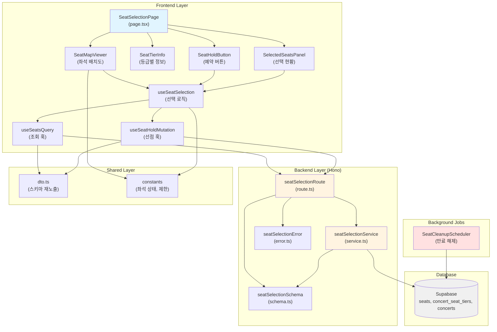

# 좌석 선택 페이지 모듈화 설계 (Seat Selection Page - Modular Design)

## 개요 (Overview)

좌석 선택 페이지는 사용자가 콘서트의 좌석 배치도를 시각적으로 확인하고, 원하는 좌석을 선택한 후 임시 선점(5분간 유효)하는 핵심 기능을 제공합니다. 이 문서는 관련 모듈들의 구조, 역할, 데이터 흐름을 정의하며, 좌석 선점 정책(Race Condition 방지, 트랜잭션 원자성 보장)을 준수하는 구현 계획을 제시합니다.

### 주요 모듈 목록

| 모듈 | 위치 | 설명 |
|------|------|------|
| **SeatSelectionPage** | `src/app/concerts/[concertId]/seats/page.tsx` | 좌석 선택 페이지 라우트 컴포넌트 |
| **SeatMapViewer** | `src/features/seat-selection/components/seat-map-viewer.tsx` | 좌석 배치도 시각화 컴포넌트 |
| **SeatTierInfo** | `src/features/seat-selection/components/seat-tier-info.tsx` | 등급별 가격/잔여 좌석 안내 카드 |
| **SelectedSeatsPanel** | `src/features/seat-selection/components/selected-seats-panel.tsx` | 선택한 좌석 현황 패널 |
| **SeatHoldButton** | `src/features/seat-selection/components/seat-hold-button.tsx` | "예약하기 (N석 선택)" 버튼 |
| **useSeatSelection** | `src/features/seat-selection/hooks/use-seat-selection.ts` | 좌석 선택 상태 관리 및 로직 훅 |
| **useSeatsQuery** | `src/features/seat-selection/hooks/use-seats-query.ts` | 좌석 배치도 데이터 조회 훅 (React Query) |
| **useSeatHoldMutation** | `src/features/seat-selection/hooks/use-seat-hold-mutation.ts` | 좌석 임시 선점 요청 훅 (React Query) |
| **seatSelectionRoute** | `src/features/seat-selection/backend/route.ts` | Hono 라우터 (좌석 조회, 선점 API) |
| **seatSelectionService** | `src/features/seat-selection/backend/service.ts` | 비즈니스 로직 (좌석 조회, 선점 트랜잭션) |
| **seatSelectionSchema** | `src/features/seat-selection/backend/schema.ts` | Zod 스키마 정의 (요청/응답) |
| **seatSelectionError** | `src/features/seat-selection/backend/error.ts` | 에러 코드 정의 |
| **dto** | `src/features/seat-selection/lib/dto.ts` | 클라이언트 측 DTO 재노출 |
| **constants** | `src/features/seat-selection/constants/index.ts` | 좌석 상태 상수, 선점 시간 등 |
| **SeatCleanupScheduler** | `src/backend/scheduler/seat-cleanup.ts` | 선점 만료 좌석 자동 해제 스케줄러 (선택적) |

---

## Diagram: 모듈 간 관계 (Mermaid)



---

## Implementation Plan

### 1. Backend Layer

#### 1.1 Schema 정의 (`src/features/seat-selection/backend/schema.ts`)

**목적**: 좌석 조회 및 선점 API의 요청/응답 데이터 구조를 Zod 스키마로 정의

**구현 계획**:
- `SeatStatusEnum`: `'available' | 'temporarily_held' | 'reserved'` enum 스키마
- `SeatSchema`: 개별 좌석 정보 스키마 (id, label, status, seatTierId, holdExpiresAt 등)
- `SeatTierSchema`: 좌석 등급 정보 스키마 (id, label, price, availableCount, totalCount)
- `ConcertBasicInfoSchema`: 콘서트 기본 정보 스키마 (id, title, status)
- `GetSeatsResponseSchema`: GET `/api/concerts/:concertId/seats` 응답 스키마
  ```typescript
  {
    concert: ConcertBasicInfoSchema,
    seatTiers: SeatTierSchema[],
    seats: SeatSchema[]
  }
  ```
- `SeatHoldRequestSchema`: POST `/api/seats/hold` 요청 스키마
  ```typescript
  {
    concertId: z.string().uuid(),
    seatIds: z.array(z.string().uuid()).min(1).max(4)
  }
  ```
- `HeldSeatInfoSchema`: 선점된 좌석 정보 (id, label, price, seatTierLabel)
- `SeatHoldResponseSchema`: POST `/api/seats/hold` 성공 응답 스키마
  ```typescript
  {
    heldSeats: HeldSeatInfoSchema[],
    holdExpiresAt: z.string(),
    totalPrice: z.number()
  }
  ```

**Unit Test 시나리오**:
- ✅ 유효한 seatId (UUID) 파싱 성공
- ❌ 잘못된 UUID 포맷 거부
- ✅ seatIds 배열 길이 1~4 범위 내 허용
- ❌ seatIds 빈 배열 또는 4개 초과 거부
- ✅ holdExpiresAt ISO 8601 형식 파싱 성공

---

#### 1.2 Error 정의 (`src/features/seat-selection/backend/error.ts`)

**목적**: 좌석 선택/선점 과정에서 발생 가능한 에러 코드 정의

**구현 계획**:
```typescript
export const seatSelectionErrorCodes = {
  // 조회 관련
  concertNotFound: 'CONCERT_NOT_FOUND',
  seatsFetchError: 'SEATS_FETCH_ERROR',
  
  // 선점 관련
  invalidSeatCount: 'INVALID_SEAT_COUNT',
  seatAlreadyHeld: 'SEAT_ALREADY_HELD',
  seatNotAvailable: 'SEAT_NOT_AVAILABLE',
  holdTransactionFailed: 'HOLD_TRANSACTION_FAILED',
  
  // 검증 관련
  validationError: 'SEAT_VALIDATION_ERROR',
} as const;

export type SeatSelectionServiceError =
  (typeof seatSelectionErrorCodes)[keyof typeof seatSelectionErrorCodes];
```

**Unit Test 시나리오**:
- ✅ 모든 에러 코드가 고유한 문자열 값으로 정의됨
- ✅ `SeatSelectionServiceError` 타입이 올바르게 추론됨

---

#### 1.3 Service 로직 (`src/features/seat-selection/backend/service.ts`)

**목적**: 좌석 조회 및 임시 선점 비즈니스 로직 구현 (Supabase 접근)

**구현 계획**:

##### 1.3.1 `getSeatsByConcertId(client, concertId)`
- **입력**: SupabaseClient, concertId (UUID)
- **처리**:
  1. `concerts` 테이블에서 `id = concertId AND status = 'published' AND deleted_at IS NULL` 조회
  2. 콘서트가 없거나 published 아니면 `concertNotFound` 에러 반환
  3. `concert_seat_tiers` 조인하여 등급별 정보 조회
  4. `seats` 테이블에서 모든 좌석 조회 (concert_id, status, hold_expires_at 포함)
  5. 등급별 잔여 좌석 수 계산 (status = 'available' 카운트)
  6. 스키마 검증 후 `GetSeatsResponseSchema` 형식으로 반환
- **출력**: `HandlerResult<GetSeatsResponse, SeatSelectionServiceError>`
- **에러 케이스**:
  - 콘서트 미존재: `404`, `concertNotFound`
  - DB 오류: `500`, `seatsFetchError`
  - 스키마 검증 실패: `500`, `validationError`

**Unit Test 시나리오**:
- ✅ 유효한 concertId로 조회 성공 시 좌석 배치도 데이터 반환
- ❌ 존재하지 않는 concertId로 조회 시 `concertNotFound` 반환
- ❌ `status = 'draft'` 콘서트 조회 시 `concertNotFound` 반환
- ✅ 등급별 availableCount 정확히 계산 (status = 'available' 개수)
- ❌ DB 오류 발생 시 `seatsFetchError` 반환

##### 1.3.2 `holdSeats(client, concertId, seatIds)`
- **입력**: SupabaseClient, concertId (UUID), seatIds (UUID[])
- **처리** (트랜잭션):
  1. 입력 검증: seatIds 길이 1~4 범위 확인
  2. **트랜잭션 시작** (`BEGIN`)
  3. `SELECT ... FOR UPDATE` 비관적 잠금으로 seatIds에 해당하는 좌석 조회
  4. 모든 좌석이 `status = 'available'`인지 검증
     - 하나라도 `temporarily_held` 또는 `reserved`면 `seatAlreadyHeld` 에러 (롤백)
  5. `UPDATE seats SET status = 'temporarily_held', hold_expires_at = now() + interval '5 minutes', updated_at = now() WHERE id = ANY(seatIds)`
  6. 업데이트된 좌석 정보와 concert_seat_tiers 조인하여 가격 정보 조회
  7. **트랜잭션 커밋** (`COMMIT`)
  8. 선점된 좌석 정보, 만료 시각, 총 가격 계산하여 반환
- **출력**: `HandlerResult<SeatHoldResponse, SeatSelectionServiceError>`
- **에러 케이스**:
  - seatIds 범위 초과: `400`, `invalidSeatCount`
  - 좌석 이미 선점/예약됨: `409`, `seatAlreadyHeld`
  - 트랜잭션 실패: `500`, `holdTransactionFailed`

**Unit Test 시나리오**:
- ✅ 모든 좌석이 available 상태일 때 선점 성공
- ✅ 선점 후 hold_expires_at이 현재 시각 + 5분으로 설정됨
- ❌ seatIds 길이가 0 또는 4 초과 시 `invalidSeatCount` 반환
- ❌ 좌석 중 하나라도 `temporarily_held` 상태면 롤백 후 `seatAlreadyHeld` 반환
- ❌ 좌석 중 하나라도 `reserved` 상태면 롤백 후 `seatAlreadyHeld` 반환
- ✅ 트랜잭션 롤백 시 좌석 상태가 변경되지 않음 (DB 확인)
- ✅ totalPrice가 선택한 좌석들의 price 합계와 일치

---

#### 1.4 Route 정의 (`src/features/seat-selection/backend/route.ts`)

**목적**: Hono 라우터에 좌석 조회 및 선점 엔드포인트 등록

**구현 계획**:

```typescript
export const registerSeatSelectionRoutes = (app: Hono<AppEnv>) => {
  // GET /api/concerts/:concertId/seats
  app.get('/api/concerts/:concertId/seats', async (c) => {
    const { concertId } = c.req.param();
    
    if (!z.string().uuid().safeParse(concertId).success) {
      return respond(c, failure(400, 'INVALID_CONCERT_ID', 'Invalid concert ID format.'));
    }
    
    const supabase = getSupabase(c);
    const logger = getLogger(c);
    
    const result = await getSeatsByConcertId(supabase, concertId);
    
    if (!result.ok && result.error.code === seatSelectionErrorCodes.seatsFetchError) {
      logger.error('Failed to fetch seats', result.error.message);
    }
    
    return respond(c, result);
  });
  
  // POST /api/seats/hold
  app.post('/api/seats/hold', async (c) => {
    const body = await c.req.json();
    const parsed = SeatHoldRequestSchema.safeParse(body);
    
    if (!parsed.success) {
      return respond(c, failure(400, 'VALIDATION_ERROR', 'Invalid request data.', parsed.error.format()));
    }
    
    const { concertId, seatIds } = parsed.data;
    const supabase = getSupabase(c);
    const logger = getLogger(c);
    
    const result = await holdSeats(supabase, concertId, seatIds);
    
    if (!result.ok && result.error.code === seatSelectionErrorCodes.holdTransactionFailed) {
      logger.error('Seat hold transaction failed', result.error.message);
    }
    
    return respond(c, result);
  });
};
```

**통합 테스트** (Postman/REST Client):
- ✅ `GET /api/concerts/:concertId/seats` 유효한 concertId로 200 응답 수신
- ❌ `GET /api/concerts/invalid-uuid/seats` 400 응답 수신
- ✅ `POST /api/seats/hold` 유효한 요청으로 200 응답, heldSeats 포함
- ❌ `POST /api/seats/hold` seatIds 빈 배열로 400 응답
- ❌ `POST /api/seats/hold` 이미 선점된 좌석으로 409 응답

---

#### 1.5 Hono 앱에 라우터 등록 (`src/backend/hono/app.ts`)

**수정 계획**:
```typescript
import { registerSeatSelectionRoutes } from '@/features/seat-selection/backend/route';

export const createHonoApp = () => {
  // ... existing code ...
  
  registerExampleRoutes(app);
  registerSeatSelectionRoutes(app); // 추가
  
  singletonApp = app;
  return app;
};
```

---

#### 1.6 Scheduler (선택적) (`src/backend/scheduler/seat-cleanup.ts`)

**목적**: 선점 만료 좌석을 자동으로 `available` 상태로 변경

**구현 계획** (간략):
```typescript
// Vercel Cron Job 또는 별도 스케줄러 사용
export const cleanupExpiredSeats = async () => {
  const supabase = createServiceClient();
  
  const { data, error } = await supabase
    .from('seats')
    .update({ status: 'available', hold_expires_at: null, updated_at: new Date().toISOString() })
    .eq('status', 'temporarily_held')
    .lt('hold_expires_at', new Date().toISOString())
    .select('id, label');
  
  if (error) {
    console.error('Seat cleanup failed:', error);
  } else {
    console.info(`Cleaned up ${data?.length ?? 0} expired seats`);
  }
};
```

**MVP 범위**: 스케줄러 구현은 선택 사항. 프론트엔드에서 타이머 만료 시 사용자를 리다이렉트하고, 선점 유효성은 예약 생성 시점에 재검증하는 방식으로 우선 처리.

---

### 2. Shared Layer

#### 2.1 DTO 재노출 (`src/features/seat-selection/lib/dto.ts`)

**목적**: 백엔드 스키마를 프론트엔드에서 재사용

**구현 계획**:
```typescript
export {
  SeatStatusEnum,
  SeatSchema,
  SeatTierSchema,
  GetSeatsResponseSchema,
  SeatHoldRequestSchema,
  SeatHoldResponseSchema,
  HeldSeatInfoSchema,
  type Seat,
  type SeatTier,
  type GetSeatsResponse,
  type SeatHoldRequest,
  type SeatHoldResponse,
} from '@/features/seat-selection/backend/schema';
```

---

#### 2.2 Constants (`src/features/seat-selection/constants/index.ts`)

**목적**: 좌석 상태 색상, 선택 제한 등 상수 정의

**구현 계획**:
```typescript
export const SEAT_STATUS_COLORS = {
  available: 'bg-gray-300 hover:bg-blue-400',
  temporarily_held: 'bg-yellow-400 cursor-not-allowed',
  reserved: 'bg-red-400 cursor-not-allowed',
  selected: 'bg-blue-600',
} as const;

export const SEAT_SELECTION_LIMITS = {
  min: 1,
  max: 4,
} as const;

export const SEAT_HOLD_DURATION_MINUTES = 5;

export const SEAT_HOLD_DURATION_MS = SEAT_HOLD_DURATION_MINUTES * 60 * 1000;
```

---

### 3. Frontend Layer

#### 3.1 Hooks

##### 3.1.1 `useSeatsQuery` (`src/features/seat-selection/hooks/use-seats-query.ts`)

**목적**: 좌석 배치도 데이터를 조회하는 React Query 훅

**구현 계획**:
```typescript
'use client';

import { useQuery } from '@tanstack/react-query';
import { apiClient, extractApiErrorMessage } from '@/lib/remote/api-client';
import { GetSeatsResponseSchema, type GetSeatsResponse } from '@/features/seat-selection/lib/dto';

const fetchSeats = async (concertId: string): Promise<GetSeatsResponse> => {
  try {
    const { data } = await apiClient.get(`/api/concerts/${concertId}/seats`);
    return GetSeatsResponseSchema.parse(data);
  } catch (error) {
    const message = extractApiErrorMessage(error, 'Failed to fetch seats.');
    throw new Error(message);
  }
};

export const useSeatsQuery = (concertId: string) =>
  useQuery({
    queryKey: ['seats', concertId],
    queryFn: () => fetchSeats(concertId),
    enabled: Boolean(concertId),
    staleTime: 30 * 1000, // 30초
  });
```

**QA Sheet**:
| 시나리오 | 예상 결과 | 실제 결과 | 통과 여부 |
|---------|----------|----------|----------|
| 유효한 concertId로 조회 시 | data에 좌석 배치도 포함 | | |
| 존재하지 않는 concertId로 조회 시 | error.message에 "Concert not found" 포함 | | |
| 네트워크 오류 발생 시 | error.message에 "Failed to fetch seats" 포함 | | |
| isLoading 상태가 올바르게 변화 | true → false | | |

---

##### 3.1.2 `useSeatHoldMutation` (`src/features/seat-selection/hooks/use-seat-hold-mutation.ts`)

**목적**: 좌석 임시 선점 요청을 처리하는 React Query Mutation 훅

**구현 계획**:
```typescript
'use client';

import { useMutation } from '@tanstack/react-query';
import { apiClient, extractApiErrorMessage } from '@/lib/remote/api-client';
import { SeatHoldRequestSchema, SeatHoldResponseSchema, type SeatHoldRequest, type SeatHoldResponse } from '@/features/seat-selection/lib/dto';

const holdSeats = async (request: SeatHoldRequest): Promise<SeatHoldResponse> => {
  try {
    const validated = SeatHoldRequestSchema.parse(request);
    const { data } = await apiClient.post('/api/seats/hold', validated);
    return SeatHoldResponseSchema.parse(data);
  } catch (error) {
    const message = extractApiErrorMessage(error, 'Failed to hold seats.');
    throw new Error(message);
  }
};

export const useSeatHoldMutation = () =>
  useMutation({
    mutationFn: holdSeats,
  });
```

**QA Sheet**:
| 시나리오 | 예상 결과 | 실제 결과 | 통과 여부 |
|---------|----------|----------|----------|
| 유효한 seatIds로 선점 요청 시 | data에 heldSeats, holdExpiresAt 포함 | | |
| seatIds 빈 배열로 요청 시 | error.message에 "Invalid request data" 포함 | | |
| 이미 선점된 좌석으로 요청 시 | error.message에 "already held" 포함 | | |
| 5개 이상 좌석 선택 시 | error.message에 "최대 4석" 포함 | | |

---

##### 3.1.3 `useSeatSelection` (`src/features/seat-selection/hooks/use-seat-selection.ts`)

**목적**: 좌석 선택 상태 관리 및 선택/해제 로직 캡슐화

**구현 계획**:
```typescript
'use client';

import { useState, useCallback } from 'react';
import { SEAT_SELECTION_LIMITS } from '@/features/seat-selection/constants';
import type { Seat } from '@/features/seat-selection/lib/dto';

export const useSeatSelection = () => {
  const [selectedSeats, setSelectedSeats] = useState<Seat[]>([]);
  
  const toggleSeat = useCallback((seat: Seat) => {
    if (seat.status !== 'available') {
      return { success: false, reason: '이미 선택된 좌석입니다.' };
    }
    
    setSelectedSeats((prev) => {
      const isSelected = prev.some((s) => s.id === seat.id);
      
      if (isSelected) {
        // 선택 해제
        return prev.filter((s) => s.id !== seat.id);
      } else {
        // 선택
        if (prev.length >= SEAT_SELECTION_LIMITS.max) {
          return prev; // 최대 개수 초과 방지
        }
        return [...prev, seat];
      }
    });
    
    return { success: true };
  }, []);
  
  const clearSelection = useCallback(() => {
    setSelectedSeats([]);
  }, []);
  
  const isSelected = useCallback((seatId: string) => {
    return selectedSeats.some((s) => s.id === seatId);
  }, [selectedSeats]);
  
  const canSelectMore = selectedSeats.length < SEAT_SELECTION_LIMITS.max;
  const canProceed = selectedSeats.length >= SEAT_SELECTION_LIMITS.min;
  
  return {
    selectedSeats,
    toggleSeat,
    clearSelection,
    isSelected,
    canSelectMore,
    canProceed,
    totalPrice: selectedSeats.reduce((sum, seat) => sum + (seat.price || 0), 0),
  };
};
```

**QA Sheet**:
| 시나리오 | 예상 결과 | 실제 결과 | 통과 여부 |
|---------|----------|----------|----------|
| available 좌석 클릭 시 | selectedSeats에 추가됨 | | |
| 선택된 좌석 다시 클릭 시 | selectedSeats에서 제거됨 | | |
| 4개 선택 후 추가 선택 시 | 추가되지 않음, canSelectMore = false | | |
| temporarily_held 좌석 클릭 시 | toggleSeat이 { success: false } 반환 | | |
| totalPrice 계산 | 선택된 좌석들의 price 합계와 일치 | | |

---

#### 3.2 Components

##### 3.2.1 `SeatMapViewer` (`src/features/seat-selection/components/seat-map-viewer.tsx`)

**목적**: 좌석 배치도를 시각적으로 렌더링하고 클릭 이벤트 처리

**Props**:
```typescript
type SeatMapViewerProps = {
  seats: Seat[];
  seatTiers: SeatTier[];
  selectedSeatIds: string[];
  onSeatClick: (seat: Seat) => void;
};
```

**구현 계획**:
- Grid 또는 Flexbox 레이아웃으로 좌석 버튼 배치
- 좌석 등급별로 색상 구분 (Constants의 `SEAT_STATUS_COLORS` 사용)
- 선택된 좌석은 `selected` 스타일 적용
- `status !== 'available'` 좌석은 클릭 불가능 (disabled)
- 좌석 라벨(label) 표시 (예: "A1", "B5")

**QA Sheet**:
| 시나리오 | 예상 결과 | 실제 결과 | 통과 여부 |
|---------|----------|----------|----------|
| seats 배열이 올바르게 렌더링됨 | 모든 좌석 버튼 표시 | | |
| available 좌석 클릭 시 | onSeatClick 호출됨 | | |
| temporarily_held 좌석 클릭 시 | onSeatClick 호출되지 않음 | | |
| 선택된 좌석의 시각적 스타일 변경 | bg-blue-600 적용 | | |
| 등급별 색상 구분 | 각 등급마다 다른 색상 | | |

---

##### 3.2.2 `SeatTierInfo` (`src/features/seat-selection/components/seat-tier-info.tsx`)

**목적**: 등급별 가격 및 잔여 좌석 수 정보를 카드 형태로 표시

**Props**:
```typescript
type SeatTierInfoProps = {
  seatTiers: SeatTier[];
};
```

**구현 계획**:
- 각 등급마다 Card 컴포넌트로 표시
- 등급명, 가격(천 단위 쉼표), 잔여 좌석 수 / 전체 좌석 수 표시
- 예: "스페셜석 | 250,000원 | 48/48석"

**QA Sheet**:
| 시나리오 | 예상 결과 | 실제 결과 | 통과 여부 |
|---------|----------|----------|----------|
| seatTiers 배열이 올바르게 렌더링됨 | 모든 등급 카드 표시 | | |
| 가격 천 단위 쉼표 포맷 | "250,000원" 형식 | | |
| availableCount / totalCount 정확히 표시 | 숫자 일치 | | |

---

##### 3.2.3 `SelectedSeatsPanel` (`src/features/seat-selection/components/selected-seats-panel.tsx`)

**목적**: 선택한 좌석 정보를 실시간으로 표시

**Props**:
```typescript
type SelectedSeatsPanelProps = {
  selectedSeats: Seat[];
  totalPrice: number;
  onRemoveSeat: (seatId: string) => void;
};
```

**구현 계획**:
- 선택한 좌석 목록 (label, 등급, 가격)
- 각 좌석마다 "제거" 버튼 (X 아이콘)
- 총 금액 표시
- 선택 좌석 수 표시 (예: "선택한 좌석: 2석")

**QA Sheet**:
| 시나리오 | 예상 결과 | 실제 결과 | 통과 여부 |
|---------|----------|----------|----------|
| selectedSeats가 빈 배열일 때 | "좌석을 선택해주세요" 메시지 표시 | | |
| 좌석 선택 시 | 선택한 좌석 정보 표시 | | |
| "제거" 버튼 클릭 시 | onRemoveSeat 호출됨 | | |
| totalPrice 표시 | 선택한 좌석들의 합계 일치 | | |

---

##### 3.2.4 `SeatHoldButton` (`src/features/seat-selection/components/seat-hold-button.tsx`)

**목적**: "예약하기 (N석 선택)" 버튼 컴포넌트

**Props**:
```typescript
type SeatHoldButtonProps = {
  selectedSeatCount: number;
  canProceed: boolean;
  isLoading: boolean;
  onClick: () => void;
};
```

**구현 계획**:
- 선택 좌석 수에 따라 텍스트 동적 변경 (예: "예약하기 (2석 선택)")
- `canProceed = false` 또는 `isLoading = true`일 때 비활성화
- 로딩 중 스피너 표시

**QA Sheet**:
| 시나리오 | 예상 결과 | 실제 결과 | 통과 여부 |
|---------|----------|----------|----------|
| 좌석 미선택 시 | 버튼 비활성화 | | |
| 좌석 1개 이상 선택 시 | 버튼 활성화 | | |
| 버튼 텍스트 동적 변경 | "예약하기 (N석 선택)" | | |
| 로딩 중 | 스피너 표시, 버튼 비활성화 | | |

---

#### 3.3 Page Component

##### 3.3.1 `SeatSelectionPage` (`src/app/concerts/[concertId]/seats/page.tsx`)

**목적**: 좌석 선택 페이지 라우트 컴포넌트 (모든 하위 컴포넌트 조합)

**구현 계획**:
```typescript
'use client';

import { use } from 'react';
import { useRouter } from 'next/navigation';
import { useSeatsQuery } from '@/features/seat-selection/hooks/use-seats-query';
import { useSeatHoldMutation } from '@/features/seat-selection/hooks/use-seat-hold-mutation';
import { useSeatSelection } from '@/features/seat-selection/hooks/use-seat-selection';
import { SeatMapViewer } from '@/features/seat-selection/components/seat-map-viewer';
import { SeatTierInfo } from '@/features/seat-selection/components/seat-tier-info';
import { SelectedSeatsPanel } from '@/features/seat-selection/components/selected-seats-panel';
import { SeatHoldButton } from '@/features/seat-selection/components/seat-hold-button';
import { useToast } from '@/hooks/use-toast';

type PageProps = {
  params: Promise<{ concertId: string }>;
};

export default function SeatSelectionPage({ params }: PageProps) {
  const { concertId } = use(params);
  const router = useRouter();
  const { toast } = useToast();
  
  const { data, isLoading, error } = useSeatsQuery(concertId);
  const holdMutation = useSeatHoldMutation();
  
  const {
    selectedSeats,
    toggleSeat,
    clearSelection,
    isSelected,
    canProceed,
    totalPrice,
  } = useSeatSelection();
  
  const handleSeatClick = (seat: Seat) => {
    const result = toggleSeat(seat);
    if (!result.success) {
      toast({ title: '선택 불가', description: result.reason, variant: 'destructive' });
    }
  };
  
  const handleHoldSeats = async () => {
    try {
      const response = await holdMutation.mutateAsync({
        concertId,
        seatIds: selectedSeats.map((s) => s.id),
      });
      
      router.push(`/book?holdExpiresAt=${response.holdExpiresAt}&seatIds=${selectedSeats.map(s => s.id).join(',')}`);
    } catch (error) {
      toast({ title: '선점 실패', description: (error as Error).message, variant: 'destructive' });
      clearSelection();
    }
  };
  
  if (isLoading) return <div>Loading...</div>;
  if (error) return <div>Error: {error.message}</div>;
  if (!data) return <div>No data</div>;
  
  return (
    <div className="container mx-auto py-8">
      <h1 className="text-3xl font-bold mb-4">{data.concert.title}</h1>
      
      <SeatTierInfo seatTiers={data.seatTiers} />
      
      <div className="grid grid-cols-1 lg:grid-cols-3 gap-8 mt-8">
        <div className="lg:col-span-2">
          <SeatMapViewer
            seats={data.seats}
            seatTiers={data.seatTiers}
            selectedSeatIds={selectedSeats.map((s) => s.id)}
            onSeatClick={handleSeatClick}
          />
        </div>
        
        <div>
          <SelectedSeatsPanel
            selectedSeats={selectedSeats}
            totalPrice={totalPrice}
            onRemoveSeat={(seatId) => toggleSeat(data.seats.find((s) => s.id === seatId)!)}
          />
          
          <SeatHoldButton
            selectedSeatCount={selectedSeats.length}
            canProceed={canProceed}
            isLoading={holdMutation.isPending}
            onClick={handleHoldSeats}
          />
        </div>
      </div>
    </div>
  );
}
```

**QA Sheet**:
| 시나리오 | 예상 결과 | 실제 결과 | 통과 여부 |
|---------|----------|----------|----------|
| 페이지 로딩 시 좌석 배치도 조회됨 | isLoading → data 표시 | | |
| 좌석 선택 후 "예약하기" 버튼 클릭 | holdMutation 호출됨 | | |
| 선점 성공 시 | `/book` 페이지로 리다이렉트 | | |
| 선점 실패 시 | 에러 토스트 메시지 표시 | | |
| 선점 실패 후 선택 초기화 | selectedSeats 빈 배열 | | |

---

## 구현 우선순위 (Implementation Priority)

### Phase 1: Backend Foundation (Day 1-2)
1. ✅ Schema 정의 (`schema.ts`)
2. ✅ Error 정의 (`error.ts`)
3. ✅ Constants 정의 (`constants/index.ts`)
4. ✅ Service 로직 - `getSeatsByConcertId` (`service.ts`)
5. ✅ Route 등록 - GET `/api/concerts/:concertId/seats` (`route.ts`)
6. ✅ Hono 앱에 라우터 등록 (`app.ts`)

### Phase 2: Seat Hold Transaction (Day 3)
7. ✅ Service 로직 - `holdSeats` with 트랜잭션 (`service.ts`)
8. ✅ Route 등록 - POST `/api/seats/hold` (`route.ts`)
9. ✅ Backend Unit Tests

### Phase 3: Frontend Hooks (Day 4)
10. ✅ DTO 재노출 (`dto.ts`)
11. ✅ `useSeatsQuery` 훅
12. ✅ `useSeatHoldMutation` 훅
13. ✅ `useSeatSelection` 훅

### Phase 4: UI Components (Day 5-6)
14. ✅ `SeatTierInfo` 컴포넌트
15. ✅ `SelectedSeatsPanel` 컴포넌트
16. ✅ `SeatHoldButton` 컴포넌트
17. ✅ `SeatMapViewer` 컴포넌트 (기본 구현)

### Phase 5: Integration (Day 7)
18. ✅ `SeatSelectionPage` 통합
19. ✅ E2E 테스트 (좌석 선택 → 선점 → 예약 정보 입력 페이지 이동)
20. ✅ Edge Case 처리 및 QA

### Phase 6: Optional Enhancements
21. ⚠️ Scheduler 구현 (`seat-cleanup.ts`) - MVP 범위 외
22. ⚠️ 좌석 배치도 고급 레이아웃 (SVG, 구역별 그룹화) - 추후 개선

---

## 참고 사항 (Notes)

### 좌석 선점 정책 확인 사항
- ✅ **Race Condition 방지**: `SELECT ... FOR UPDATE` 비관적 잠금 사용
- ✅ **트랜잭션 원자성**: 모든 좌석이 선점되거나, 하나도 선점되지 않음 (All-or-Nothing)
- ✅ **선점 시간 관리**: `hold_expires_at = now() + interval '5 minutes'`
- ✅ **자동 해제**: 스케줄러 또는 예약 생성 시점 재검증으로 처리
- ✅ **동시성 제어**: First-come, first-served 정책 (먼저 커밋된 트랜잭션만 성공)

### Convention 준수
- ✅ Hono 라우트 경로는 `/api` prefix 포함
- ✅ `AppLogger`는 `info`, `error`, `warn`, `debug` 메서드만 사용
- ✅ `respond(c, result)` 패턴 사용
- ✅ 모든 컴포넌트는 `'use client'` 지시어 포함
- ✅ React Query 훅은 `staleTime` 설정으로 캐싱 최적화

### 확장 고려 사항
- 좌석 배치도 레이아웃을 JSON 설정으로 관리 (구역별 그룹화, 좌표 기반 배치 등)
- WebSocket을 통한 실시간 좌석 상태 동기화 (추후 개선)
- 선점 시간 타이머 UI 구현 (countdown)
- 좌석 등급별 SVG 아이콘 또는 이미지 적용

---

## 관련 문서 (Related Documents)
- `/docs/database.md` - 데이터베이스 스키마 및 정책
- `/docs/prd.md` - 제품 요구사항 정의서
- `/docs/userflow.md` - 사용자 플로우 정의
- `/docs/002/spec.md` - Use Case 002: 좌석 선택 및 임시 선점
- `/docs/003/spec.md` - Use Case 003: 예약 정보 입력 및 확정
- `AGENTS.md` - Senior Developer Guidelines
